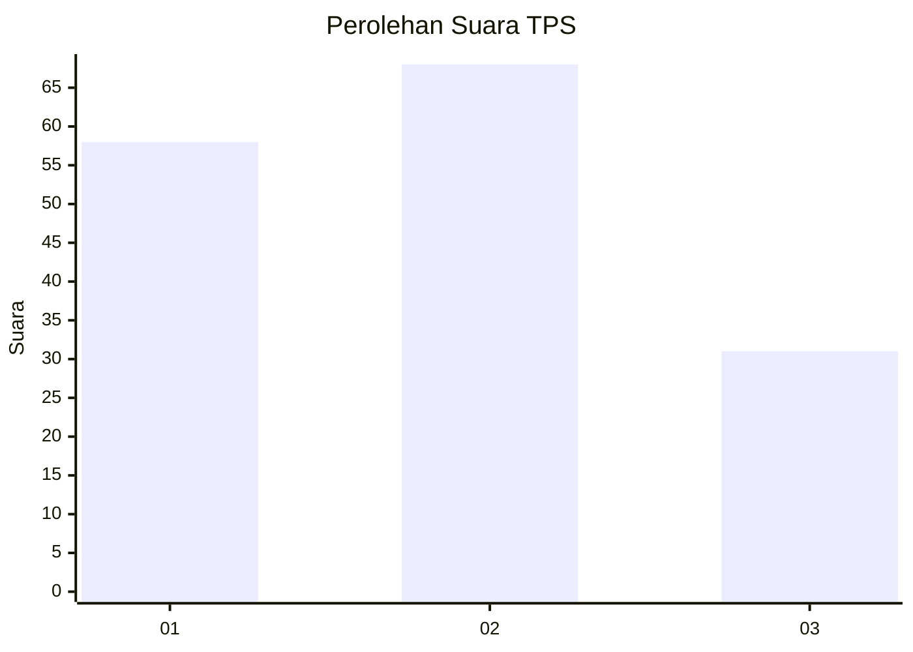
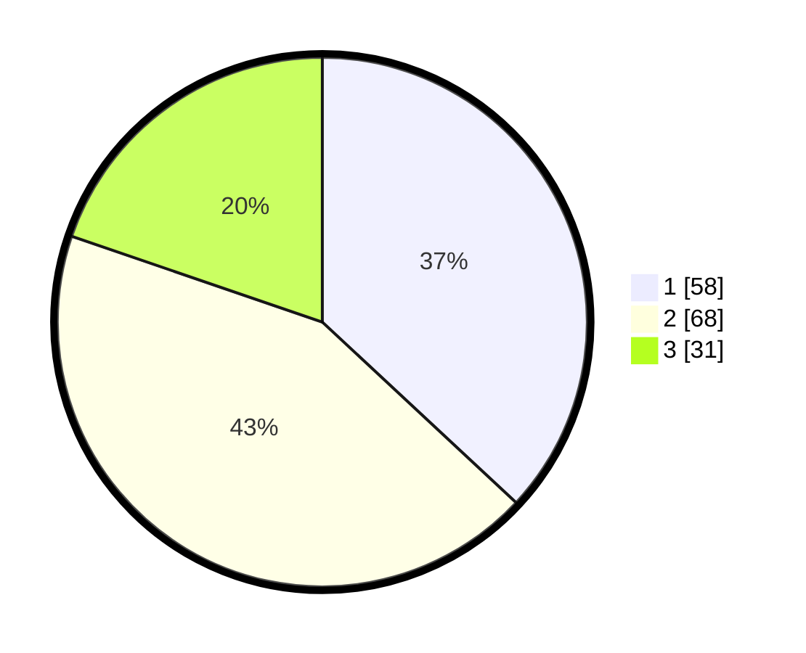

# Hasil

## Grafik

## Tabel

| No. | Nama Paslon    | Suara | Suara (raw) | Persentase |
|:--- |:-------------- | -----:| -----------:| ----------:|
| 1   | ANIES MUHAIMIN | 58    | [58][p-1]   | 36,94      |
| 2   | PRABOWO GIBRAN | 68    | [68][p-2]   | 43,31      |
| 3   | GANJAR MAHFUD  | 31    | [31][p-3]   | 19,75      |

[p-1]: https://github.com/gigit-pemilu/pemilu-2024-35-jawa-timur/blob/main/pilpres/hitung-suara/sub/35-jawa-timur/sub/20-magetan/sub/07-plaosan/sub/2006-randugede/sub/006-tps/sub/paslon-1.txt
[p-2]: https://github.com/gigit-pemilu/pemilu-2024-35-jawa-timur/blob/main/pilpres/hitung-suara/sub/35-jawa-timur/sub/20-magetan/sub/07-plaosan/sub/2006-randugede/sub/006-tps/sub/paslon-2.txt
[p-3]: https://github.com/gigit-pemilu/pemilu-2024-35-jawa-timur/blob/main/pilpres/hitung-suara/sub/35-jawa-timur/sub/20-magetan/sub/07-plaosan/sub/2006-randugede/sub/006-tps/sub/paslon-3.txt

## Foto C Plano

https://sirekap-obj-formc.kpu.go.id/0695/pemilu/ppwp/35/20/07/20/06/3520072006006-20240214-155327--af5daf17-c906-4d6a-bd71-1207a1c67104.jpg

https://sirekap-obj-formc.kpu.go.id/0695/pemilu/ppwp/35/20/07/20/06/3520072006006-20240214-141529--3739962a-fec7-40dc-a4bf-9a16b3eb2596.jpg

https://sirekap-obj-formc.kpu.go.id/0695/pemilu/ppwp/35/20/07/20/06/3520072006006-20240214-141646--63a0329d-46a3-4d96-9337-7c44c68359c0.jpg

## Metadata

| Key        | Value               |
| ---------- | ------------------- |
| Time Stamp | 2024-02-16 21:01:00 |

