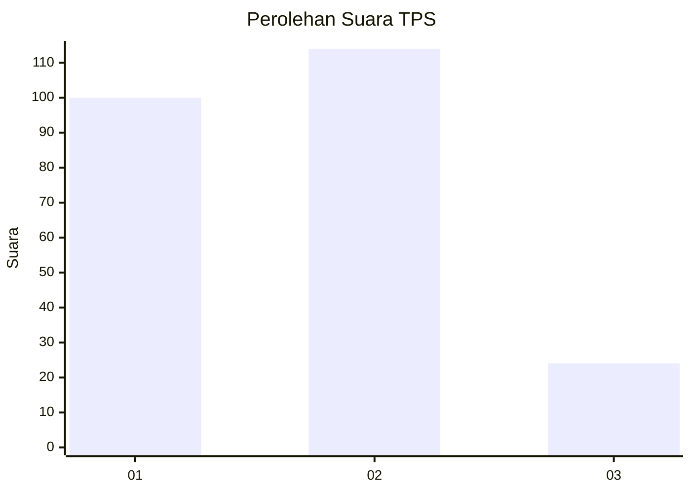
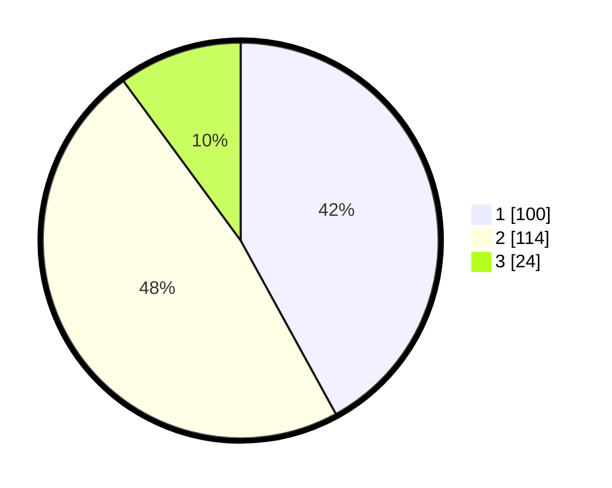

# Hasil

## Grafik

## Tabel

| No. | Nama Paslon    | Suara | Suara (raw) | Persentase |
|:--- |:-------------- | -----:| -----------:| ----------:|
| 1   | ANIES MUHAIMIN | 100   | [100][p-1]  | 42,02      |
| 2   | PRABOWO GIBRAN | 114   | [114][p-2]  | 47,90      |
| 3   | GANJAR MAHFUD  | 24    | [24][p-3]   | 10,08      |

[p-1]: https://github.com/gigit-pemilu/pemilu-2024/blob/main/pilpres/hitung-suara/sub/35-jawa-timur/sub/20-magetan/sub/07-plaosan/sub/2007-sumberagung/sub/002-tps/sub/paslon-1.txt
[p-2]: https://github.com/gigit-pemilu/pemilu-2024/blob/main/pilpres/hitung-suara/sub/35-jawa-timur/sub/20-magetan/sub/07-plaosan/sub/2007-sumberagung/sub/002-tps/sub/paslon-2.txt
[p-3]: https://github.com/gigit-pemilu/pemilu-2024/blob/main/pilpres/hitung-suara/sub/35-jawa-timur/sub/20-magetan/sub/07-plaosan/sub/2007-sumberagung/sub/002-tps/sub/paslon-3.txt

## Foto C Plano

https://sirekap-obj-formc.kpu.go.id/744f/pemilu/ppwp/35/20/07/20/07/3520072007002-20240214-213017--26358f79-46dd-47a0-8ebf-a3f809c3ea60.jpg

https://sirekap-obj-formc.kpu.go.id/744f/pemilu/ppwp/35/20/07/20/07/3520072007002-20240214-213146--9fda3c55-f981-419b-8d42-403cc00ec44c.jpg

https://sirekap-obj-formc.kpu.go.id/744f/pemilu/ppwp/35/20/07/20/07/3520072007002-20240214-213305--bbddf40c-2b64-424d-b525-d04a8bbc9e49.jpg

## Metadata

| Key        | Value               |
| ---------- | ------------------- |
| Time Stamp | 2024-02-16 21:01:00 |

