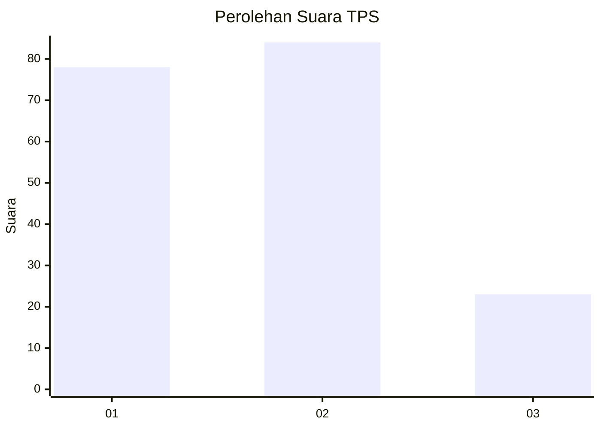
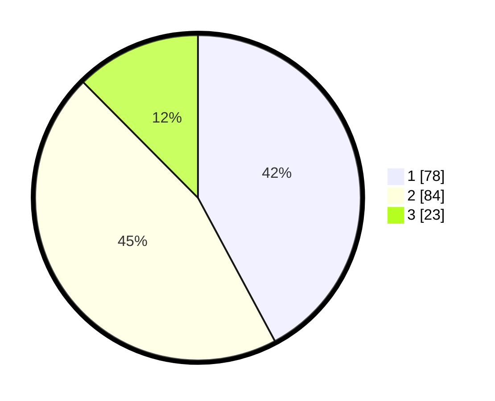

# Hasil

## Grafik

## Tabel

| No. | Nama Paslon    | Suara | Suara (raw) | Persentase |
|:--- |:-------------- | -----:| -----------:| ----------:|
| 1   | ANIES MUHAIMIN | 78    | [78][p-1]   | 42,16      |
| 2   | PRABOWO GIBRAN | 84    | [84][p-2]   | 45,41      |
| 3   | GANJAR MAHFUD  | 23    | [23][p-3]   | 12,43      |

[p-1]: https://github.com/gigit-pemilu/pemilu-2024/blob/main/pilpres/hitung-suara/sub/35-jawa-timur/sub/20-magetan/sub/07-plaosan/sub/2007-sumberagung/sub/007-tps/sub/paslon-1.txt
[p-2]: https://github.com/gigit-pemilu/pemilu-2024/blob/main/pilpres/hitung-suara/sub/35-jawa-timur/sub/20-magetan/sub/07-plaosan/sub/2007-sumberagung/sub/007-tps/sub/paslon-2.txt
[p-3]: https://github.com/gigit-pemilu/pemilu-2024/blob/main/pilpres/hitung-suara/sub/35-jawa-timur/sub/20-magetan/sub/07-plaosan/sub/2007-sumberagung/sub/007-tps/sub/paslon-3.txt

## Foto C Plano

https://sirekap-obj-formc.kpu.go.id/98ba/pemilu/ppwp/35/20/07/20/07/3520072007007-20240214-231513--87a4d306-99b2-43d8-82e7-6772a605209d.jpg

https://sirekap-obj-formc.kpu.go.id/98ba/pemilu/ppwp/35/20/07/20/07/3520072007007-20240214-191417--9cb93e60-821d-4aca-8e0f-0c0f4c678e75.jpg

https://sirekap-obj-formc.kpu.go.id/98ba/pemilu/ppwp/35/20/07/20/07/3520072007007-20240214-191449--76b29afc-d0fb-42cb-af04-2725721aa7ac.jpg

## Metadata

| Key        | Value               |
| ---------- | ------------------- |
| Time Stamp | 2024-02-16 21:01:00 |

