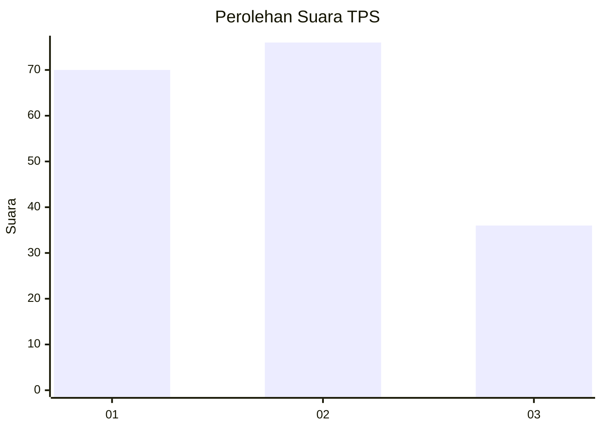
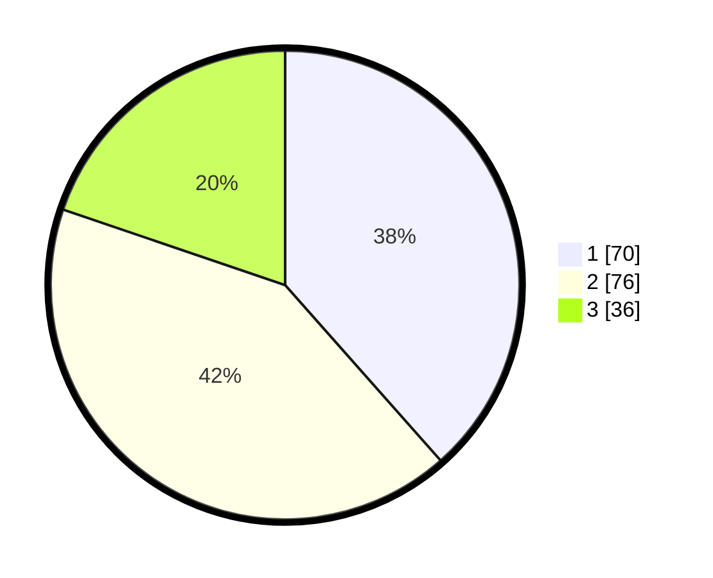

# Hasil

## Grafik

## Tabel

| No. | Nama Paslon    | Suara | Suara (raw) | Persentase |
|:--- |:-------------- | -----:| -----------:| ----------:|
| 1   | ANIES MUHAIMIN | 70    | [70][p-1]   | 38,46      |
| 2   | PRABOWO GIBRAN | 76    | [76][p-2]   | 41,76      |
| 3   | GANJAR MAHFUD  | 36    | [36][p-3]   | 19,78      |

[p-1]: https://github.com/gigit-pemilu/pemilu-2024-35-jawa-timur/blob/main/pilpres/hitung-suara/sub/35-jawa-timur/sub/20-magetan/sub/07-plaosan/sub/2008-nitikan/sub/001-tps/sub/paslon-1.txt
[p-2]: https://github.com/gigit-pemilu/pemilu-2024-35-jawa-timur/blob/main/pilpres/hitung-suara/sub/35-jawa-timur/sub/20-magetan/sub/07-plaosan/sub/2008-nitikan/sub/001-tps/sub/paslon-2.txt
[p-3]: https://github.com/gigit-pemilu/pemilu-2024-35-jawa-timur/blob/main/pilpres/hitung-suara/sub/35-jawa-timur/sub/20-magetan/sub/07-plaosan/sub/2008-nitikan/sub/001-tps/sub/paslon-3.txt

## Foto C Plano

https://sirekap-obj-formc.kpu.go.id/8f13/pemilu/ppwp/35/20/07/20/08/3520072008001-20240214-141532--36e01922-3d68-4081-8169-a22bab5f70a3.jpg

https://sirekap-obj-formc.kpu.go.id/8f13/pemilu/ppwp/35/20/07/20/08/3520072008001-20240214-141637--59859543-8ef6-4550-9fe2-1696aa16705d.jpg

https://sirekap-obj-formc.kpu.go.id/8f13/pemilu/ppwp/35/20/07/20/08/3520072008001-20240214-141713--8b8921f0-99c4-4949-9fa4-de51bdb94661.jpg

## Metadata

| Key        | Value               |
| ---------- | ------------------- |
| Time Stamp | 2024-02-16 21:01:00 |

