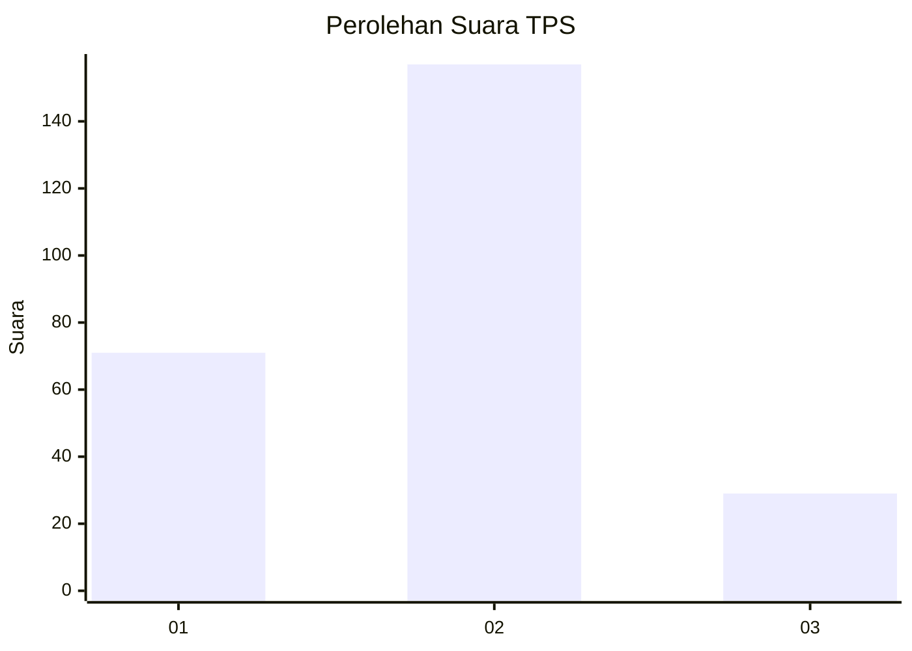
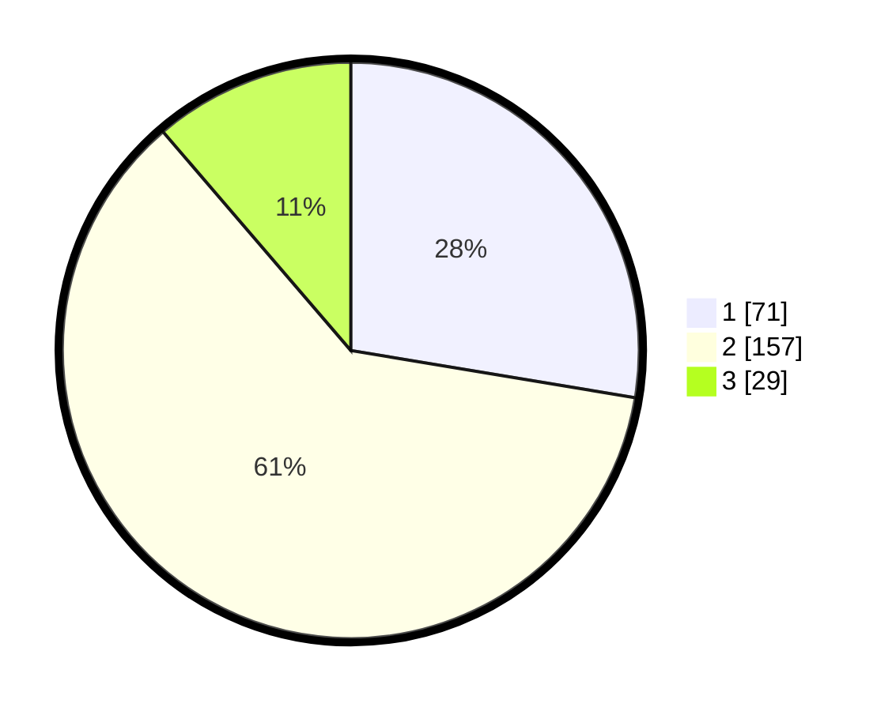

# Hasil

## Grafik

## Tabel

| No. | Nama Paslon    | Suara | Suara (raw) | Persentase |
|:--- |:-------------- | -----:| -----------:| ----------:|
| 1   | ANIES MUHAIMIN | 71    | [71][p-1]   | 27,63      |
| 2   | PRABOWO GIBRAN | 157   | [157][p-2]  | 61,09      |
| 3   | GANJAR MAHFUD  | 29    | [29][p-3]   | 11,28      |

[p-1]: https://github.com/gigit-pemilu/pemilu-2024/blob/main/pilpres/hitung-suara/sub/35-jawa-timur/sub/20-magetan/sub/07-plaosan/sub/2010-buluharjo/sub/010-tps/sub/paslon-1.txt
[p-2]: https://github.com/gigit-pemilu/pemilu-2024/blob/main/pilpres/hitung-suara/sub/35-jawa-timur/sub/20-magetan/sub/07-plaosan/sub/2010-buluharjo/sub/010-tps/sub/paslon-2.txt
[p-3]: https://github.com/gigit-pemilu/pemilu-2024/blob/main/pilpres/hitung-suara/sub/35-jawa-timur/sub/20-magetan/sub/07-plaosan/sub/2010-buluharjo/sub/010-tps/sub/paslon-3.txt

## Foto C Plano

https://sirekap-obj-formc.kpu.go.id/168d/pemilu/ppwp/35/20/07/20/10/3520072010010-20240214-223937--57ea29ac-85d2-4b29-9218-2aa933e5c27c.jpg

https://sirekap-obj-formc.kpu.go.id/168d/pemilu/ppwp/35/20/07/20/10/3520072010010-20240214-224355--06737780-8b9c-4fa4-98e4-96314de48ee1.jpg

https://sirekap-obj-formc.kpu.go.id/168d/pemilu/ppwp/35/20/07/20/10/3520072010010-20240214-224514--e0add6b6-6b4a-45c7-9652-e6ad0a89ecbd.jpg

## Metadata

| Key        | Value               |
| ---------- | ------------------- |
| Time Stamp | 2024-02-15 12:00:28 |

