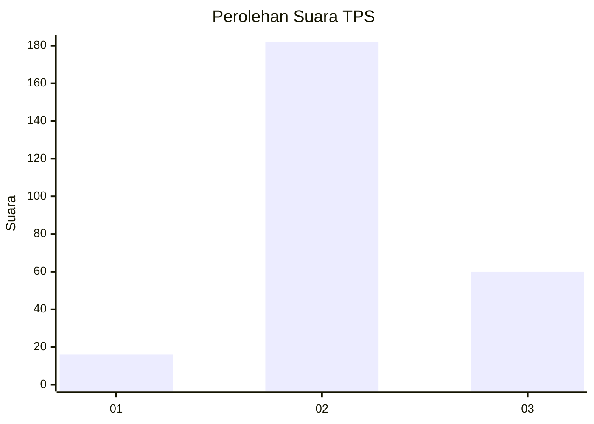
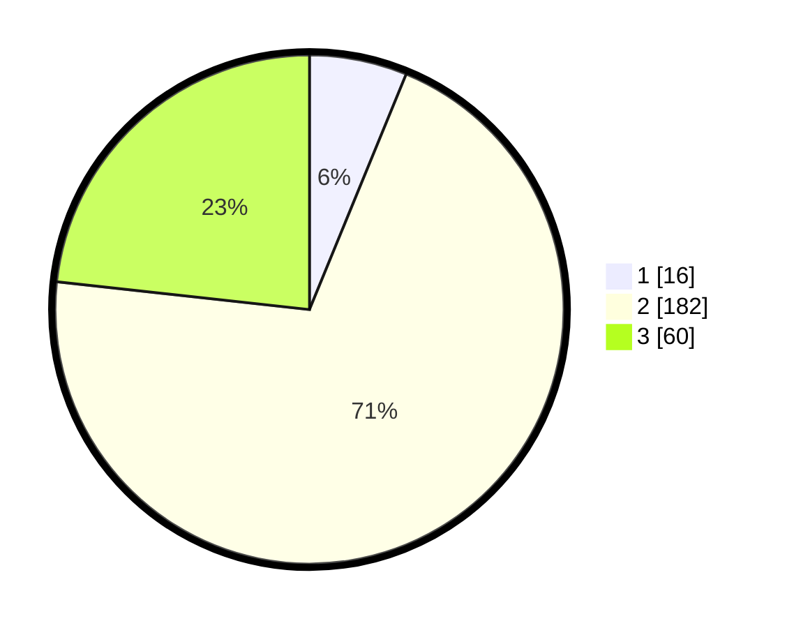

# Hasil

## Grafik

## Tabel

| No. | Nama Paslon    | Suara | Suara (raw) | Persentase |
|:--- |:-------------- | -----:| -----------:| ----------:|
| 1   | ANIES MUHAIMIN | 16    | [16][p-1]   | 6,20       |
| 2   | PRABOWO GIBRAN | 182   | [182][p-2]  | 70,54      |
| 3   | GANJAR MAHFUD  | 60    | [60][p-3]   | 23,26      |

[p-1]: https://github.com/gigit-pemilu/pemilu-2024-35-jawa-timur/blob/main/pilpres/hitung-suara/sub/35-jawa-timur/sub/20-magetan/sub/07-plaosan/sub/2012-dadi/sub/001-tps/sub/paslon-1.txt
[p-2]: https://github.com/gigit-pemilu/pemilu-2024-35-jawa-timur/blob/main/pilpres/hitung-suara/sub/35-jawa-timur/sub/20-magetan/sub/07-plaosan/sub/2012-dadi/sub/001-tps/sub/paslon-2.txt
[p-3]: https://github.com/gigit-pemilu/pemilu-2024-35-jawa-timur/blob/main/pilpres/hitung-suara/sub/35-jawa-timur/sub/20-magetan/sub/07-plaosan/sub/2012-dadi/sub/001-tps/sub/paslon-3.txt

## Foto C Plano

https://sirekap-obj-formc.kpu.go.id/73fb/pemilu/ppwp/35/20/07/20/12/3520072012001-20240214-155920--e48998aa-ee85-4fc7-b4b8-03cf152c256b.jpg

https://sirekap-obj-formc.kpu.go.id/73fb/pemilu/ppwp/35/20/07/20/12/3520072012001-20240217-194455--5ff3c1c3-2b44-4403-b1e8-de104a66ac1a.jpg

https://sirekap-obj-formc.kpu.go.id/73fb/pemilu/ppwp/35/20/07/20/12/3520072012001-20240214-155305--dbe94fd8-cd51-40ae-8542-03254e9235bf.jpg

## Metadata

| Key        | Value               |
| ---------- | ------------------- |
| Time Stamp | 2024-02-22 12:00:00 |

