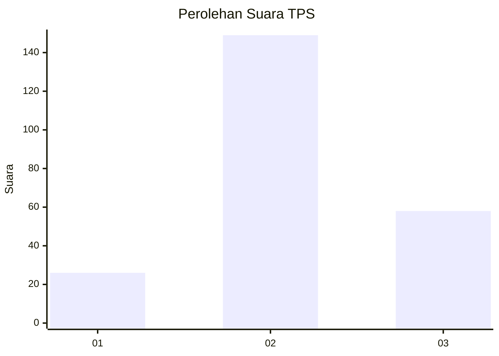
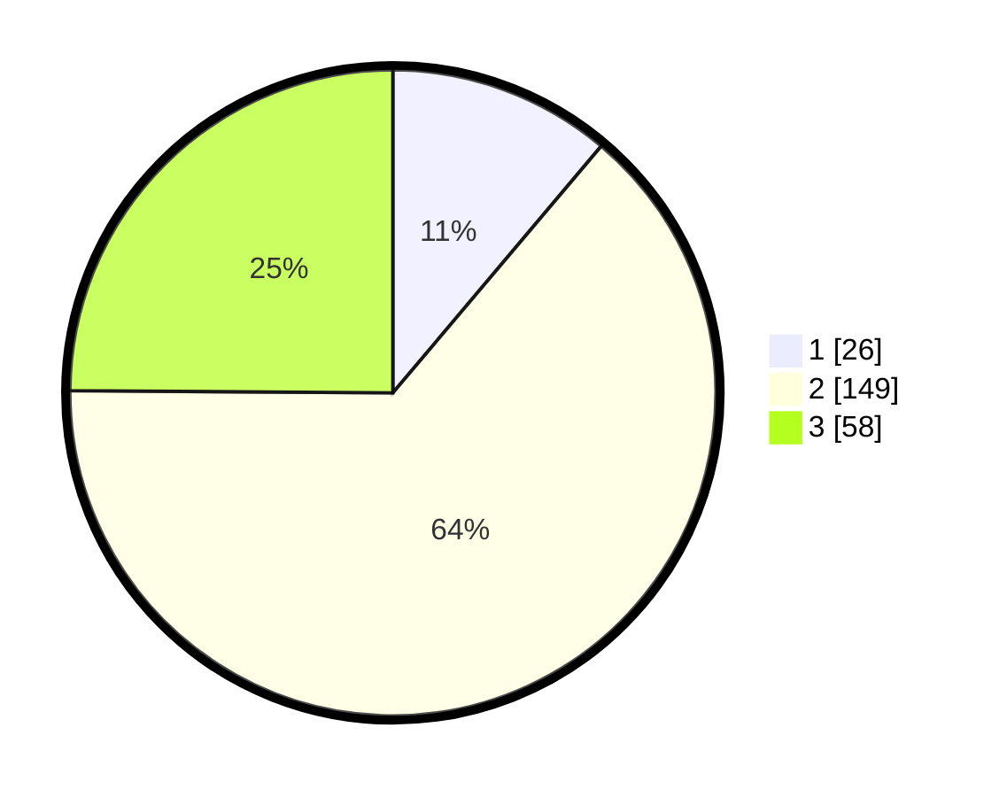

# Hasil

## Grafik

## Tabel

| No. | Nama Paslon    | Suara | Suara (raw) | Persentase |
|:--- |:-------------- | -----:| -----------:| ----------:|
| 1   | ANIES MUHAIMIN | 26    | [26][p-1]   | 11,16      |
| 2   | PRABOWO GIBRAN | 149   | [149][p-2]  | 63,95      |
| 3   | GANJAR MAHFUD  | 58    | [58][p-3]   | 24,89      |

[p-1]: https://github.com/gigit-pemilu/pemilu-2024/blob/main/pilpres/hitung-suara/sub/35-jawa-timur/sub/20-magetan/sub/08-panekan/sub/1009-panekan/sub/002-tps/sub/paslon-1.txt
[p-2]: https://github.com/gigit-pemilu/pemilu-2024/blob/main/pilpres/hitung-suara/sub/35-jawa-timur/sub/20-magetan/sub/08-panekan/sub/1009-panekan/sub/002-tps/sub/paslon-2.txt
[p-3]: https://github.com/gigit-pemilu/pemilu-2024/blob/main/pilpres/hitung-suara/sub/35-jawa-timur/sub/20-magetan/sub/08-panekan/sub/1009-panekan/sub/002-tps/sub/paslon-3.txt

## Foto C Plano

https://sirekap-obj-formc.kpu.go.id/fc8b/pemilu/ppwp/35/20/08/10/09/3520081009002-20240215-025255--19782b3a-64ca-4639-9c7d-287cc211123f.jpg

https://sirekap-obj-formc.kpu.go.id/fc8b/pemilu/ppwp/35/20/08/10/09/3520081009002-20240215-043813--36a066c9-57eb-4f11-a411-f596b184efaa.jpg

https://sirekap-obj-formc.kpu.go.id/fc8b/pemilu/ppwp/35/20/08/10/09/3520081009002-20240215-043837--26e297b2-b51d-46c7-b8dc-0b206838c18a.jpg

## Metadata

| Key        | Value               |
| ---------- | ------------------- |
| Time Stamp | 2024-02-22 13:00:00 |

