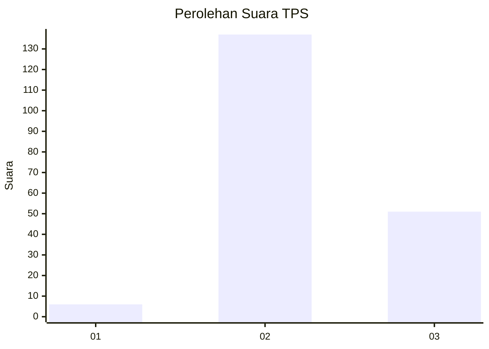
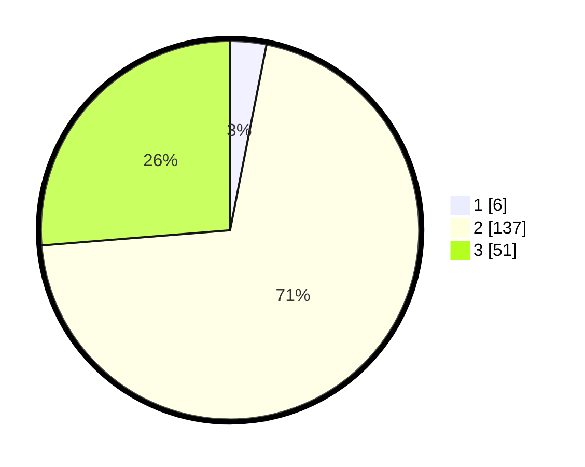

# Hasil

## Grafik

## Tabel

| No. | Nama Paslon    | Suara | Suara (raw) | Persentase |
|:--- |:-------------- | -----:| -----------:| ----------:|
| 1   | ANIES MUHAIMIN | 6     | [6][p-1]    | 3,09       |
| 2   | PRABOWO GIBRAN | 137   | [137][p-2]  | 70,62      |
| 3   | GANJAR MAHFUD  | 51    | [51][p-3]   | 26,29      |

[p-1]: https://github.com/gigit-pemilu/pemilu-2024/blob/main/pilpres/hitung-suara/sub/35-jawa-timur/sub/20-magetan/sub/08-panekan/sub/1009-panekan/sub/006-tps/sub/paslon-1.txt
[p-2]: https://github.com/gigit-pemilu/pemilu-2024/blob/main/pilpres/hitung-suara/sub/35-jawa-timur/sub/20-magetan/sub/08-panekan/sub/1009-panekan/sub/006-tps/sub/paslon-2.txt
[p-3]: https://github.com/gigit-pemilu/pemilu-2024/blob/main/pilpres/hitung-suara/sub/35-jawa-timur/sub/20-magetan/sub/08-panekan/sub/1009-panekan/sub/006-tps/sub/paslon-3.txt

## Foto C Plano

https://sirekap-obj-formc.kpu.go.id/de8e/pemilu/ppwp/35/20/08/10/09/3520081009006-20240215-062746--700cb900-7cc5-4ac3-9ef5-81815731d13f.jpg

https://sirekap-obj-formc.kpu.go.id/de8e/pemilu/ppwp/35/20/08/10/09/3520081009006-20240215-062802--84ea73e1-44d5-452d-ab5d-9c9d8cd59d72.jpg

https://sirekap-obj-formc.kpu.go.id/de8e/pemilu/ppwp/35/20/08/10/09/3520081009006-20240215-062814--5179291e-8103-47e6-8974-aa2411909e6d.jpg

## Metadata

| Key        | Value               |
| ---------- | ------------------- |
| Time Stamp | 2024-02-22 13:00:00 |

