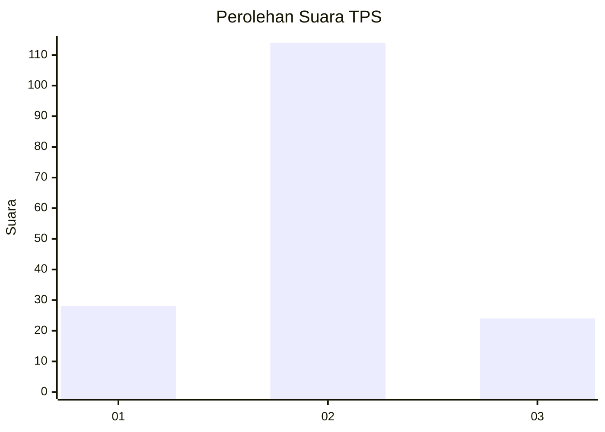
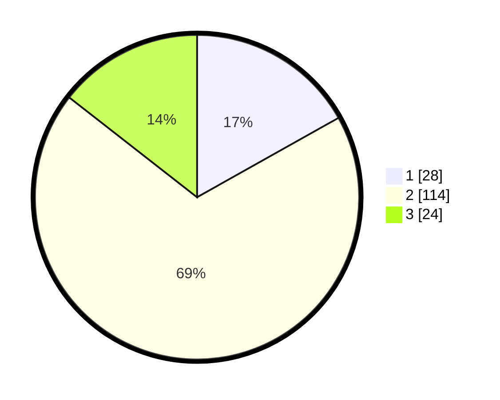

# Hasil

## Grafik

## Tabel

| No. | Nama Paslon    | Suara | Suara (raw) | Persentase |
|:--- |:-------------- | -----:| -----------:| ----------:|
| 1   | ANIES MUHAIMIN | 28    | [28][p-1]   | 16,87      |
| 2   | PRABOWO GIBRAN | 114   | [114][p-2]  | 68,67      |
| 3   | GANJAR MAHFUD  | 24    | [24][p-3]   | 14,46      |

[p-1]: https://github.com/gigit-pemilu/pemilu-2024/blob/main/pilpres/hitung-suara/sub/35-jawa-timur/sub/20-magetan/sub/08-panekan/sub/2006-milangasri/sub/008-tps/sub/paslon-1.txt
[p-2]: https://github.com/gigit-pemilu/pemilu-2024/blob/main/pilpres/hitung-suara/sub/35-jawa-timur/sub/20-magetan/sub/08-panekan/sub/2006-milangasri/sub/008-tps/sub/paslon-2.txt
[p-3]: https://github.com/gigit-pemilu/pemilu-2024/blob/main/pilpres/hitung-suara/sub/35-jawa-timur/sub/20-magetan/sub/08-panekan/sub/2006-milangasri/sub/008-tps/sub/paslon-3.txt

## Foto C Plano

https://sirekap-obj-formc.kpu.go.id/bb78/pemilu/ppwp/35/20/08/20/06/3520082006008-20240214-225818--fc4b913c-e66f-47ef-ad7c-c9723099d79c.jpg

https://sirekap-obj-formc.kpu.go.id/bb78/pemilu/ppwp/35/20/08/20/06/3520082006008-20240214-225912--b31a732a-8a12-44a2-9aa9-f0c180841280.jpg

https://sirekap-obj-formc.kpu.go.id/bb78/pemilu/ppwp/35/20/08/20/06/3520082006008-20240214-230047--858f5c6e-61ee-4bd8-803a-76bd8ca8dc49.jpg

## Metadata

| Key        | Value               |
| ---------- | ------------------- |
| Time Stamp | 2024-02-22 13:00:00 |

