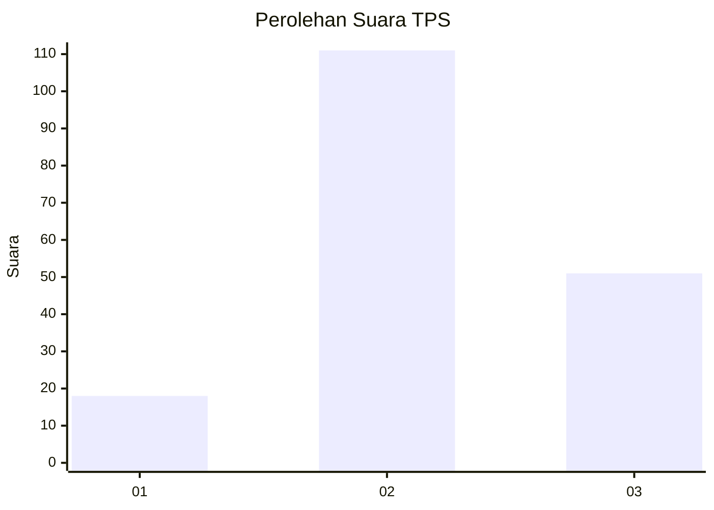
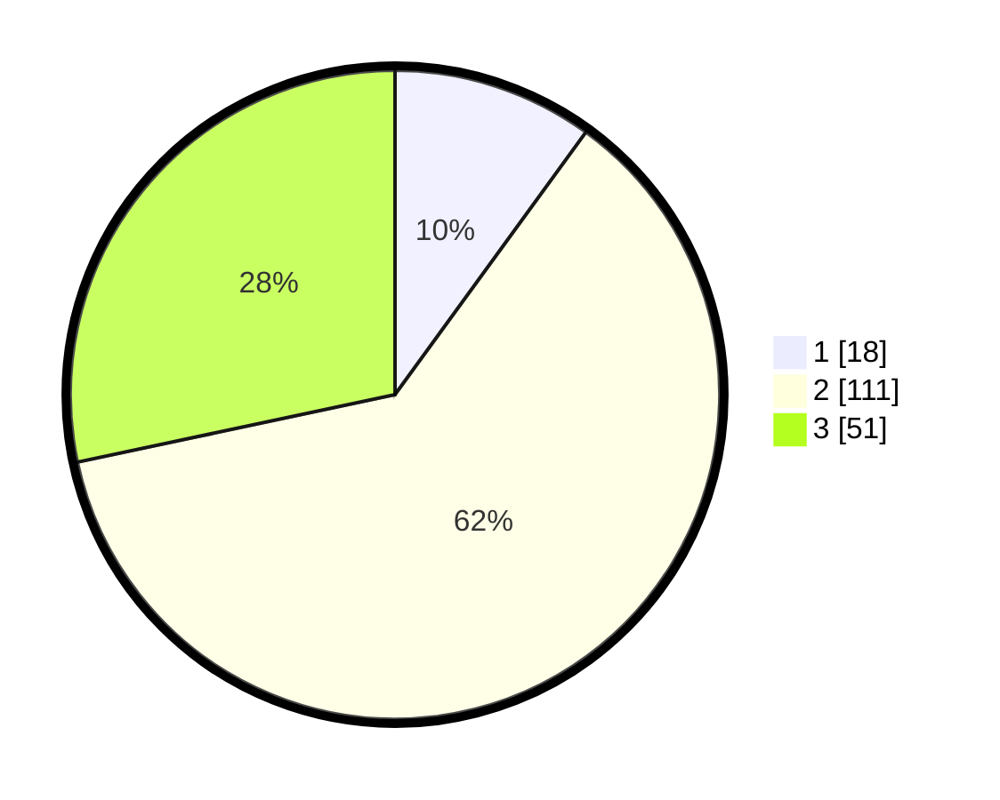

# Hasil

## Grafik

## Tabel

| No. | Nama Paslon    | Suara | Suara (raw) | Persentase |
|:--- |:-------------- | -----:| -----------:| ----------:|
| 1   | ANIES MUHAIMIN | 18    | [18][p-1]   | 10,00      |
| 2   | PRABOWO GIBRAN | 111   | [111][p-2]  | 61,67      |
| 3   | GANJAR MAHFUD  | 51    | [51][p-3]   | 28,33      |

[p-1]: https://github.com/gigit-pemilu/pemilu-2024/blob/main/pilpres/hitung-suara/sub/35-jawa-timur/sub/20-magetan/sub/08-panekan/sub/2008-sidowayah/sub/001-tps/sub/paslon-1.txt
[p-2]: https://github.com/gigit-pemilu/pemilu-2024/blob/main/pilpres/hitung-suara/sub/35-jawa-timur/sub/20-magetan/sub/08-panekan/sub/2008-sidowayah/sub/001-tps/sub/paslon-2.txt
[p-3]: https://github.com/gigit-pemilu/pemilu-2024/blob/main/pilpres/hitung-suara/sub/35-jawa-timur/sub/20-magetan/sub/08-panekan/sub/2008-sidowayah/sub/001-tps/sub/paslon-3.txt

## Foto C Plano

https://sirekap-obj-formc.kpu.go.id/a124/pemilu/ppwp/35/20/08/20/08/3520082008001-20240214-225301--bf3f0879-fd3a-40ba-b195-b9d37648b57f.jpg

https://sirekap-obj-formc.kpu.go.id/a124/pemilu/ppwp/35/20/08/20/08/3520082008001-20240214-225457--ae14b6f5-f13c-40ba-852f-cf128b9262de.jpg

https://sirekap-obj-formc.kpu.go.id/a124/pemilu/ppwp/35/20/08/20/08/3520082008001-20240214-225636--c4a1a5f4-2e9f-4b4b-9a9e-1bd5a320361c.jpg

## Metadata

| Key        | Value               |
| ---------- | ------------------- |
| Time Stamp | 2024-02-22 14:00:00 |

