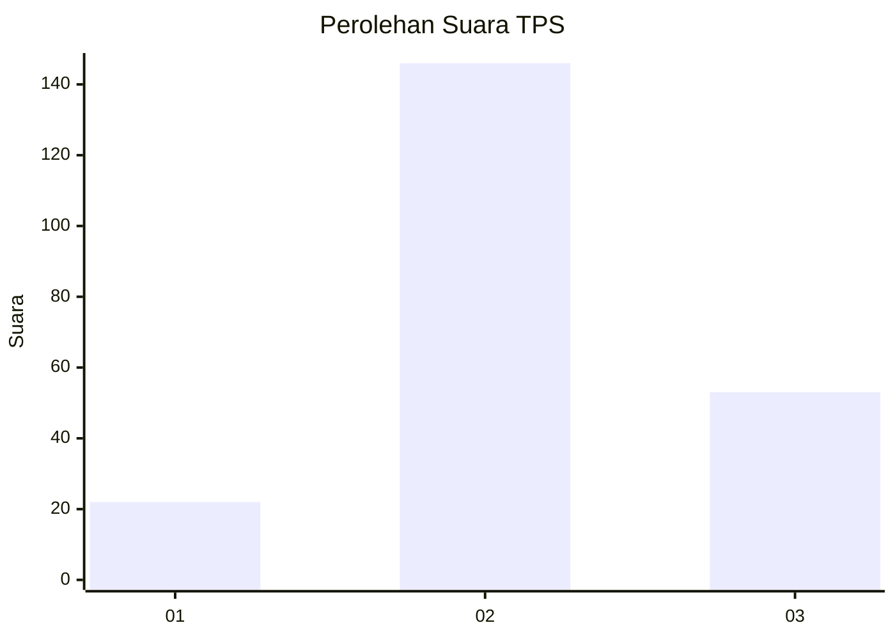
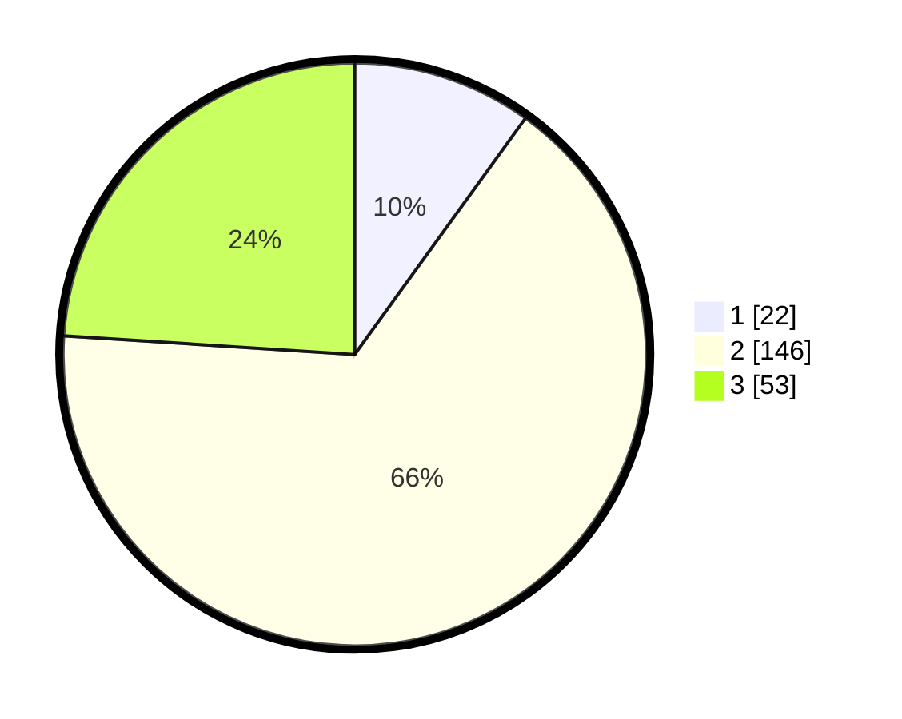

# Hasil

## Grafik

## Tabel

| No. | Nama Paslon    | Suara | Suara (raw) | Persentase |
|:--- |:-------------- | -----:| -----------:| ----------:|
| 1   | ANIES MUHAIMIN | 22    | [22][p-1]   | 9,95       |
| 2   | PRABOWO GIBRAN | 146   | [146][p-2]  | 66,06      |
| 3   | GANJAR MAHFUD  | 53    | [53][p-3]   | 23,98      |

[p-1]: https://github.com/gigit-pemilu/pemilu-2024/blob/main/pilpres/hitung-suara/sub/35-jawa-timur/sub/20-magetan/sub/08-panekan/sub/2008-sidowayah/sub/004-tps/sub/paslon-1.txt
[p-2]: https://github.com/gigit-pemilu/pemilu-2024/blob/main/pilpres/hitung-suara/sub/35-jawa-timur/sub/20-magetan/sub/08-panekan/sub/2008-sidowayah/sub/004-tps/sub/paslon-2.txt
[p-3]: https://github.com/gigit-pemilu/pemilu-2024/blob/main/pilpres/hitung-suara/sub/35-jawa-timur/sub/20-magetan/sub/08-panekan/sub/2008-sidowayah/sub/004-tps/sub/paslon-3.txt

## Foto C Plano

https://sirekap-obj-formc.kpu.go.id/d64e/pemilu/ppwp/35/20/08/20/08/3520082008004-20240214-230139--2c8b447d-fb6f-49c6-8119-1a8a96bd50ea.jpg

https://sirekap-obj-formc.kpu.go.id/d64e/pemilu/ppwp/35/20/08/20/08/3520082008004-20240214-230223--6dea464b-a08a-4317-9ebb-9e8acc294425.jpg

https://sirekap-obj-formc.kpu.go.id/d64e/pemilu/ppwp/35/20/08/20/08/3520082008004-20240214-230256--63ba862a-23d1-4b25-aa88-4fc697ad4f83.jpg

## Metadata

| Key        | Value               |
| ---------- | ------------------- |
| Time Stamp | 2024-02-22 12:00:00 |

