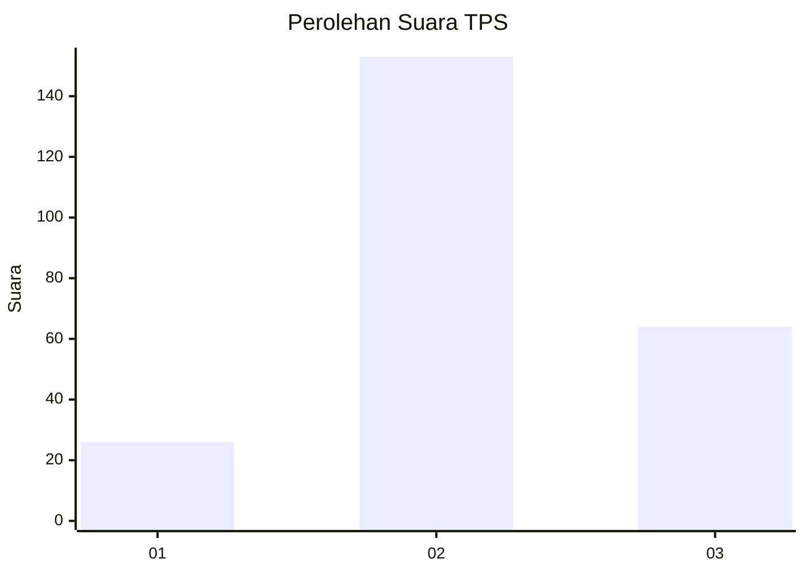
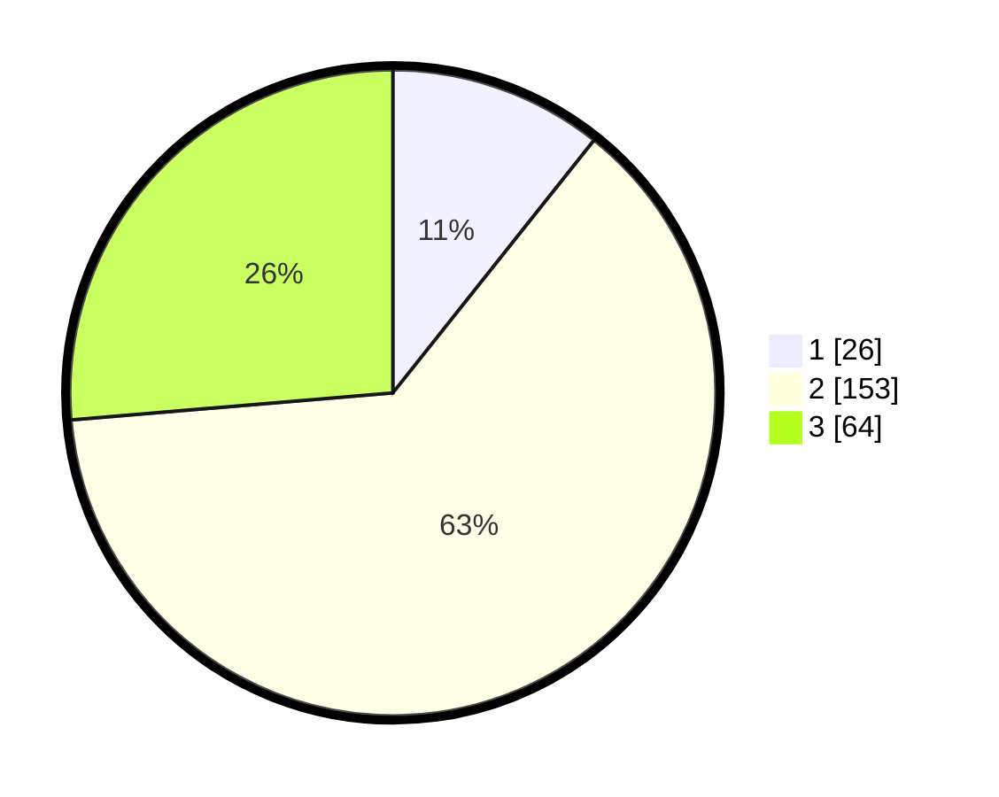

# Hasil

## Grafik

## Tabel

| No. | Nama Paslon    | Suara | Suara (raw) | Persentase |
|:--- |:-------------- | -----:| -----------:| ----------:|
| 1   | ANIES MUHAIMIN | 26    | [26][p-1]   | 10,70      |
| 2   | PRABOWO GIBRAN | 153   | [153][p-2]  | 62,96      |
| 3   | GANJAR MAHFUD  | 64    | [64][p-3]   | 26,34      |

[p-1]: https://github.com/gigit-pemilu/pemilu-2024/blob/main/pilpres/hitung-suara/sub/35-jawa-timur/sub/20-magetan/sub/08-panekan/sub/2011-sumberdodol/sub/005-tps/sub/paslon-1.txt
[p-2]: https://github.com/gigit-pemilu/pemilu-2024/blob/main/pilpres/hitung-suara/sub/35-jawa-timur/sub/20-magetan/sub/08-panekan/sub/2011-sumberdodol/sub/005-tps/sub/paslon-2.txt
[p-3]: https://github.com/gigit-pemilu/pemilu-2024/blob/main/pilpres/hitung-suara/sub/35-jawa-timur/sub/20-magetan/sub/08-panekan/sub/2011-sumberdodol/sub/005-tps/sub/paslon-3.txt

## Foto C Plano

https://sirekap-obj-formc.kpu.go.id/546d/pemilu/ppwp/35/20/08/20/11/3520082011005-20240215-013025--8d800ce9-4106-4d66-ab34-f3694aa9b8cd.jpg

https://sirekap-obj-formc.kpu.go.id/546d/pemilu/ppwp/35/20/08/20/11/3520082011005-20240215-013151--fc083303-ae89-4c41-ab95-7b0649086895.jpg

https://sirekap-obj-formc.kpu.go.id/546d/pemilu/ppwp/35/20/08/20/11/3520082011005-20240215-013307--9167e75e-b780-4122-a364-3768224e2294.jpg

## Metadata

| Key        | Value               |
| ---------- | ------------------- |
| Time Stamp | 2024-02-15 12:00:28 |

