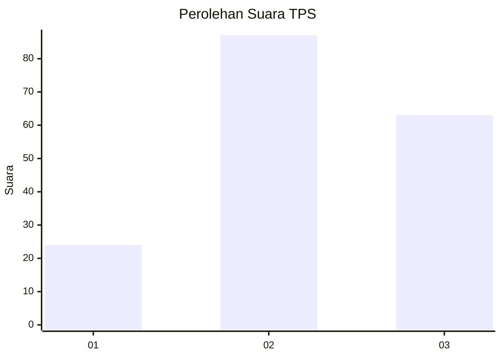
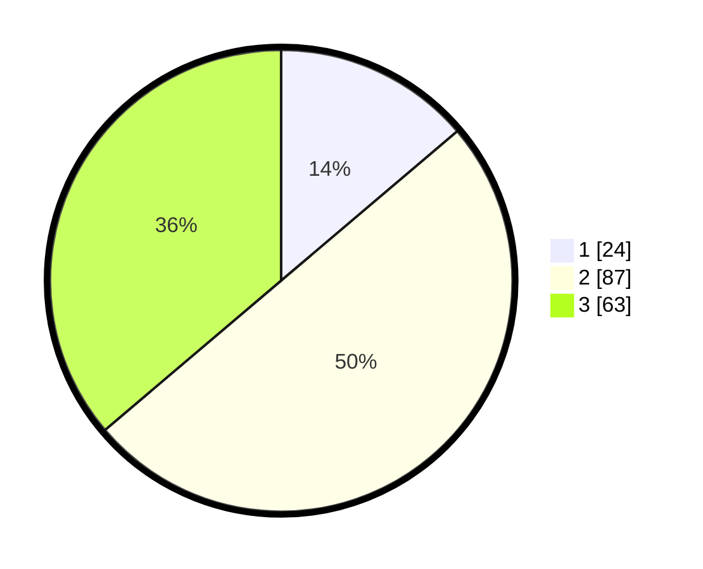

# Hasil

## Grafik

## Tabel

| No. | Nama Paslon    | Suara | Suara (raw) | Persentase |
|:--- |:-------------- | -----:| -----------:| ----------:|
| 1   | ANIES MUHAIMIN | 24    | [24][p-1]   | 13,79      |
| 2   | PRABOWO GIBRAN | 87    | [87][p-2]   | 50,00      |
| 3   | GANJAR MAHFUD  | 63    | [63][p-3]   | 36,21      |

[p-1]: https://github.com/gigit-pemilu/pemilu-2024-35-jawa-timur/blob/main/pilpres/hitung-suara/sub/35-jawa-timur/sub/20-magetan/sub/08-panekan/sub/2012-manjung/sub/003-tps/sub/paslon-1.txt
[p-2]: https://github.com/gigit-pemilu/pemilu-2024-35-jawa-timur/blob/main/pilpres/hitung-suara/sub/35-jawa-timur/sub/20-magetan/sub/08-panekan/sub/2012-manjung/sub/003-tps/sub/paslon-2.txt
[p-3]: https://github.com/gigit-pemilu/pemilu-2024-35-jawa-timur/blob/main/pilpres/hitung-suara/sub/35-jawa-timur/sub/20-magetan/sub/08-panekan/sub/2012-manjung/sub/003-tps/sub/paslon-3.txt

## Foto C Plano

https://sirekap-obj-formc.kpu.go.id/8522/pemilu/ppwp/35/20/08/20/12/3520082012003-20240214-155806--a86731a4-723e-4cbb-80bb-0b61d3a7a3b5.jpg

https://sirekap-obj-formc.kpu.go.id/8522/pemilu/ppwp/35/20/08/20/12/3520082012003-20240214-212322--ea1a726c-5e7d-491d-b355-da938e288d6c.jpg

https://sirekap-obj-formc.kpu.go.id/8522/pemilu/ppwp/35/20/08/20/12/3520082012003-20240214-213703--de8c808a-0363-4e40-931b-3caf3e5396e6.jpg

## Metadata

| Key        | Value               |
| ---------- | ------------------- |
| Time Stamp | 2024-02-15 03:06:03 |

