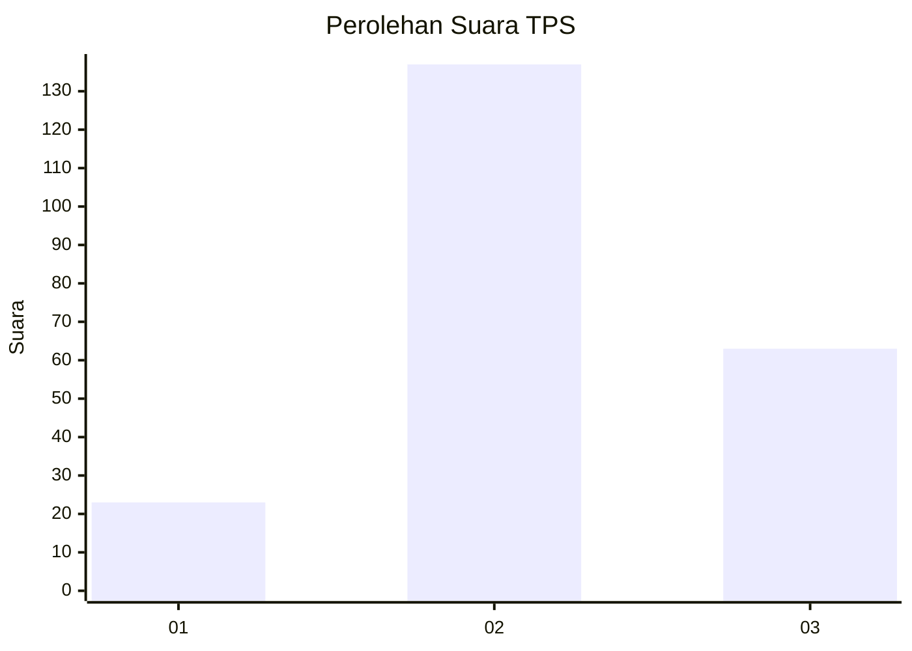
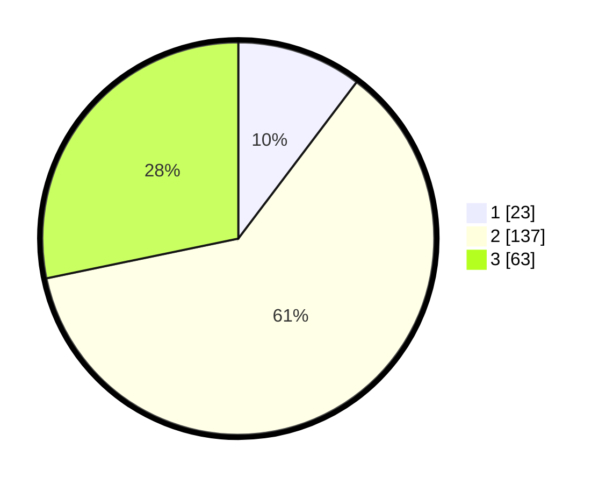

# Hasil

## Grafik

## Tabel

| No. | Nama Paslon    | Suara | Suara (raw) | Persentase |
|:--- |:-------------- | -----:| -----------:| ----------:|
| 1   | ANIES MUHAIMIN | 23    | [23][p-1]   | 10,31      |
| 2   | PRABOWO GIBRAN | 137   | [137][p-2]  | 61,43      |
| 3   | GANJAR MAHFUD  | 63    | [63][p-3]   | 28,25      |

[p-1]: https://github.com/gigit-pemilu/pemilu-2024/blob/main/pilpres/hitung-suara/sub/35-jawa-timur/sub/20-magetan/sub/08-panekan/sub/2014-sukowidi/sub/005-tps/sub/paslon-1.txt
[p-2]: https://github.com/gigit-pemilu/pemilu-2024/blob/main/pilpres/hitung-suara/sub/35-jawa-timur/sub/20-magetan/sub/08-panekan/sub/2014-sukowidi/sub/005-tps/sub/paslon-2.txt
[p-3]: https://github.com/gigit-pemilu/pemilu-2024/blob/main/pilpres/hitung-suara/sub/35-jawa-timur/sub/20-magetan/sub/08-panekan/sub/2014-sukowidi/sub/005-tps/sub/paslon-3.txt

## Foto C Plano

https://sirekap-obj-formc.kpu.go.id/b636/pemilu/ppwp/35/20/08/20/14/3520082014005-20240214-225105--46f2db89-cf37-4fb8-bd63-7390cc2b65f5.jpg

https://sirekap-obj-formc.kpu.go.id/b636/pemilu/ppwp/35/20/08/20/14/3520082014005-20240214-225217--e1fa3793-4780-4638-b1ee-c8436337ea45.jpg

https://sirekap-obj-formc.kpu.go.id/b636/pemilu/ppwp/35/20/08/20/14/3520082014005-20240214-225306--eaad8062-9873-4d8e-bd37-cb9f31963d94.jpg

## Metadata

| Key        | Value               |
| ---------- | ------------------- |
| Time Stamp | 2024-02-24 22:31:28 |

