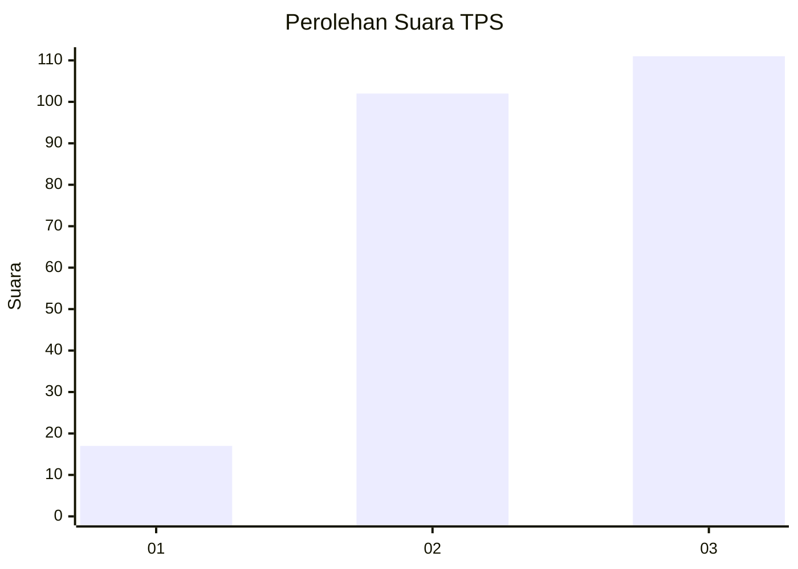
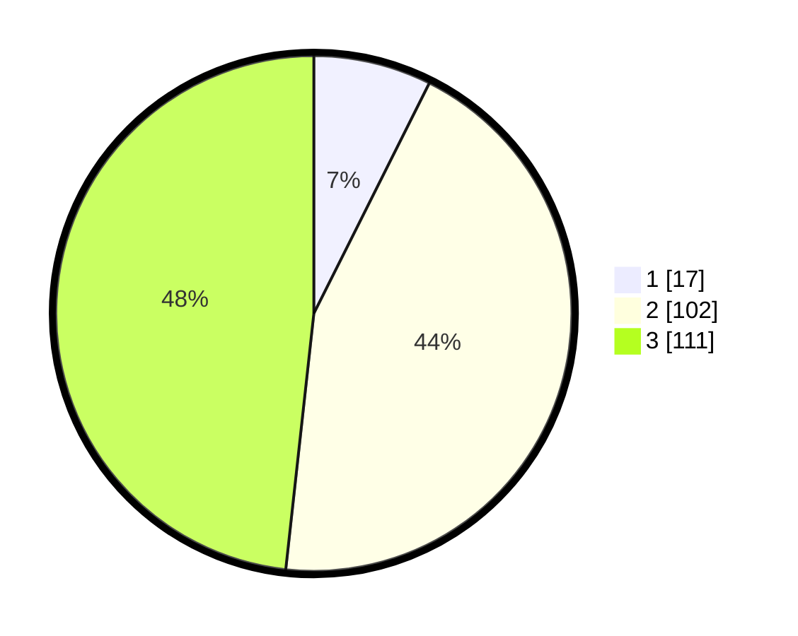

# Hasil

## Grafik

## Tabel

| No. | Nama Paslon    | Suara | Suara (raw) | Persentase |
|:--- |:-------------- | -----:| -----------:| ----------:|
| 1   | ANIES MUHAIMIN | 17    | [17][p-1]   | 7,39       |
| 2   | PRABOWO GIBRAN | 102   | [102][p-2]  | 44,35      |
| 3   | GANJAR MAHFUD  | 111   | [111][p-3]  | 48,26      |

[p-1]: https://github.com/gigit-pemilu/pemilu-2024-35-jawa-timur/blob/main/pilpres/hitung-suara/sub/35-jawa-timur/sub/20-magetan/sub/08-panekan/sub/2016-ngiliran/sub/005-tps/sub/paslon-1.txt
[p-2]: https://github.com/gigit-pemilu/pemilu-2024-35-jawa-timur/blob/main/pilpres/hitung-suara/sub/35-jawa-timur/sub/20-magetan/sub/08-panekan/sub/2016-ngiliran/sub/005-tps/sub/paslon-2.txt
[p-3]: https://github.com/gigit-pemilu/pemilu-2024-35-jawa-timur/blob/main/pilpres/hitung-suara/sub/35-jawa-timur/sub/20-magetan/sub/08-panekan/sub/2016-ngiliran/sub/005-tps/sub/paslon-3.txt

## Foto C Plano

https://sirekap-obj-formc.kpu.go.id/c160/pemilu/ppwp/35/20/08/20/16/3520082016005-20240214-233416--ed07461f-6bc0-462f-9d4a-95ae5708b405.jpg

https://sirekap-obj-formc.kpu.go.id/c160/pemilu/ppwp/35/20/08/20/16/3520082016005-20240214-233527--ab57450f-cb4f-479f-922b-851e8eb0f6c8.jpg

https://sirekap-obj-formc.kpu.go.id/c160/pemilu/ppwp/35/20/08/20/16/3520082016005-20240214-233629--c14358df-802c-49f8-bf73-8fdf5e3c25ef.jpg

## Metadata

| Key        | Value               |
| ---------- | ------------------- |
| Time Stamp | 2024-02-22 15:00:00 |

