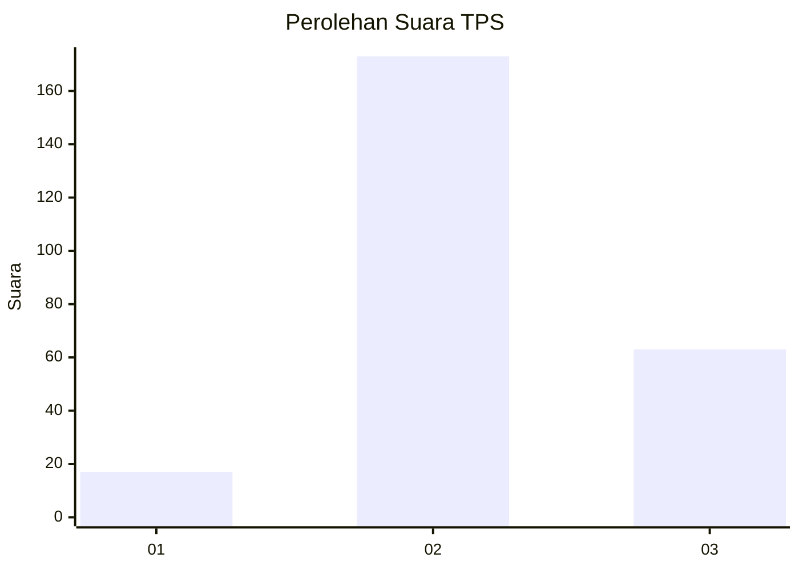
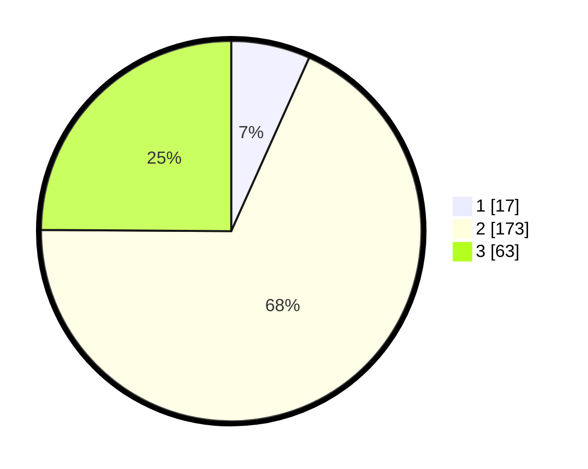

# Hasil

## Grafik

## Tabel

| No. | Nama Paslon    | Suara | Suara (raw) | Persentase |
|:--- |:-------------- | -----:| -----------:| ----------:|
| 1   | ANIES MUHAIMIN | 17    | [17][p-1]   | 6,72       |
| 2   | PRABOWO GIBRAN | 173   | [173][p-2]  | 68,38      |
| 3   | GANJAR MAHFUD  | 63    | [63][p-3]   | 24,90      |

[p-1]: https://github.com/gigit-pemilu/pemilu-2024-35-jawa-timur/blob/main/pilpres/hitung-suara/sub/35-jawa-timur/sub/20-magetan/sub/08-panekan/sub/2017-jabung/sub/007-tps/sub/paslon-1.txt
[p-2]: https://github.com/gigit-pemilu/pemilu-2024-35-jawa-timur/blob/main/pilpres/hitung-suara/sub/35-jawa-timur/sub/20-magetan/sub/08-panekan/sub/2017-jabung/sub/007-tps/sub/paslon-2.txt
[p-3]: https://github.com/gigit-pemilu/pemilu-2024-35-jawa-timur/blob/main/pilpres/hitung-suara/sub/35-jawa-timur/sub/20-magetan/sub/08-panekan/sub/2017-jabung/sub/007-tps/sub/paslon-3.txt

## Foto C Plano

https://sirekap-obj-formc.kpu.go.id/394e/pemilu/ppwp/35/20/08/20/17/3520082017007-20240214-234427--2c7e7eec-2a87-402f-abd5-0ec52d2c801b.jpg

https://sirekap-obj-formc.kpu.go.id/394e/pemilu/ppwp/35/20/08/20/17/3520082017007-20240214-234532--9c2d9121-0550-48bd-9cd0-85c745da2287.jpg

https://sirekap-obj-formc.kpu.go.id/394e/pemilu/ppwp/35/20/08/20/17/3520082017007-20240214-234635--bf035118-01eb-4dc9-8dbc-a82d762ce23c.jpg

## Metadata

| Key        | Value               |
| ---------- | ------------------- |
| Time Stamp | 2024-02-22 15:00:00 |

