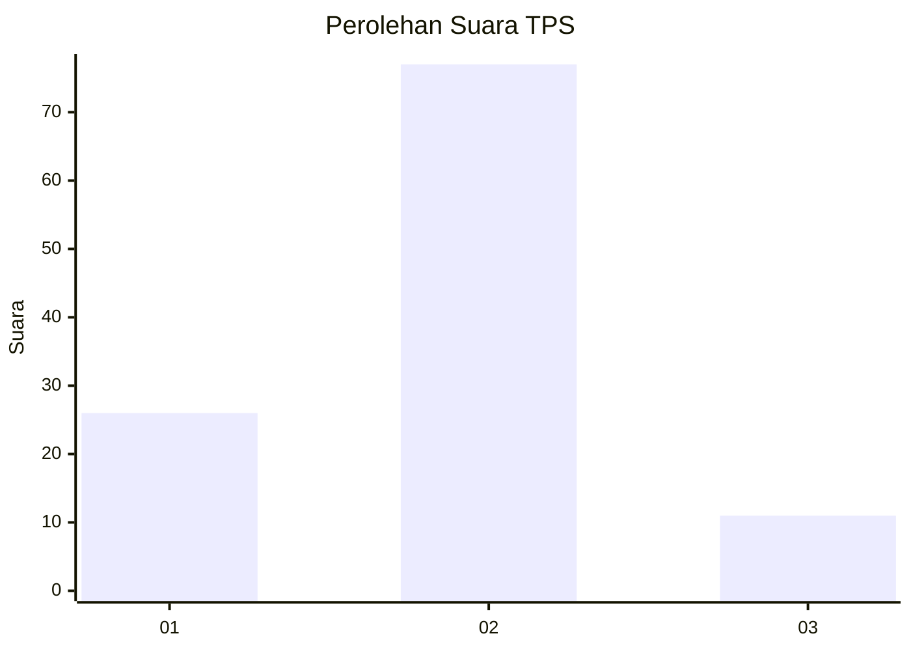

# Hasil

## Grafik

## Tabel

| No. | Nama Paslon    | Suara | Suara (raw) | Persentase |
|:--- |:-------------- | -----:| -----------:| ----------:|
| 1   | ANIES MUHAIMIN | 26    | [26][p-1]   | 22,81      |
| 2   | PRABOWO GIBRAN | 77    | [77][p-2]   | 67,54      |
| 3   | GANJAR MAHFUD  | 11    | [11][p-3]   | 9,65       |

[p-1]: https://github.com/gigit-pemilu/pemilu-2024-35-jawa-timur/blob/main/pilpres/hitung-suara/sub/35-jawa-timur/sub/20-magetan/sub/08-panekan/sub/2018-rejomulyo/sub/002-tps/sub/paslon-1.txt
[p-2]: https://github.com/gigit-pemilu/pemilu-2024-35-jawa-timur/blob/main/pilpres/hitung-suara/sub/35-jawa-timur/sub/20-magetan/sub/08-panekan/sub/2018-rejomulyo/sub/002-tps/sub/paslon-2.txt
[p-3]: https://github.com/gigit-pemilu/pemilu-2024-35-jawa-timur/blob/main/pilpres/hitung-suara/sub/35-jawa-timur/sub/20-magetan/sub/08-panekan/sub/2018-rejomulyo/sub/002-tps/sub/paslon-3.txt

## Foto C Plano

https://sirekap-obj-formc.kpu.go.id/0eb2/pemilu/ppwp/35/20/08/20/18/3520082018002-20240215-000718--438fee7b-4a33-48d3-8f19-7c1b9e78ec55.jpg

https://sirekap-obj-formc.kpu.go.id/0eb2/pemilu/ppwp/35/20/08/20/18/3520082018002-20240215-000831--2c4a1bcd-4d1e-44d3-983e-43086831e275.jpg

https://sirekap-obj-formc.kpu.go.id/0eb2/pemilu/ppwp/35/20/08/20/18/3520082018002-20240215-000950--819a1a0a-8aa8-47bb-8f07-c262a0e17592.jpg

## Metadata

| Key        | Value               |
| ---------- | ------------------- |
| Time Stamp | 2024-02-22 15:00:00 |

