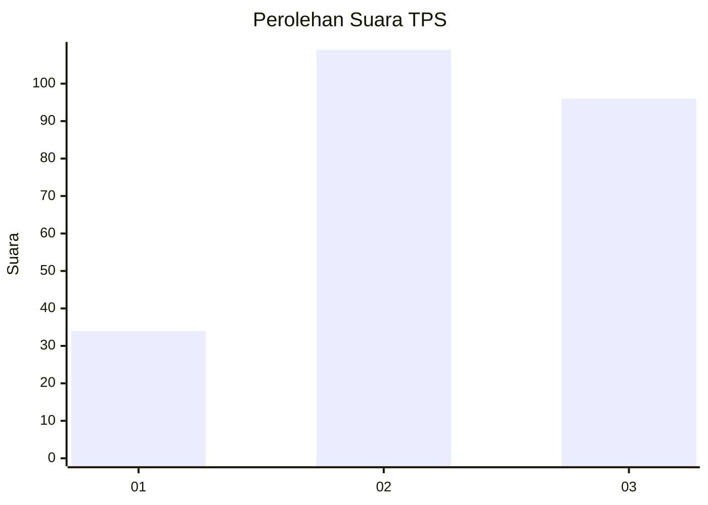
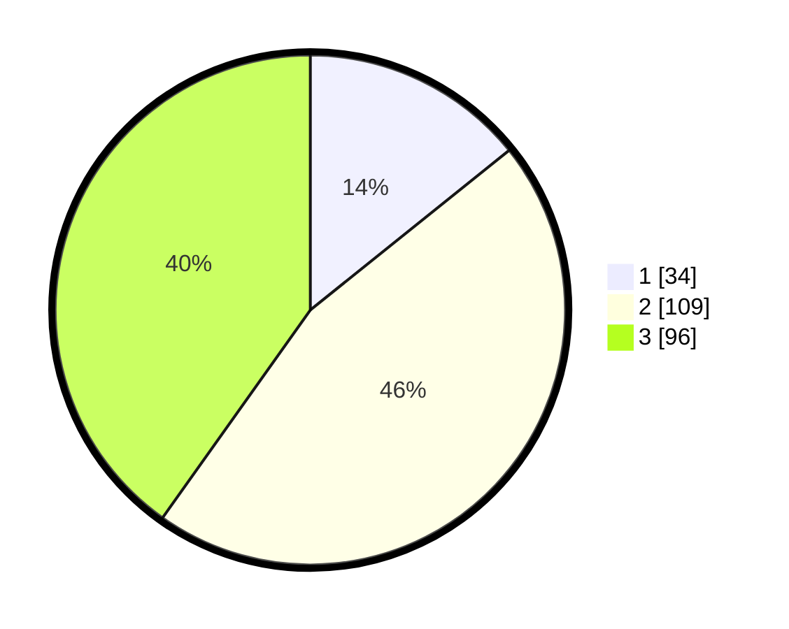

# Hasil

## Grafik

## Tabel

| No. | Nama Paslon    | Suara | Suara (raw) | Persentase |
|:--- |:-------------- | -----:| -----------:| ----------:|
| 1   | ANIES MUHAIMIN | 34    | [34][p-1]   | 14,23      |
| 2   | PRABOWO GIBRAN | 109   | [109][p-2]  | 45,61      |
| 3   | GANJAR MAHFUD  | 96    | [96][p-3]   | 40,17      |

[p-1]: https://github.com/gigit-pemilu/pemilu-2024-35-jawa-timur/blob/main/pilpres/hitung-suara/sub/35-jawa-timur/sub/20-magetan/sub/08-panekan/sub/2019-turi/sub/011-tps/sub/paslon-1.txt
[p-2]: https://github.com/gigit-pemilu/pemilu-2024-35-jawa-timur/blob/main/pilpres/hitung-suara/sub/35-jawa-timur/sub/20-magetan/sub/08-panekan/sub/2019-turi/sub/011-tps/sub/paslon-2.txt
[p-3]: https://github.com/gigit-pemilu/pemilu-2024-35-jawa-timur/blob/main/pilpres/hitung-suara/sub/35-jawa-timur/sub/20-magetan/sub/08-panekan/sub/2019-turi/sub/011-tps/sub/paslon-3.txt

## Foto C Plano

https://sirekap-obj-formc.kpu.go.id/deaf/pemilu/ppwp/35/20/08/20/19/3520082019011-20240214-185741--5e270dcb-c6da-4e31-91c6-efee7cf0bae5.jpg

https://sirekap-obj-formc.kpu.go.id/deaf/pemilu/ppwp/35/20/08/20/19/3520082019011-20240214-224945--91748e87-8a2a-45bd-abe9-a432c1d9224a.jpg

https://sirekap-obj-formc.kpu.go.id/deaf/pemilu/ppwp/35/20/08/20/19/3520082019011-20240214-185759--9f3691d3-8dd8-42f4-87aa-e2db81acd6ae.jpg

## Metadata

| Key        | Value               |
| ---------- | ------------------- |
| Time Stamp | 2024-02-22 15:00:00 |

