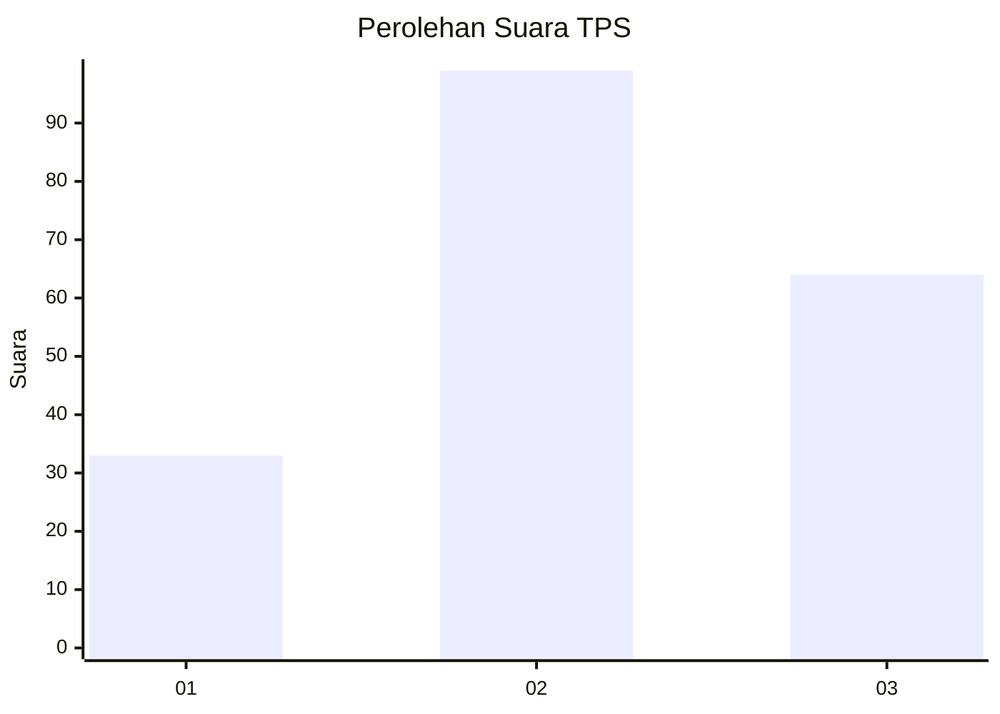
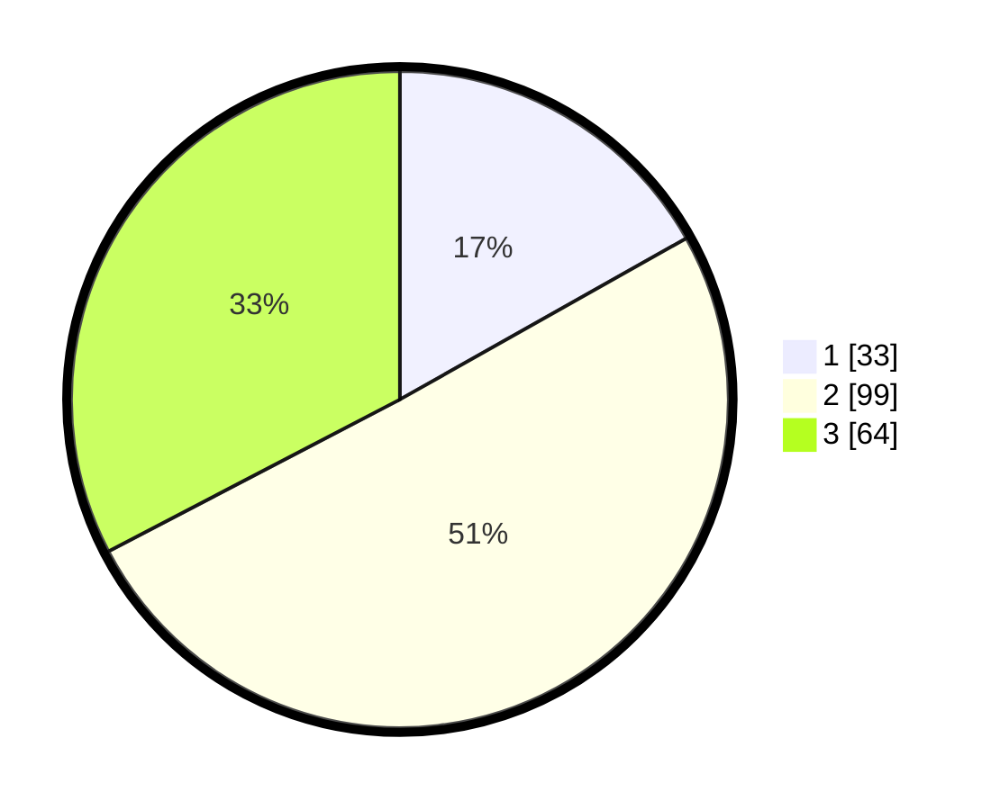

# Hasil

## Grafik

## Tabel

| No. | Nama Paslon    | Suara | Suara (raw) | Persentase |
|:--- |:-------------- | -----:| -----------:| ----------:|
| 1   | ANIES MUHAIMIN | 33    | [33][p-1]   | 16,84      |
| 2   | PRABOWO GIBRAN | 99    | [99][p-2]   | 50,51      |
| 3   | GANJAR MAHFUD  | 64    | [64][p-3]   | 32,65      |

[p-1]: https://github.com/gigit-pemilu/pemilu-2024/blob/main/pilpres/hitung-suara/sub/35-jawa-timur/sub/20-magetan/sub/08-panekan/sub/2019-turi/sub/016-tps/sub/paslon-1.txt
[p-2]: https://github.com/gigit-pemilu/pemilu-2024/blob/main/pilpres/hitung-suara/sub/35-jawa-timur/sub/20-magetan/sub/08-panekan/sub/2019-turi/sub/016-tps/sub/paslon-2.txt
[p-3]: https://github.com/gigit-pemilu/pemilu-2024/blob/main/pilpres/hitung-suara/sub/35-jawa-timur/sub/20-magetan/sub/08-panekan/sub/2019-turi/sub/016-tps/sub/paslon-3.txt

## Foto C Plano

https://sirekap-obj-formc.kpu.go.id/9d28/pemilu/ppwp/35/20/08/20/19/3520082019016-20240214-221916--7475b3aa-6481-49ee-bf6c-dd56fef97f3b.jpg

https://sirekap-obj-formc.kpu.go.id/9d28/pemilu/ppwp/35/20/08/20/19/3520082019016-20240214-222059--9ebaccae-09e3-4561-b8dc-811d98b95ee4.jpg

https://sirekap-obj-formc.kpu.go.id/9d28/pemilu/ppwp/35/20/08/20/19/3520082019016-20240214-222219--60d47805-12e9-49c5-88e5-ee2830caa9e3.jpg

## Metadata

| Key        | Value               |
| ---------- | ------------------- |
| Time Stamp | 2024-02-22 15:00:00 |

