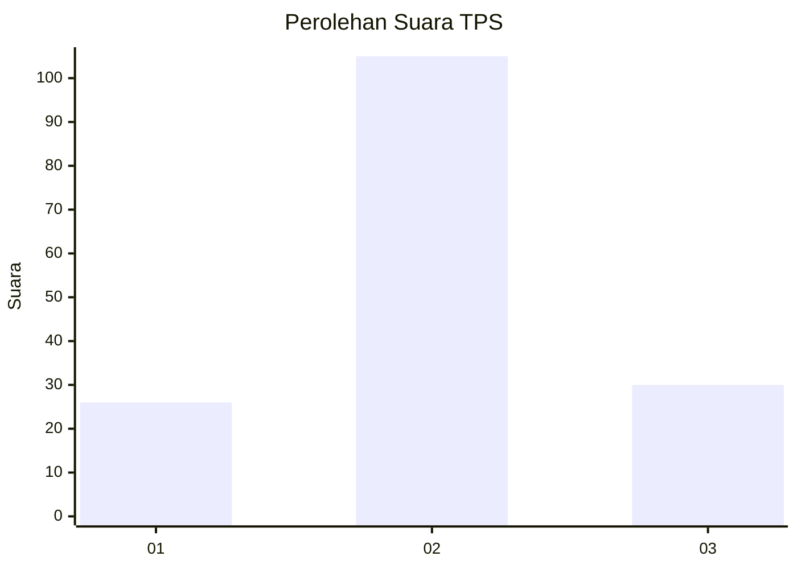
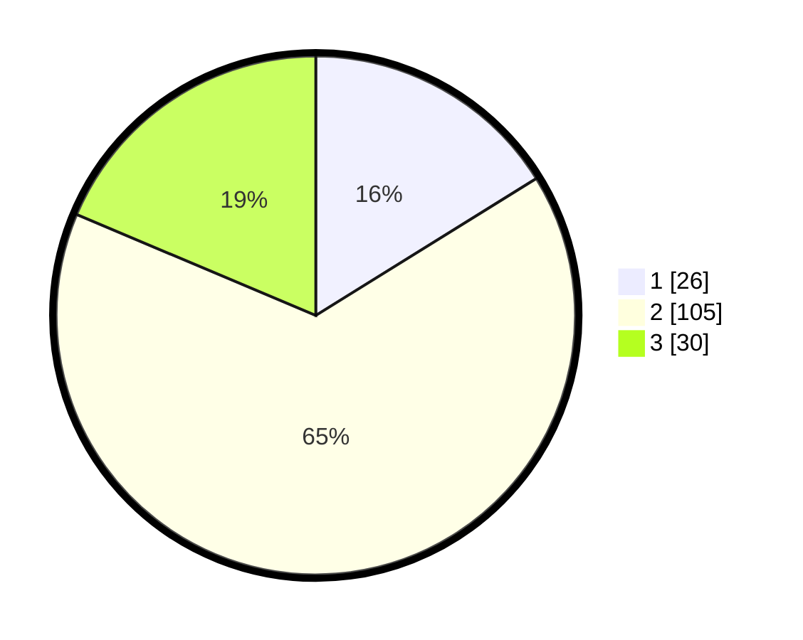

# Hasil

## Grafik

## Tabel

| No. | Nama Paslon    | Suara | Suara (raw) | Persentase |
|:--- |:-------------- | -----:| -----------:| ----------:|
| 1   | ANIES MUHAIMIN | 26    | [26][p-1]   | 16,15      |
| 2   | PRABOWO GIBRAN | 105   | [105][p-2]  | 65,22      |
| 3   | GANJAR MAHFUD  | 30    | [30][p-3]   | 18,63      |

[p-1]: https://github.com/gigit-pemilu/pemilu-2024-35-jawa-timur/blob/main/pilpres/hitung-suara/sub/35-jawa-timur/sub/20-magetan/sub/09-sukomoro/sub/2001-kalangketi/sub/004-tps/sub/paslon-1.txt
[p-2]: https://github.com/gigit-pemilu/pemilu-2024-35-jawa-timur/blob/main/pilpres/hitung-suara/sub/35-jawa-timur/sub/20-magetan/sub/09-sukomoro/sub/2001-kalangketi/sub/004-tps/sub/paslon-2.txt
[p-3]: https://github.com/gigit-pemilu/pemilu-2024-35-jawa-timur/blob/main/pilpres/hitung-suara/sub/35-jawa-timur/sub/20-magetan/sub/09-sukomoro/sub/2001-kalangketi/sub/004-tps/sub/paslon-3.txt

## Foto C Plano

https://sirekap-obj-formc.kpu.go.id/5327/pemilu/ppwp/35/20/09/20/01/3520092001004-20240215-000024--33aec8e6-1733-4bba-871a-c0b8f2485e1d.jpg

https://sirekap-obj-formc.kpu.go.id/5327/pemilu/ppwp/35/20/09/20/01/3520092001004-20240214-231410--49f1443d-1351-42f7-aee3-6549b3c6c7ea.jpg

https://sirekap-obj-formc.kpu.go.id/5327/pemilu/ppwp/35/20/09/20/01/3520092001004-20240215-000246--c874a450-547f-42fd-a4d2-bd8785b9ecfd.jpg

## Metadata

| Key        | Value               |
| ---------- | ------------------- |
| Time Stamp | 2024-02-22 15:00:00 |

