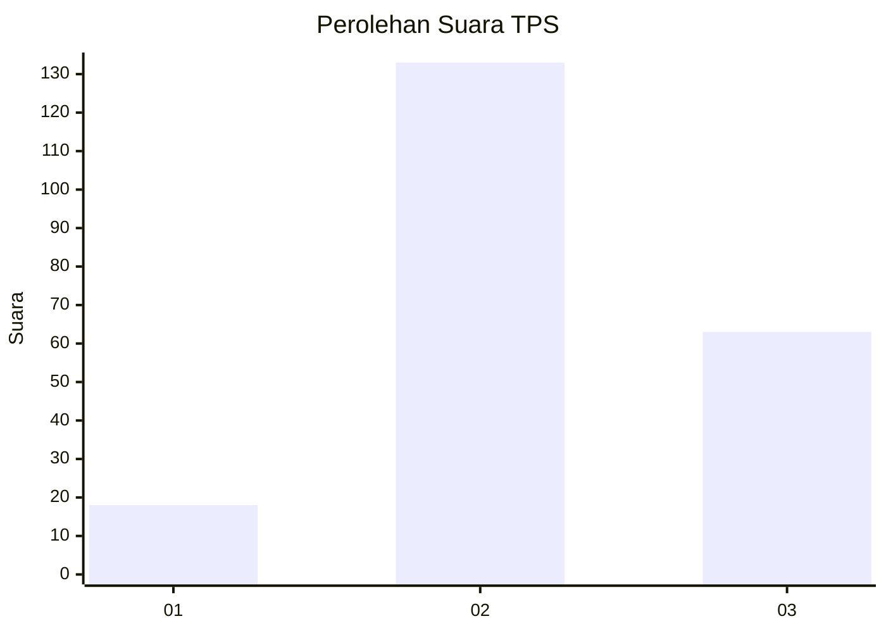
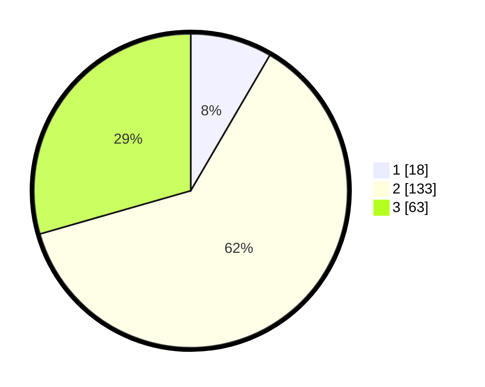

# Hasil

## Grafik

## Tabel

| No. | Nama Paslon    | Suara | Suara (raw) | Persentase |
|:--- |:-------------- | -----:| -----------:| ----------:|
| 1   | ANIES MUHAIMIN | 18    | [18][p-1]   | 8,41       |
| 2   | PRABOWO GIBRAN | 133   | [133][p-2]  | 62,15      |
| 3   | GANJAR MAHFUD  | 63    | [63][p-3]   | 29,44      |

[p-1]: https://github.com/gigit-pemilu/pemilu-2024/blob/main/pilpres/hitung-suara/sub/35-jawa-timur/sub/20-magetan/sub/10-bendo/sub/1012-bendo/sub/002-tps/sub/paslon-1.txt
[p-2]: https://github.com/gigit-pemilu/pemilu-2024/blob/main/pilpres/hitung-suara/sub/35-jawa-timur/sub/20-magetan/sub/10-bendo/sub/1012-bendo/sub/002-tps/sub/paslon-2.txt
[p-3]: https://github.com/gigit-pemilu/pemilu-2024/blob/main/pilpres/hitung-suara/sub/35-jawa-timur/sub/20-magetan/sub/10-bendo/sub/1012-bendo/sub/002-tps/sub/paslon-3.txt

## Foto C Plano

https://sirekap-obj-formc.kpu.go.id/d81d/pemilu/ppwp/35/20/10/10/12/3520101012002-20240215-034419--8d73be84-b044-4358-968a-75601566f247.jpg

https://sirekap-obj-formc.kpu.go.id/d81d/pemilu/ppwp/35/20/10/10/12/3520101012002-20240215-034806--a9fd5302-b14a-4411-9ff0-45f65abee764.jpg

https://sirekap-obj-formc.kpu.go.id/d81d/pemilu/ppwp/35/20/10/10/12/3520101012002-20240215-035033--bc2c24eb-0e85-4271-837e-5f5bf5f7d96a.jpg

## Metadata

| Key        | Value               |
| ---------- | ------------------- |
| Time Stamp | 2024-02-22 12:00:00 |

