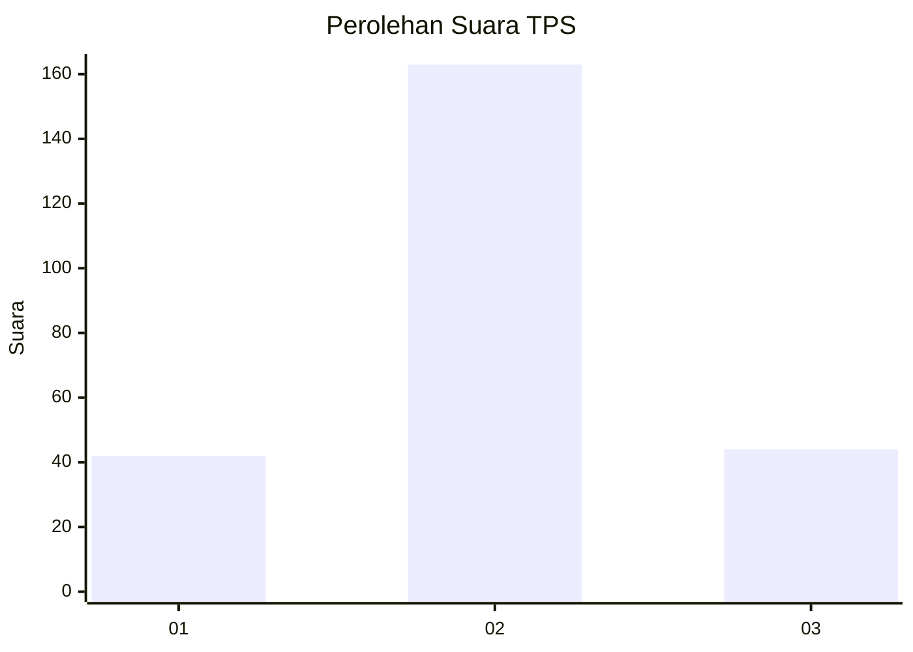
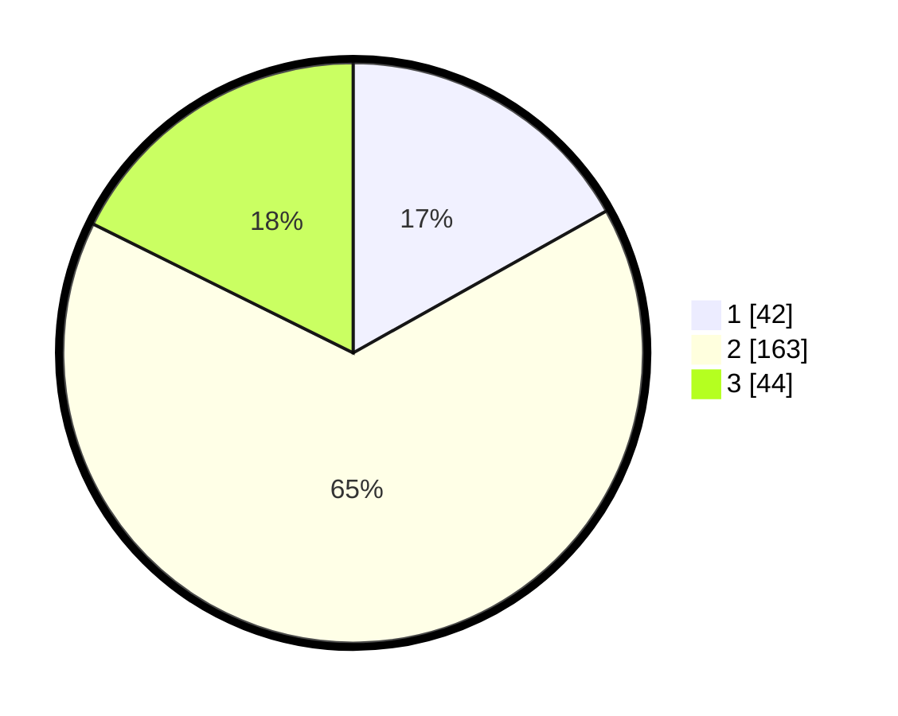

# Hasil

## Grafik

## Tabel

| No. | Nama Paslon    | Suara | Suara (raw) | Persentase |
|:--- |:-------------- | -----:| -----------:| ----------:|
| 1   | ANIES MUHAIMIN | 42    | [42][p-1]   | 16,87      |
| 2   | PRABOWO GIBRAN | 163   | [163][p-2]  | 65,46      |
| 3   | GANJAR MAHFUD  | 44    | [44][p-3]   | 17,67      |

[p-1]: https://github.com/gigit-pemilu/pemilu-2024/blob/main/pilpres/hitung-suara/sub/35-jawa-timur/sub/20-magetan/sub/10-bendo/sub/2002-belotan/sub/008-tps/sub/paslon-1.txt
[p-2]: https://github.com/gigit-pemilu/pemilu-2024/blob/main/pilpres/hitung-suara/sub/35-jawa-timur/sub/20-magetan/sub/10-bendo/sub/2002-belotan/sub/008-tps/sub/paslon-2.txt
[p-3]: https://github.com/gigit-pemilu/pemilu-2024/blob/main/pilpres/hitung-suara/sub/35-jawa-timur/sub/20-magetan/sub/10-bendo/sub/2002-belotan/sub/008-tps/sub/paslon-3.txt

## Foto C Plano

https://sirekap-obj-formc.kpu.go.id/c9ce/pemilu/ppwp/35/20/10/20/02/3520102002008-20240215-141625--a56df0ed-920f-4508-a12e-8d9271e0d5ea.jpg

https://sirekap-obj-formc.kpu.go.id/c9ce/pemilu/ppwp/35/20/10/20/02/3520102002008-20240215-141725--19502800-8e19-4fee-af70-f6a9a049a9cc.jpg

https://sirekap-obj-formc.kpu.go.id/c9ce/pemilu/ppwp/35/20/10/20/02/3520102002008-20240215-141834--be66f38f-ba69-4a48-82d4-239a73a6665d.jpg

## Metadata

| Key        | Value               |
| ---------- | ------------------- |
| Time Stamp | 2024-02-22 12:00:00 |

