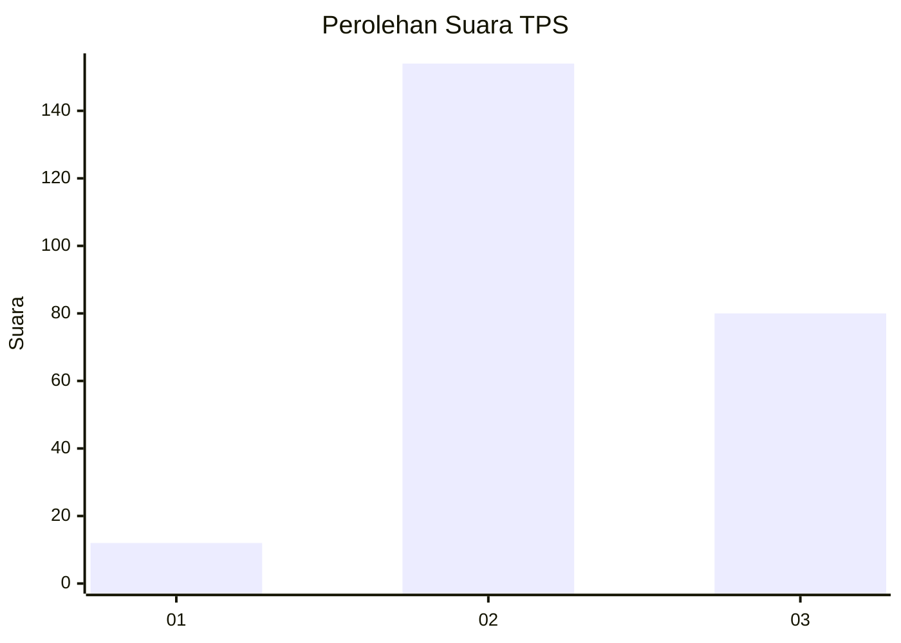
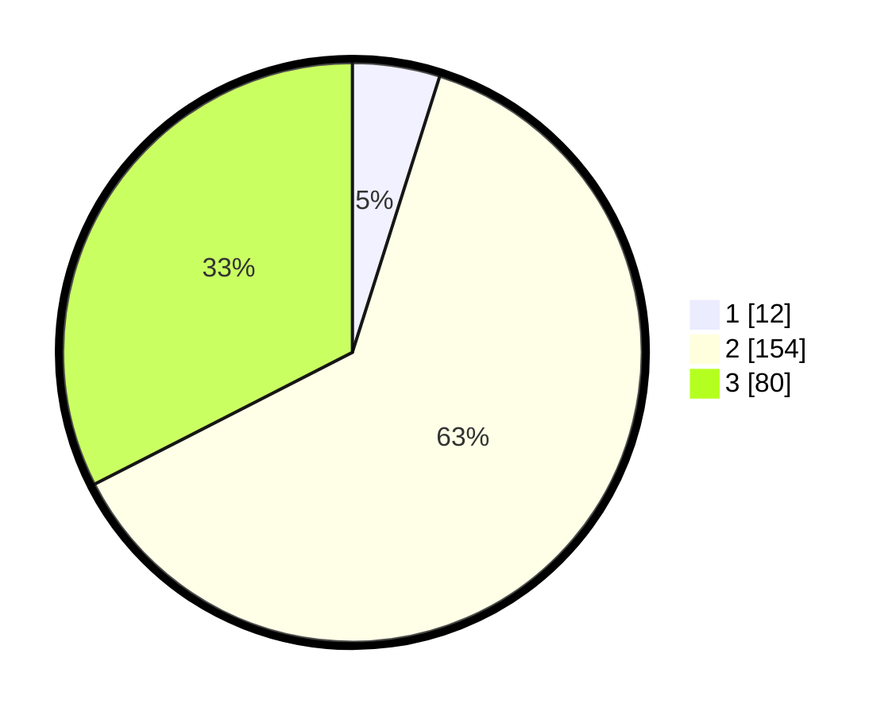

# Hasil

## Grafik

## Tabel

| No. | Nama Paslon    | Suara | Suara (raw) | Persentase |
|:--- |:-------------- | -----:| -----------:| ----------:|
| 1   | ANIES MUHAIMIN | 12    | [12][p-1]   | 4,88       |
| 2   | PRABOWO GIBRAN | 154   | [154][p-2]  | 62,60      |
| 3   | GANJAR MAHFUD  | 80    | [80][p-3]   | 32,52      |

[p-1]: https://github.com/gigit-pemilu/pemilu-2024-35-jawa-timur/blob/main/pilpres/hitung-suara/sub/35-jawa-timur/sub/20-magetan/sub/10-bendo/sub/2005-tegalarum/sub/007-tps/sub/paslon-1.txt
[p-2]: https://github.com/gigit-pemilu/pemilu-2024-35-jawa-timur/blob/main/pilpres/hitung-suara/sub/35-jawa-timur/sub/20-magetan/sub/10-bendo/sub/2005-tegalarum/sub/007-tps/sub/paslon-2.txt
[p-3]: https://github.com/gigit-pemilu/pemilu-2024-35-jawa-timur/blob/main/pilpres/hitung-suara/sub/35-jawa-timur/sub/20-magetan/sub/10-bendo/sub/2005-tegalarum/sub/007-tps/sub/paslon-3.txt

## Foto C Plano

https://sirekap-obj-formc.kpu.go.id/0f8f/pemilu/ppwp/35/20/10/20/05/3520102005007-20240215-044159--a3d7b0e0-bbed-4be9-b30a-98bd0645938f.jpg

https://sirekap-obj-formc.kpu.go.id/0f8f/pemilu/ppwp/35/20/10/20/05/3520102005007-20240215-044642--c025aba6-f11f-466b-947f-c2fa47474059.jpg

https://sirekap-obj-formc.kpu.go.id/0f8f/pemilu/ppwp/35/20/10/20/05/3520102005007-20240215-044839--ee487421-405e-4f64-a0b2-626186c09d88.jpg

## Metadata

| Key        | Value               |
| ---------- | ------------------- |
| Time Stamp | 2024-02-22 19:00:00 |

