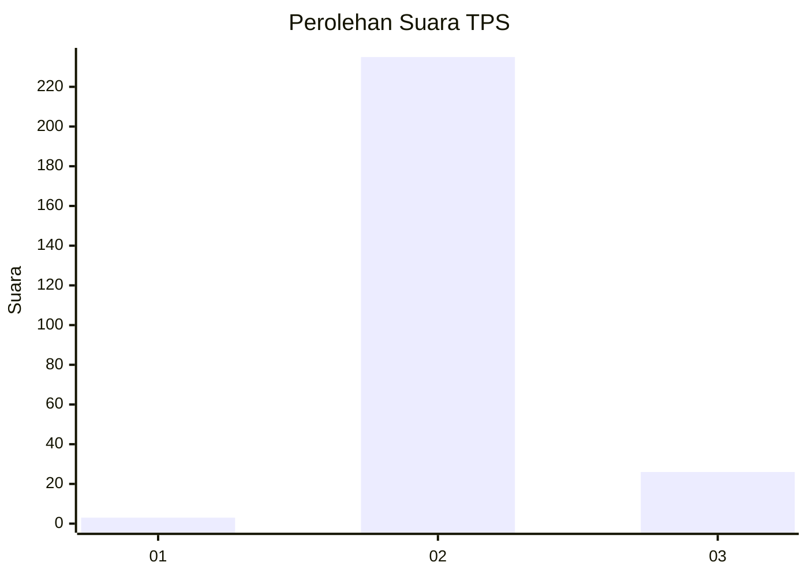
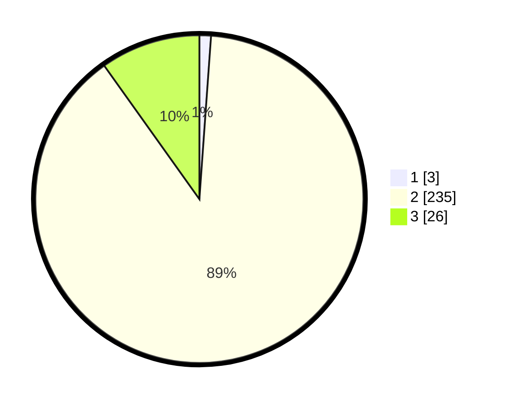

# Hasil

## Grafik

## Tabel

| No. | Nama Paslon    | Suara | Suara (raw) | Persentase |
|:--- |:-------------- | -----:| -----------:| ----------:|
| 1   | ANIES MUHAIMIN | 3     | [3][p-1]    | 1,14       |
| 2   | PRABOWO GIBRAN | 235   | [235][p-2]  | 89,02      |
| 3   | GANJAR MAHFUD  | 26    | [26][p-3]   | 9,85       |

[p-1]: https://github.com/gigit-pemilu/pemilu-2024-35-jawa-timur/blob/main/pilpres/hitung-suara/sub/35-jawa-timur/sub/20-magetan/sub/10-bendo/sub/2007-kinandang/sub/001-tps/sub/paslon-1.txt
[p-2]: https://github.com/gigit-pemilu/pemilu-2024-35-jawa-timur/blob/main/pilpres/hitung-suara/sub/35-jawa-timur/sub/20-magetan/sub/10-bendo/sub/2007-kinandang/sub/001-tps/sub/paslon-2.txt
[p-3]: https://github.com/gigit-pemilu/pemilu-2024-35-jawa-timur/blob/main/pilpres/hitung-suara/sub/35-jawa-timur/sub/20-magetan/sub/10-bendo/sub/2007-kinandang/sub/001-tps/sub/paslon-3.txt

## Foto C Plano

https://sirekap-obj-formc.kpu.go.id/494e/pemilu/ppwp/35/20/10/20/07/3520102007001-20240214-213834--a3bb126f-5168-45b7-b55d-26adc566321c.jpg

https://sirekap-obj-formc.kpu.go.id/494e/pemilu/ppwp/35/20/10/20/07/3520102007001-20240215-020756--1fe790a5-03c6-4bae-92cc-2fbaf3d6feee.jpg

https://sirekap-obj-formc.kpu.go.id/494e/pemilu/ppwp/35/20/10/20/07/3520102007001-20240214-213839--57320570-feba-4a13-a127-e131af405add.jpg

## Metadata

| Key        | Value               |
| ---------- | ------------------- |
| Time Stamp | 2024-02-22 19:00:00 |

