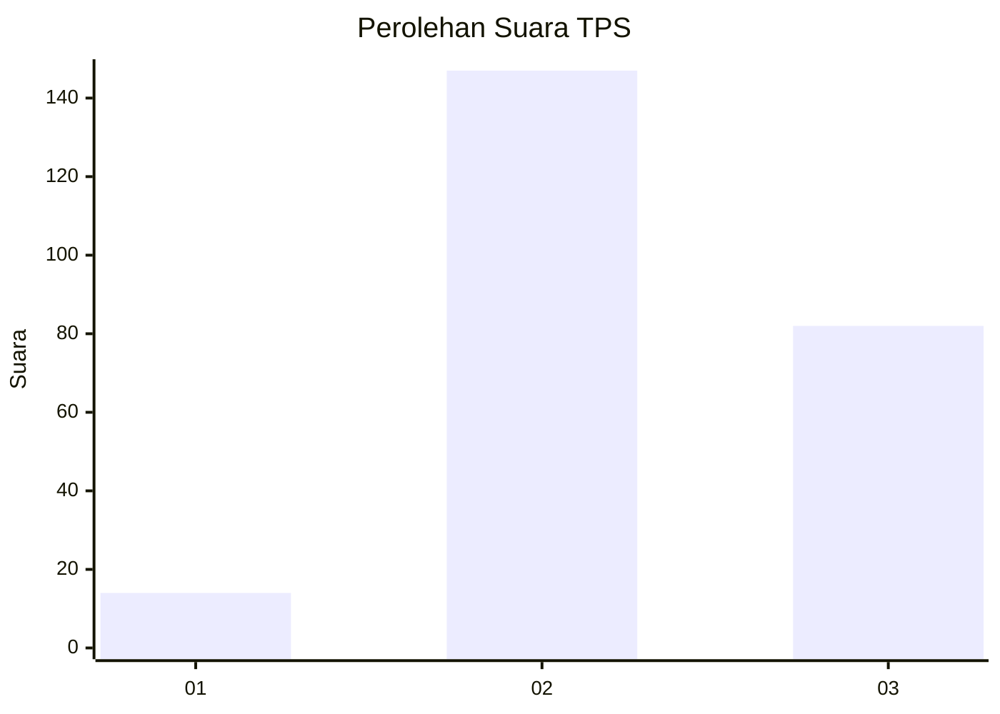
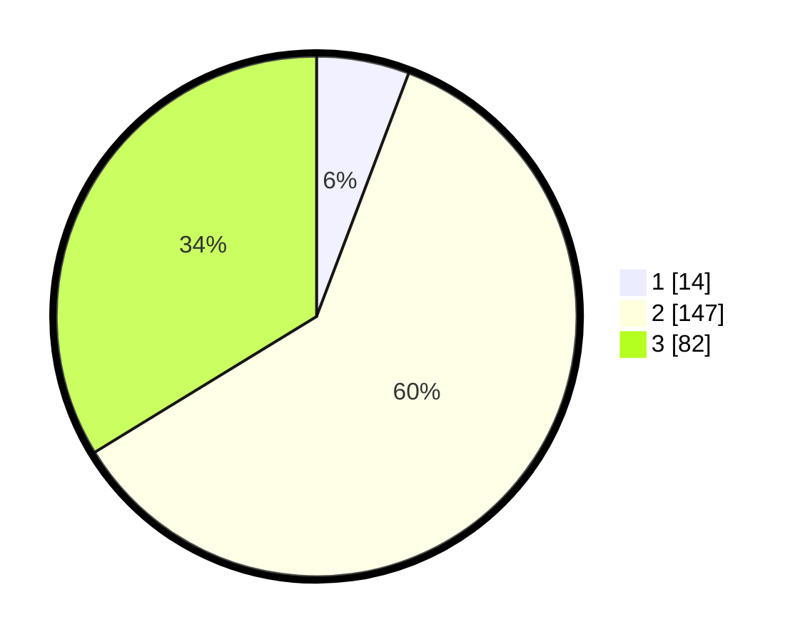

# Hasil

## Grafik

## Tabel

| No. | Nama Paslon    | Suara | Suara (raw) | Persentase |
|:--- |:-------------- | -----:| -----------:| ----------:|
| 1   | ANIES MUHAIMIN | 14    | [14][p-1]   | 5,76       |
| 2   | PRABOWO GIBRAN | 147   | [147][p-2]  | 60,49      |
| 3   | GANJAR MAHFUD  | 82    | [82][p-3]   | 33,74      |

[p-1]: https://github.com/gigit-pemilu/pemilu-2024/blob/main/pilpres/hitung-suara/sub/35-jawa-timur/sub/20-magetan/sub/10-bendo/sub/2014-duwet/sub/005-tps/sub/paslon-1.txt
[p-2]: https://github.com/gigit-pemilu/pemilu-2024/blob/main/pilpres/hitung-suara/sub/35-jawa-timur/sub/20-magetan/sub/10-bendo/sub/2014-duwet/sub/005-tps/sub/paslon-2.txt
[p-3]: https://github.com/gigit-pemilu/pemilu-2024/blob/main/pilpres/hitung-suara/sub/35-jawa-timur/sub/20-magetan/sub/10-bendo/sub/2014-duwet/sub/005-tps/sub/paslon-3.txt

## Foto C Plano

https://sirekap-obj-formc.kpu.go.id/4be5/pemilu/ppwp/35/20/10/20/14/3520102014005-20240214-205513--c2555d8d-ad19-4852-9572-8b97c91b4da1.jpg

https://sirekap-obj-formc.kpu.go.id/4be5/pemilu/ppwp/35/20/10/20/14/3520102014005-20240214-205549--f73f8cd3-8d4c-41ca-a924-4209cf5c6208.jpg

https://sirekap-obj-formc.kpu.go.id/4be5/pemilu/ppwp/35/20/10/20/14/3520102014005-20240214-205621--7e3e742d-1ae0-4c74-8f40-34f437fe3c80.jpg

## Metadata

| Key        | Value               |
| ---------- | ------------------- |
| Time Stamp | 2024-02-22 20:00:00 |

