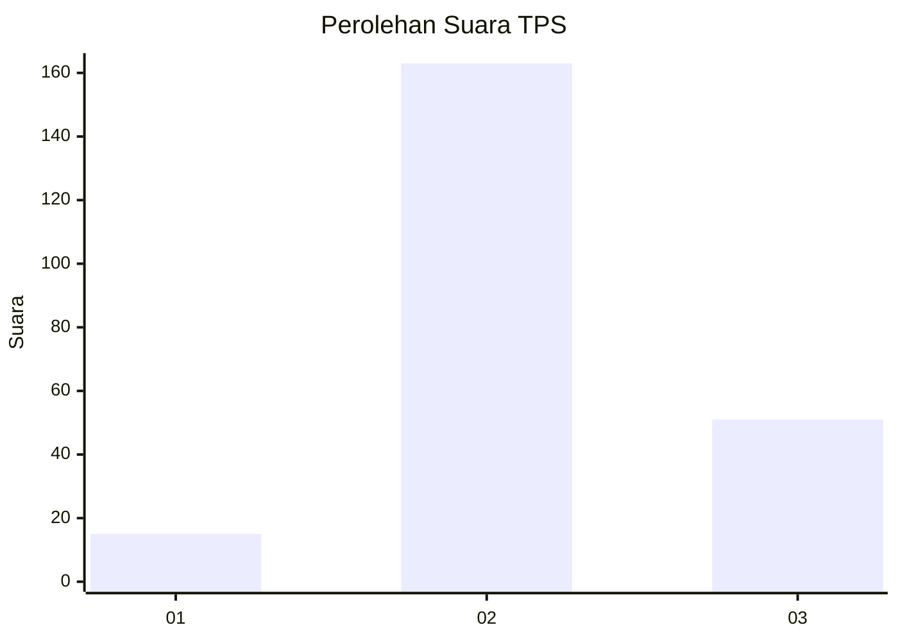
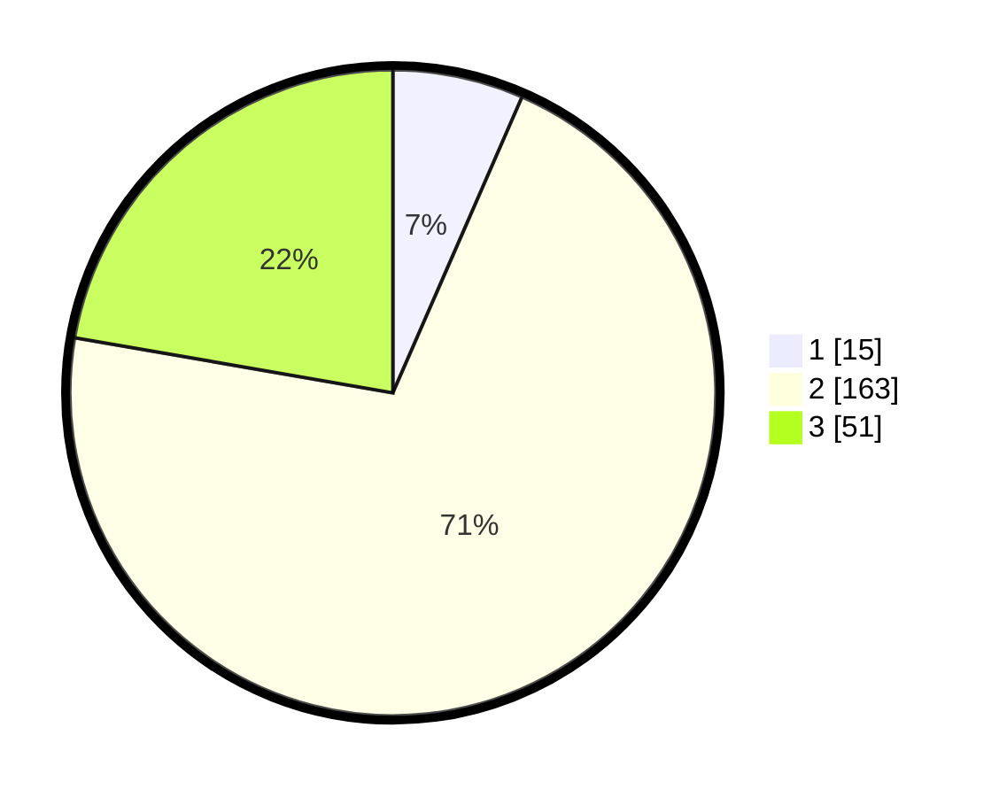

# Hasil

## Grafik

## Tabel

| No. | Nama Paslon    | Suara | Suara (raw) | Persentase |
|:--- |:-------------- | -----:| -----------:| ----------:|
| 1   | ANIES MUHAIMIN | 15    | [15][p-1]   | 6,55       |
| 2   | PRABOWO GIBRAN | 163   | [163][p-2]  | 71,18      |
| 3   | GANJAR MAHFUD  | 51    | [51][p-3]   | 22,27      |

[p-1]: https://github.com/gigit-pemilu/pemilu-2024/blob/main/pilpres/hitung-suara/sub/35-jawa-timur/sub/20-magetan/sub/10-bendo/sub/2015-setren/sub/006-tps/sub/paslon-1.txt
[p-2]: https://github.com/gigit-pemilu/pemilu-2024/blob/main/pilpres/hitung-suara/sub/35-jawa-timur/sub/20-magetan/sub/10-bendo/sub/2015-setren/sub/006-tps/sub/paslon-2.txt
[p-3]: https://github.com/gigit-pemilu/pemilu-2024/blob/main/pilpres/hitung-suara/sub/35-jawa-timur/sub/20-magetan/sub/10-bendo/sub/2015-setren/sub/006-tps/sub/paslon-3.txt

## Foto C Plano

https://sirekap-obj-formc.kpu.go.id/9cf0/pemilu/ppwp/35/20/10/20/15/3520102015006-20240215-022600--1a9f4c55-6463-411c-8aa5-1256750ea4ec.jpg

https://sirekap-obj-formc.kpu.go.id/9cf0/pemilu/ppwp/35/20/10/20/15/3520102015006-20240214-203454--7b3b99e0-24f7-4f0d-b7d3-0edb38f6787f.jpg

https://sirekap-obj-formc.kpu.go.id/9cf0/pemilu/ppwp/35/20/10/20/15/3520102015006-20240215-022432--8ff27ac0-c363-4a39-9d13-53225d7e2dcc.jpg

## Metadata

| Key        | Value               |
| ---------- | ------------------- |
| Time Stamp | 2024-02-15 12:00:28 |

