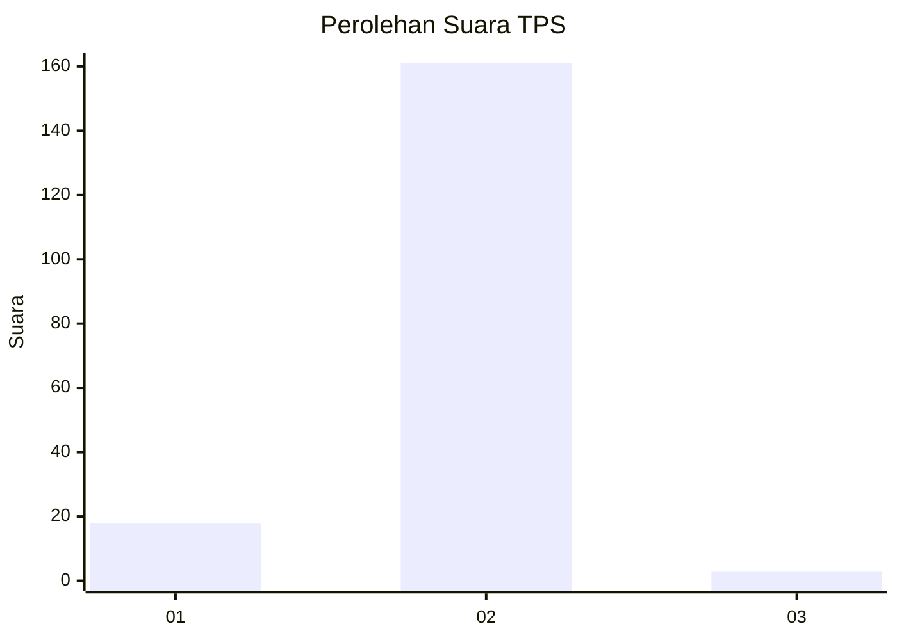
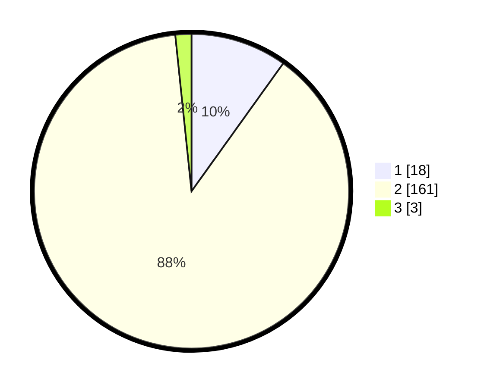

# Hasil

## Grafik

## Tabel

| No. | Nama Paslon    | Suara | Suara (raw) | Persentase |
|:--- |:-------------- | -----:| -----------:| ----------:|
| 1   | ANIES MUHAIMIN | 18    | [18][p-1]   | 9,89       |
| 2   | PRABOWO GIBRAN | 161   | [161][p-2]  | 88,46      |
| 3   | GANJAR MAHFUD  | 3     | [3][p-3]    | 1,65       |

[p-1]: https://github.com/gigit-pemilu/pemilu-2024/blob/main/pilpres/hitung-suara/sub/35-jawa-timur/sub/20-magetan/sub/11-maospati/sub/1005-maospati/sub/003-tps/sub/paslon-1.txt
[p-2]: https://github.com/gigit-pemilu/pemilu-2024/blob/main/pilpres/hitung-suara/sub/35-jawa-timur/sub/20-magetan/sub/11-maospati/sub/1005-maospati/sub/003-tps/sub/paslon-2.txt
[p-3]: https://github.com/gigit-pemilu/pemilu-2024/blob/main/pilpres/hitung-suara/sub/35-jawa-timur/sub/20-magetan/sub/11-maospati/sub/1005-maospati/sub/003-tps/sub/paslon-3.txt

## Foto C Plano

https://sirekap-obj-formc.kpu.go.id/0742/pemilu/ppwp/35/20/11/10/05/3520111005003-20240214-201719--68e72b83-4510-4f79-a67b-b79d84ec996a.jpg

https://sirekap-obj-formc.kpu.go.id/0742/pemilu/ppwp/35/20/11/10/05/3520111005003-20240214-202137--08c8bebc-e274-471f-8cae-bd72b41b3645.jpg

https://sirekap-obj-formc.kpu.go.id/0742/pemilu/ppwp/35/20/11/10/05/3520111005003-20240214-210736--c1f6579d-3753-4f0b-aeae-88edfebbebed.jpg

## Metadata

| Key        | Value               |
| ---------- | ------------------- |
| Time Stamp | 2024-02-16 00:30:27 |

## DATA PEMILIH TETAP

Jumlah pemilih dalam DPT: **243**.
 * L: **57**.
 * P: **186**.

## DATA PENGGUNA HAK PILIH

Jumlah pengguna hak pilih dalam DPT: **163**.
 * L: **34**.
 * P: **129**.

Jumlah pengguna hak pilih dalam DPTb: **8**.
 * L: **1**.
 * P: **7**.

Jumlah pengguna hak pilih dalam DPK: **11**.
 * L: **1**.
 * P: **10**.

Jumlah pengguna hak pilih: **182**.
 * L: **36**.
 * P: **146**.

## JUMLAH SUARA SAH DAN TIDAK SAH

JUMLAH SELURUH SUARA SAH: **182**.

JUMLAH SUARA TIDAK SAH: **0**.

JUMLAH SELURUH SUARA SAH DAN SUARA TIDAK SAH: **182**.

