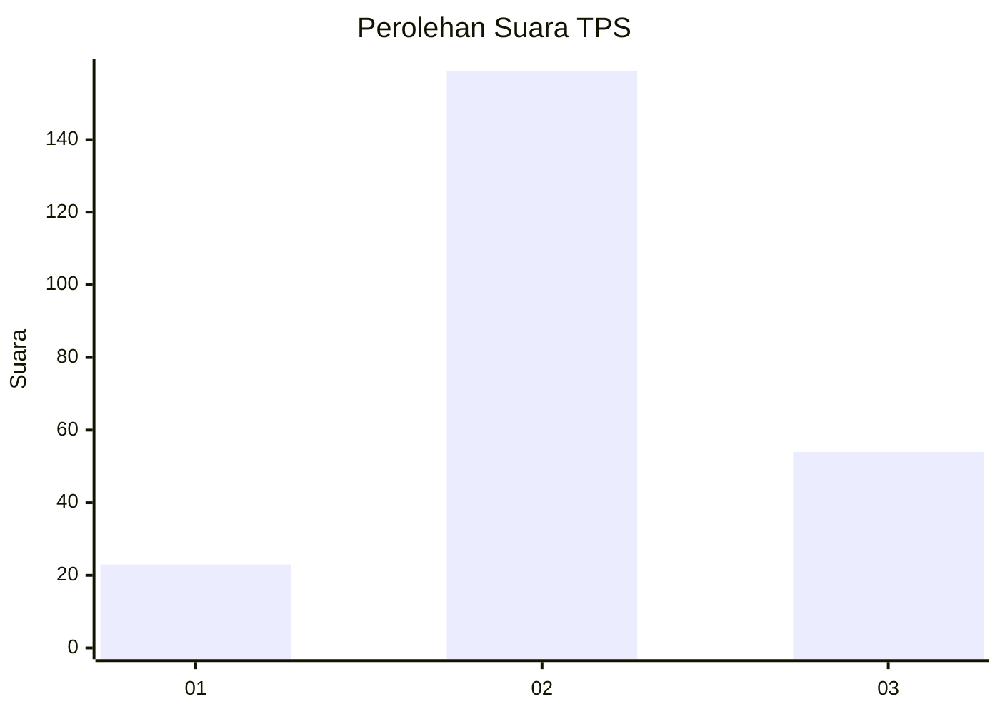
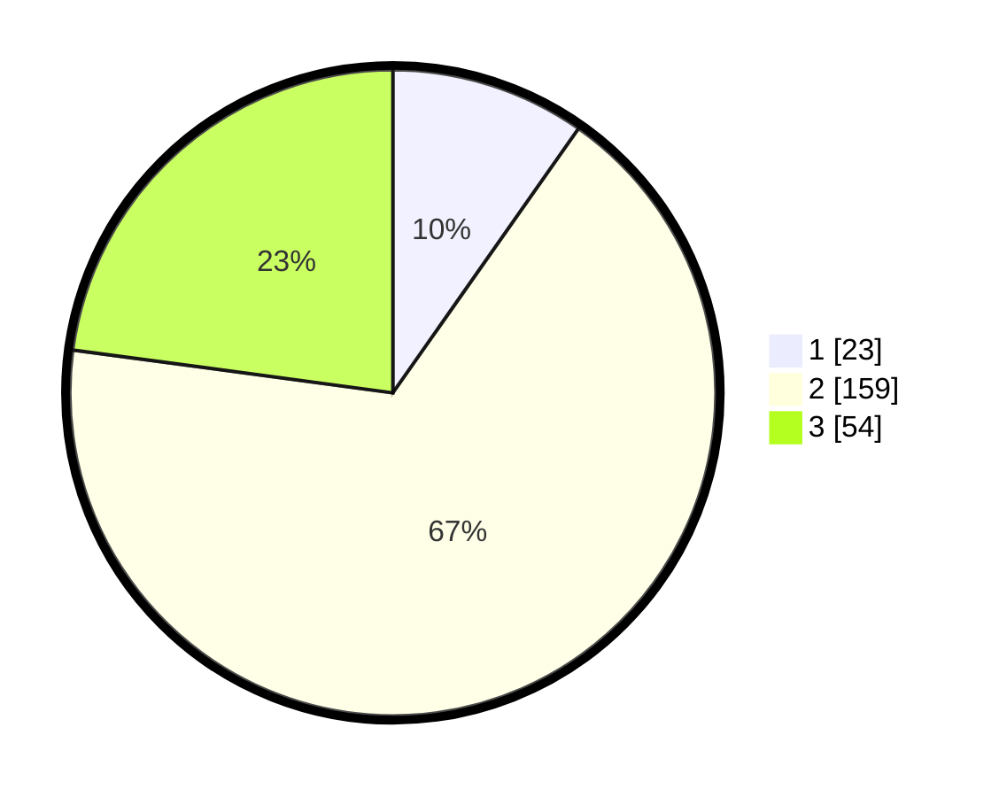

# Hasil

## Grafik

## Tabel

| No. | Nama Paslon    | Suara | Suara (raw) | Persentase |
|:--- |:-------------- | -----:| -----------:| ----------:|
| 1   | ANIES MUHAIMIN | 23    | [23][p-1]   | 9,75       |
| 2   | PRABOWO GIBRAN | 159   | [159][p-2]  | 67,37      |
| 3   | GANJAR MAHFUD  | 54    | [54][p-3]   | 22,88      |

[p-1]: https://github.com/gigit-pemilu/pemilu-2024/blob/main/pilpres/hitung-suara/sub/35-jawa-timur/sub/20-magetan/sub/11-maospati/sub/1005-maospati/sub/005-tps/sub/paslon-1.txt
[p-2]: https://github.com/gigit-pemilu/pemilu-2024/blob/main/pilpres/hitung-suara/sub/35-jawa-timur/sub/20-magetan/sub/11-maospati/sub/1005-maospati/sub/005-tps/sub/paslon-2.txt
[p-3]: https://github.com/gigit-pemilu/pemilu-2024/blob/main/pilpres/hitung-suara/sub/35-jawa-timur/sub/20-magetan/sub/11-maospati/sub/1005-maospati/sub/005-tps/sub/paslon-3.txt

## Foto C Plano

https://sirekap-obj-formc.kpu.go.id/d58e/pemilu/ppwp/35/20/11/10/05/3520111005005-20240218-004413--56ae77e1-1c1a-4196-862f-be4bc48736ac.jpg

https://sirekap-obj-formc.kpu.go.id/d58e/pemilu/ppwp/35/20/11/10/05/3520111005005-20240218-004505--3a8a175b-f5c1-43ee-aa94-540502a63baf.jpg

https://sirekap-obj-formc.kpu.go.id/d58e/pemilu/ppwp/35/20/11/10/05/3520111005005-20240217-205912--7cd3e330-0dbe-42e7-8cae-9fa32a432572.jpg

## Metadata

| Key        | Value               |
| ---------- | ------------------- |
| Time Stamp | 2024-02-22 12:00:00 |

