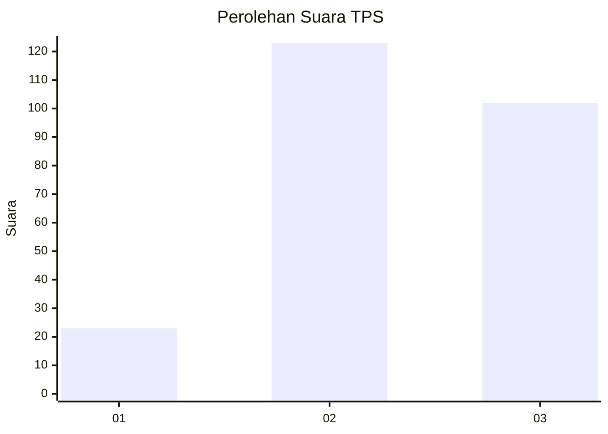
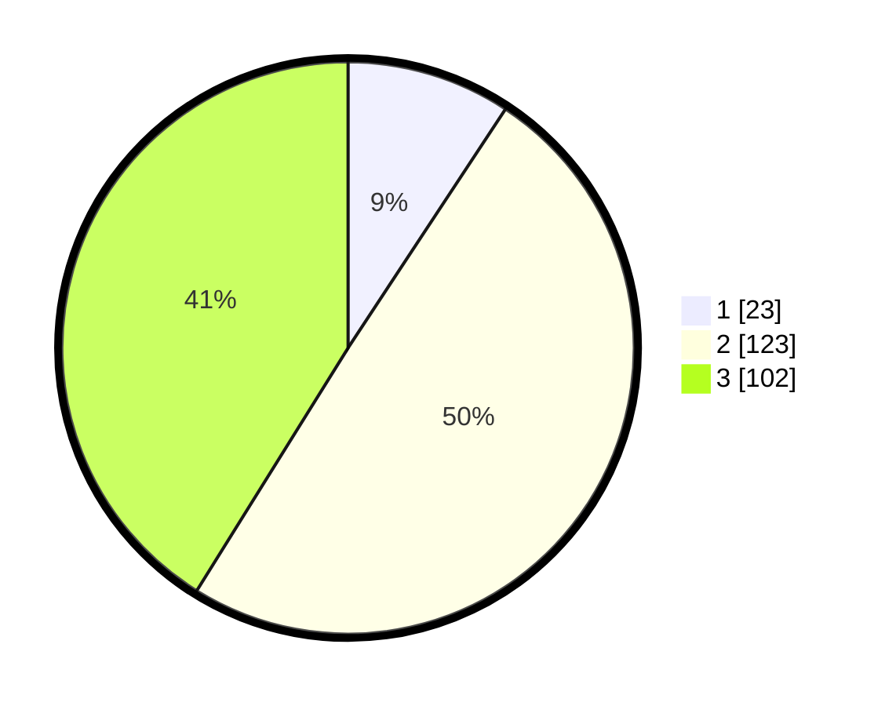

# Hasil

## Grafik

## Tabel

| No. | Nama Paslon    | Suara | Suara (raw) | Persentase |
|:--- |:-------------- | -----:| -----------:| ----------:|
| 1   | ANIES MUHAIMIN | 23    | [23][p-1]   | 9,27       |
| 2   | PRABOWO GIBRAN | 123   | [123][p-2]  | 49,60      |
| 3   | GANJAR MAHFUD  | 102   | [102][p-3]  | 41,13      |

[p-1]: https://github.com/gigit-pemilu/pemilu-2024-35-jawa-timur/blob/main/pilpres/hitung-suara/sub/35-jawa-timur/sub/20-magetan/sub/11-maospati/sub/2001-sugihwaras/sub/012-tps/sub/paslon-1.txt
[p-2]: https://github.com/gigit-pemilu/pemilu-2024-35-jawa-timur/blob/main/pilpres/hitung-suara/sub/35-jawa-timur/sub/20-magetan/sub/11-maospati/sub/2001-sugihwaras/sub/012-tps/sub/paslon-2.txt
[p-3]: https://github.com/gigit-pemilu/pemilu-2024-35-jawa-timur/blob/main/pilpres/hitung-suara/sub/35-jawa-timur/sub/20-magetan/sub/11-maospati/sub/2001-sugihwaras/sub/012-tps/sub/paslon-3.txt

## Foto C Plano

https://sirekap-obj-formc.kpu.go.id/43c3/pemilu/ppwp/35/20/11/20/01/3520112001012-20240214-205634--908d6fd4-440a-4dfc-9ea6-edcef51feda9.jpg

https://sirekap-obj-formc.kpu.go.id/43c3/pemilu/ppwp/35/20/11/20/01/3520112001012-20240214-205658--22014687-a9c9-48ae-96be-489ad294e616.jpg

https://sirekap-obj-formc.kpu.go.id/43c3/pemilu/ppwp/35/20/11/20/01/3520112001012-20240214-205709--fe236366-6fca-48d4-9044-60904c3504fe.jpg

## Metadata

| Key        | Value               |
| ---------- | ------------------- |
| Time Stamp | 2024-02-22 12:00:00 |

