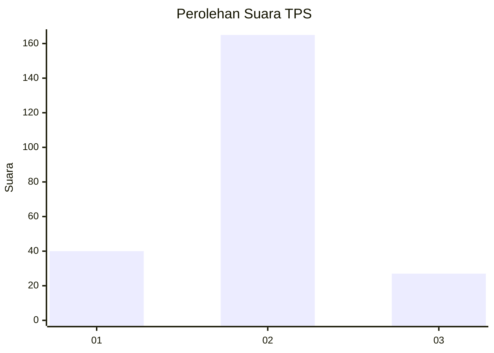
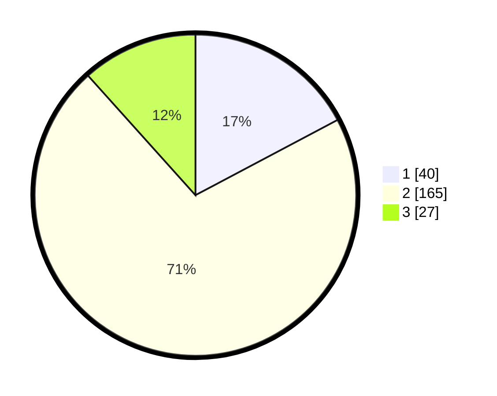

# Hasil

## Grafik

## Tabel

| No. | Nama Paslon    | Suara | Suara (raw) | Persentase |
|:--- |:-------------- | -----:| -----------:| ----------:|
| 1   | ANIES MUHAIMIN | 40    | [40][p-1]   | 17,24      |
| 2   | PRABOWO GIBRAN | 165   | [165][p-2]  | 71,12      |
| 3   | GANJAR MAHFUD  | 27    | [27][p-3]   | 11,64      |

[p-1]: https://github.com/gigit-pemilu/pemilu-2024/blob/main/pilpres/hitung-suara/sub/35-jawa-timur/sub/20-magetan/sub/11-maospati/sub/2003-gulun/sub/004-tps/sub/paslon-1.txt
[p-2]: https://github.com/gigit-pemilu/pemilu-2024/blob/main/pilpres/hitung-suara/sub/35-jawa-timur/sub/20-magetan/sub/11-maospati/sub/2003-gulun/sub/004-tps/sub/paslon-2.txt
[p-3]: https://github.com/gigit-pemilu/pemilu-2024/blob/main/pilpres/hitung-suara/sub/35-jawa-timur/sub/20-magetan/sub/11-maospati/sub/2003-gulun/sub/004-tps/sub/paslon-3.txt

## Foto C Plano

https://sirekap-obj-formc.kpu.go.id/3fd6/pemilu/ppwp/35/20/11/20/03/3520112003004-20240215-041623--4eaec521-aeaa-4ec8-a17c-e2dba57e0dba.jpg

https://sirekap-obj-formc.kpu.go.id/3fd6/pemilu/ppwp/35/20/11/20/03/3520112003004-20240216-154244--f427e478-2d6b-4c11-9798-247c3c8077d9.jpg

https://sirekap-obj-formc.kpu.go.id/3fd6/pemilu/ppwp/35/20/11/20/03/3520112003004-20240217-113833--bd91a0a3-53d7-4a8e-a381-b99fba7851a4.jpg

## Metadata

| Key        | Value               |
| ---------- | ------------------- |
| Time Stamp | 2024-02-17 12:00:00 |

