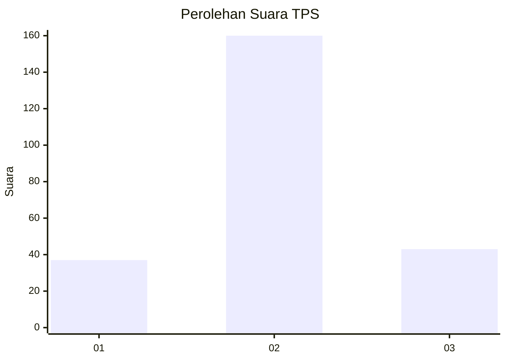
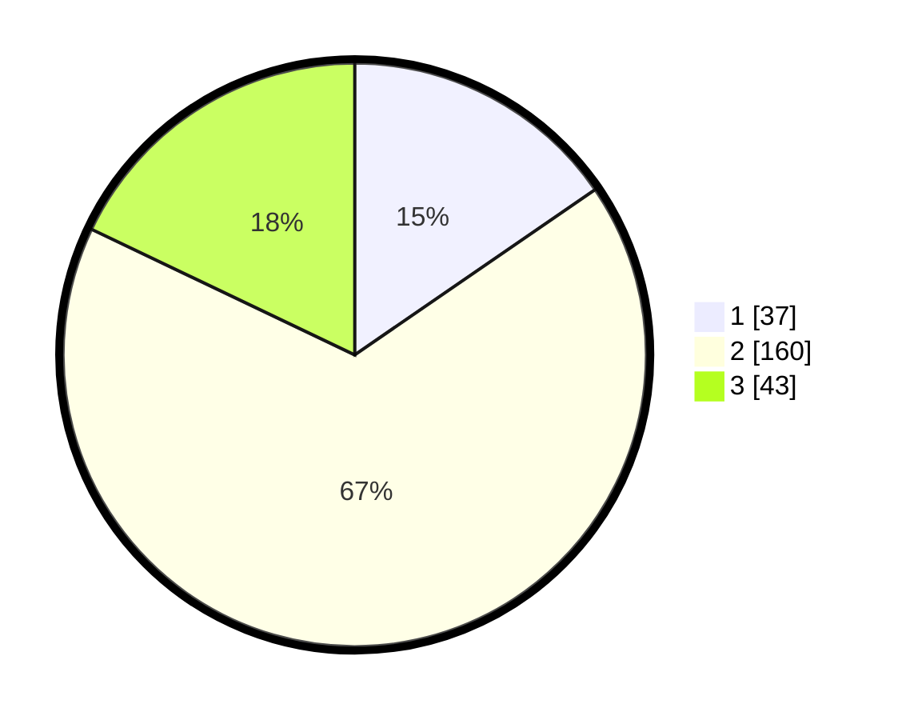

# Hasil

## Grafik

## Tabel

| No. | Nama Paslon    | Suara | Suara (raw) | Persentase |
|:--- |:-------------- | -----:| -----------:| ----------:|
| 1   | ANIES MUHAIMIN | 37    | [37][p-1]   | 15,42      |
| 2   | PRABOWO GIBRAN | 160   | [160][p-2]  | 66,67      |
| 3   | GANJAR MAHFUD  | 43    | [43][p-3]   | 17,92      |

[p-1]: https://github.com/gigit-pemilu/pemilu-2024/blob/main/pilpres/hitung-suara/sub/35-jawa-timur/sub/20-magetan/sub/12-barat/sub/1005-mangge/sub/001-tps/sub/paslon-1.txt
[p-2]: https://github.com/gigit-pemilu/pemilu-2024/blob/main/pilpres/hitung-suara/sub/35-jawa-timur/sub/20-magetan/sub/12-barat/sub/1005-mangge/sub/001-tps/sub/paslon-2.txt
[p-3]: https://github.com/gigit-pemilu/pemilu-2024/blob/main/pilpres/hitung-suara/sub/35-jawa-timur/sub/20-magetan/sub/12-barat/sub/1005-mangge/sub/001-tps/sub/paslon-3.txt

## Foto C Plano

https://sirekap-obj-formc.kpu.go.id/5454/pemilu/ppwp/35/20/12/10/05/3520121005001-20240214-220825--5a365f34-fcd7-4bc1-b370-823b0f7acb45.jpg

https://sirekap-obj-formc.kpu.go.id/5454/pemilu/ppwp/35/20/12/10/05/3520121005001-20240214-221133--42d8c3f5-717b-4b5d-8e02-bfe6527a6266.jpg

https://sirekap-obj-formc.kpu.go.id/5454/pemilu/ppwp/35/20/12/10/05/3520121005001-20240214-221337--05825ad2-5712-426e-9f4a-fb68a7ee88c1.jpg

## Metadata

| Key        | Value               |
| ---------- | ------------------- |
| Time Stamp | 2024-02-22 20:00:00 |

