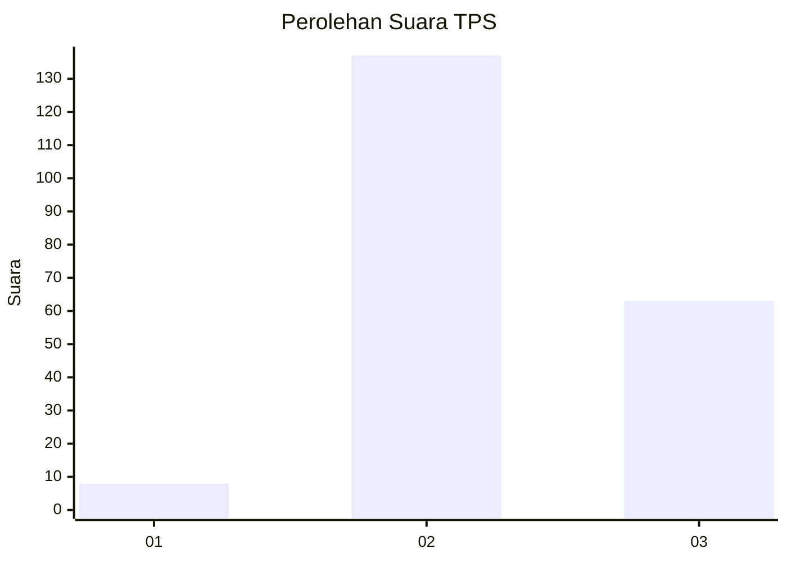

# Hasil

## Grafik

## Tabel

| No. | Nama Paslon    | Suara | Suara (raw) | Persentase |
|:--- |:-------------- | -----:| -----------:| ----------:|
| 1   | ANIES MUHAIMIN | 8     | [8][p-1]    | 3,85       |
| 2   | PRABOWO GIBRAN | 137   | [137][p-2]  | 65,87      |
| 3   | GANJAR MAHFUD  | 63    | [63][p-3]   | 30,29      |

[p-1]: https://github.com/gigit-pemilu/pemilu-2024/blob/main/pilpres/hitung-suara/sub/35-jawa-timur/sub/20-magetan/sub/12-barat/sub/1005-mangge/sub/003-tps/sub/paslon-1.txt
[p-2]: https://github.com/gigit-pemilu/pemilu-2024/blob/main/pilpres/hitung-suara/sub/35-jawa-timur/sub/20-magetan/sub/12-barat/sub/1005-mangge/sub/003-tps/sub/paslon-2.txt
[p-3]: https://github.com/gigit-pemilu/pemilu-2024/blob/main/pilpres/hitung-suara/sub/35-jawa-timur/sub/20-magetan/sub/12-barat/sub/1005-mangge/sub/003-tps/sub/paslon-3.txt

## Foto C Plano

https://sirekap-obj-formc.kpu.go.id/8433/pemilu/ppwp/35/20/12/10/05/3520121005003-20240215-073123--9b2a9b1d-dd02-497e-8ffc-efdaab267c53.jpg

https://sirekap-obj-formc.kpu.go.id/8433/pemilu/ppwp/35/20/12/10/05/3520121005003-20240215-073658--effd7e3f-084a-4205-a322-23b73abaf3a7.jpg

https://sirekap-obj-formc.kpu.go.id/8433/pemilu/ppwp/35/20/12/10/05/3520121005003-20240215-073754--b9d2cfcf-ab32-48f5-8345-459a620db73b.jpg

## Metadata

| Key        | Value               |
| ---------- | ------------------- |
| Time Stamp | 2024-02-16 13:30:32 |

