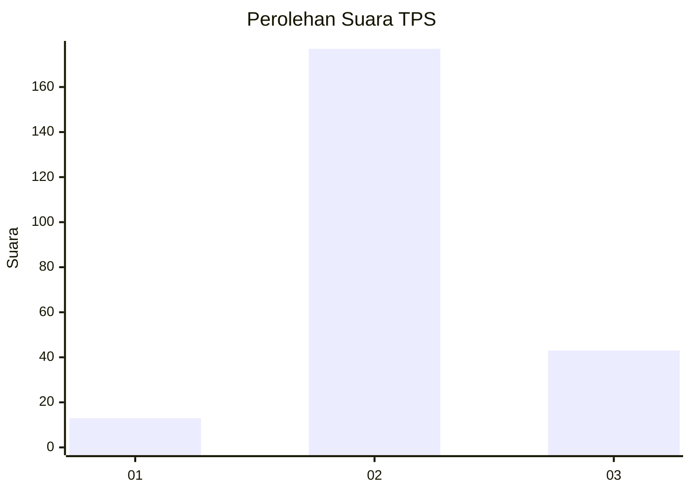
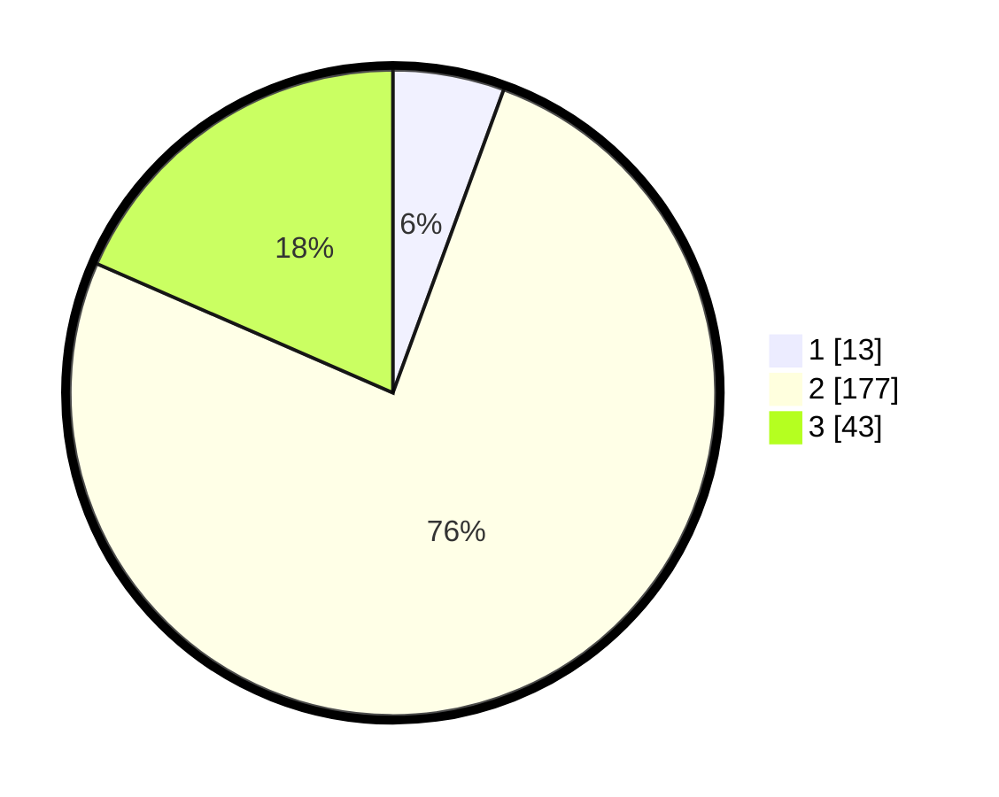

# Hasil

## Grafik

## Tabel

| No. | Nama Paslon    | Suara | Suara (raw) | Persentase |
|:--- |:-------------- | -----:| -----------:| ----------:|
| 1   | ANIES MUHAIMIN | 13    | [13][p-1]   | 5,58       |
| 2   | PRABOWO GIBRAN | 177   | [177][p-2]  | 75,97      |
| 3   | GANJAR MAHFUD  | 43    | [43][p-3]   | 18,45      |

[p-1]: https://github.com/gigit-pemilu/pemilu-2024/blob/main/pilpres/hitung-suara/sub/35-jawa-timur/sub/20-magetan/sub/12-barat/sub/1005-mangge/sub/004-tps/sub/paslon-1.txt
[p-2]: https://github.com/gigit-pemilu/pemilu-2024/blob/main/pilpres/hitung-suara/sub/35-jawa-timur/sub/20-magetan/sub/12-barat/sub/1005-mangge/sub/004-tps/sub/paslon-2.txt
[p-3]: https://github.com/gigit-pemilu/pemilu-2024/blob/main/pilpres/hitung-suara/sub/35-jawa-timur/sub/20-magetan/sub/12-barat/sub/1005-mangge/sub/004-tps/sub/paslon-3.txt

## Foto C Plano

https://sirekap-obj-formc.kpu.go.id/dead/pemilu/ppwp/35/20/12/10/05/3520121005004-20240214-194510--b7a0a3bf-44c9-4f04-8384-900fb56fb6b6.jpg

https://sirekap-obj-formc.kpu.go.id/dead/pemilu/ppwp/35/20/12/10/05/3520121005004-20240214-222758--af5cee9a-18d5-4b5c-a2e1-0e539a47affb.jpg

https://sirekap-obj-formc.kpu.go.id/dead/pemilu/ppwp/35/20/12/10/05/3520121005004-20240214-194630--c60a37be-4181-4baa-bb6b-16516f8f7ff3.jpg

## Metadata

| Key        | Value               |
| ---------- | ------------------- |
| Time Stamp | 2024-02-22 20:00:00 |

