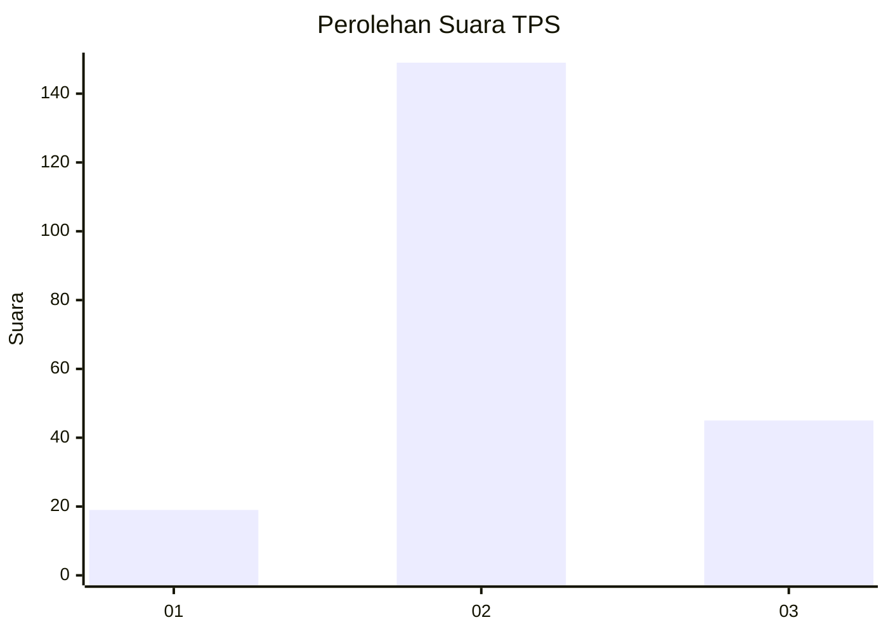
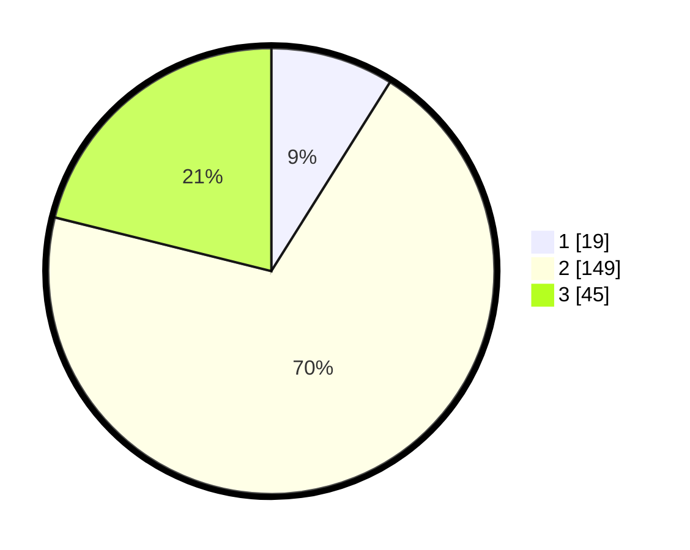

# Hasil

## Grafik

## Tabel

| No. | Nama Paslon    | Suara | Suara (raw) | Persentase |
|:--- |:-------------- | -----:| -----------:| ----------:|
| 1   | ANIES MUHAIMIN | 19    | [19][p-1]   | 8,92       |
| 2   | PRABOWO GIBRAN | 149   | [149][p-2]  | 69,95      |
| 3   | GANJAR MAHFUD  | 45    | [45][p-3]   | 21,13      |

[p-1]: https://github.com/gigit-pemilu/pemilu-2024/blob/main/pilpres/hitung-suara/sub/35-jawa-timur/sub/20-magetan/sub/12-barat/sub/1005-mangge/sub/005-tps/sub/paslon-1.txt
[p-2]: https://github.com/gigit-pemilu/pemilu-2024/blob/main/pilpres/hitung-suara/sub/35-jawa-timur/sub/20-magetan/sub/12-barat/sub/1005-mangge/sub/005-tps/sub/paslon-2.txt
[p-3]: https://github.com/gigit-pemilu/pemilu-2024/blob/main/pilpres/hitung-suara/sub/35-jawa-timur/sub/20-magetan/sub/12-barat/sub/1005-mangge/sub/005-tps/sub/paslon-3.txt

## Foto C Plano

https://sirekap-obj-formc.kpu.go.id/2355/pemilu/ppwp/35/20/12/10/05/3520121005005-20240214-230303--09a32ee2-f0d9-4633-a243-85f00372a4ab.jpg

https://sirekap-obj-formc.kpu.go.id/2355/pemilu/ppwp/35/20/12/10/05/3520121005005-20240214-231055--c1f73b46-2bd3-4bc7-a111-fae74956975c.jpg

https://sirekap-obj-formc.kpu.go.id/2355/pemilu/ppwp/35/20/12/10/05/3520121005005-20240214-231211--c0e9ee33-93fa-4f43-aa8c-1093b5d8e5b8.jpg

## Metadata

| Key        | Value               |
| ---------- | ------------------- |
| Time Stamp | 2024-02-22 20:00:00 |

