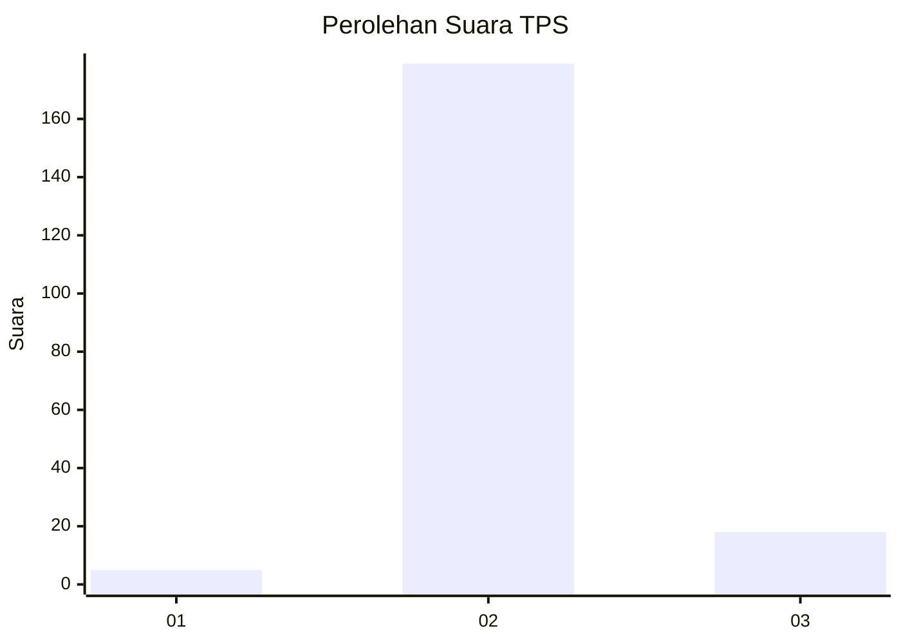
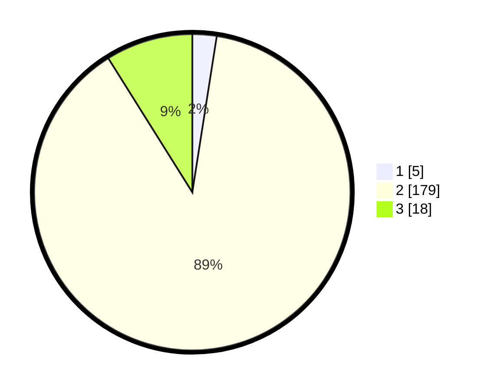

# Hasil

## Grafik

## Tabel

| No. | Nama Paslon    | Suara | Suara (raw) | Persentase |
|:--- |:-------------- | -----:| -----------:| ----------:|
| 1   | ANIES MUHAIMIN | 5     | [5][p-1]    | 2,48       |
| 2   | PRABOWO GIBRAN | 179   | [179][p-2]  | 88,61      |
| 3   | GANJAR MAHFUD  | 18    | [18][p-3]   | 8,91       |

[p-1]: https://github.com/gigit-pemilu/pemilu-2024/blob/main/pilpres/hitung-suara/sub/35-jawa-timur/sub/20-magetan/sub/12-barat/sub/2014-klagen/sub/008-tps/sub/paslon-1.txt
[p-2]: https://github.com/gigit-pemilu/pemilu-2024/blob/main/pilpres/hitung-suara/sub/35-jawa-timur/sub/20-magetan/sub/12-barat/sub/2014-klagen/sub/008-tps/sub/paslon-2.txt
[p-3]: https://github.com/gigit-pemilu/pemilu-2024/blob/main/pilpres/hitung-suara/sub/35-jawa-timur/sub/20-magetan/sub/12-barat/sub/2014-klagen/sub/008-tps/sub/paslon-3.txt

## Foto C Plano

https://sirekap-obj-formc.kpu.go.id/cd84/pemilu/ppwp/35/20/12/20/14/3520122014008-20240214-214138--e2feba19-9800-4f6e-b15b-f4caf302f13b.jpg

https://sirekap-obj-formc.kpu.go.id/cd84/pemilu/ppwp/35/20/12/20/14/3520122014008-20240216-135614--0aca8b1e-6b1f-46be-9cc8-823855051069.jpg

https://sirekap-obj-formc.kpu.go.id/cd84/pemilu/ppwp/35/20/12/20/14/3520122014008-20240214-214157--2fbbd6d7-d45b-4b53-b023-33a09703401a.jpg

## Metadata

| Key        | Value               |
| ---------- | ------------------- |
| Time Stamp | 2024-02-21 17:00:00 |

