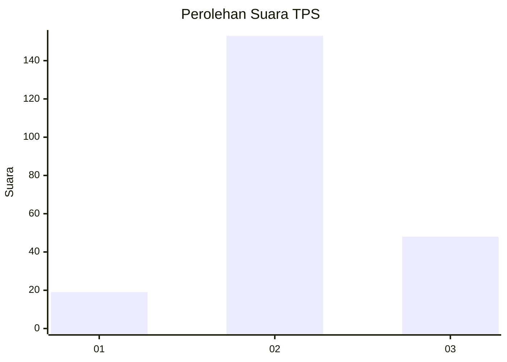
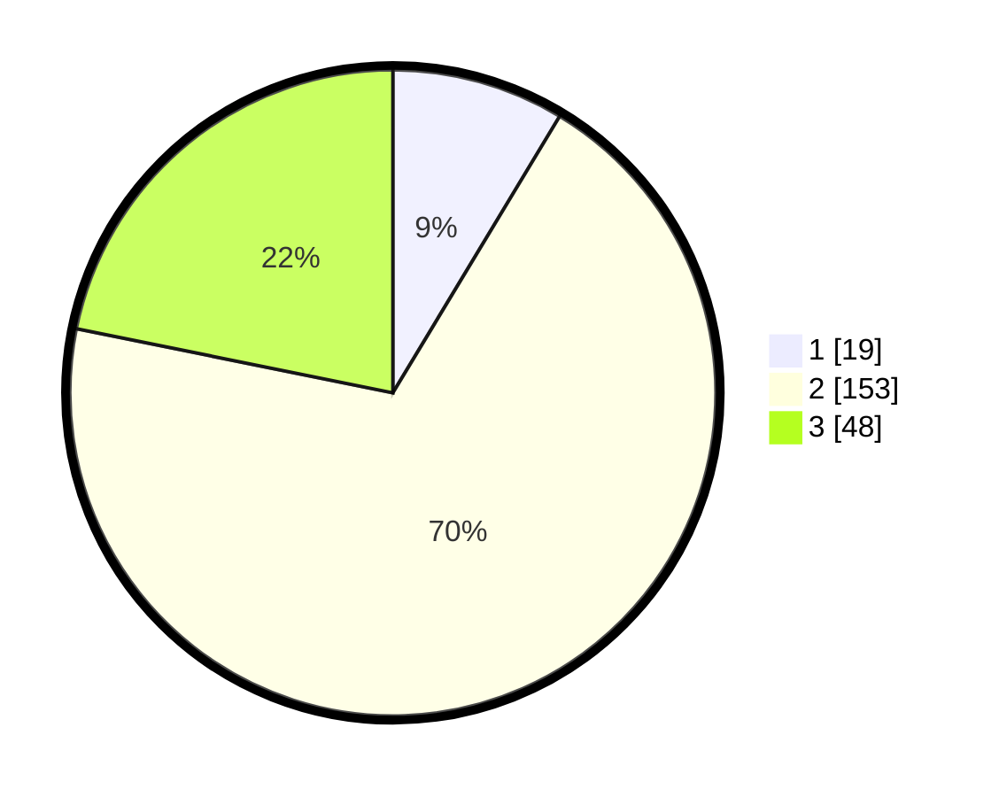

# Hasil

## Grafik

## Tabel

| No. | Nama Paslon    | Suara | Suara (raw) | Persentase |
|:--- |:-------------- | -----:| -----------:| ----------:|
| 1   | ANIES MUHAIMIN | 19    | [19][p-1]   | 8,64       |
| 2   | PRABOWO GIBRAN | 153   | [153][p-2]  | 69,55      |
| 3   | GANJAR MAHFUD  | 48    | [48][p-3]   | 21,82      |

[p-1]: https://github.com/gigit-pemilu/pemilu-2024-35-jawa-timur/blob/main/pilpres/hitung-suara/sub/35-jawa-timur/sub/20-magetan/sub/13-karangrejo/sub/1001-karangrejo/sub/001-tps/sub/paslon-1.txt
[p-2]: https://github.com/gigit-pemilu/pemilu-2024-35-jawa-timur/blob/main/pilpres/hitung-suara/sub/35-jawa-timur/sub/20-magetan/sub/13-karangrejo/sub/1001-karangrejo/sub/001-tps/sub/paslon-2.txt
[p-3]: https://github.com/gigit-pemilu/pemilu-2024-35-jawa-timur/blob/main/pilpres/hitung-suara/sub/35-jawa-timur/sub/20-magetan/sub/13-karangrejo/sub/1001-karangrejo/sub/001-tps/sub/paslon-3.txt

## Foto C Plano

https://sirekap-obj-formc.kpu.go.id/83a3/pemilu/ppwp/35/20/13/10/01/3520131001001-20240216-091905--b81b35bf-0856-42be-9000-2dd4fac6d856.jpg

https://sirekap-obj-formc.kpu.go.id/83a3/pemilu/ppwp/35/20/13/10/01/3520131001001-20240215-004847--6338e57d-9aa4-472d-bc5c-e9228478fcf2.jpg

https://sirekap-obj-formc.kpu.go.id/83a3/pemilu/ppwp/35/20/13/10/01/3520131001001-20240215-005003--0586ce54-f627-4eab-875a-99526c68aea7.jpg

## Metadata

| Key        | Value               |
| ---------- | ------------------- |
| Time Stamp | 2024-02-22 12:00:00 |

