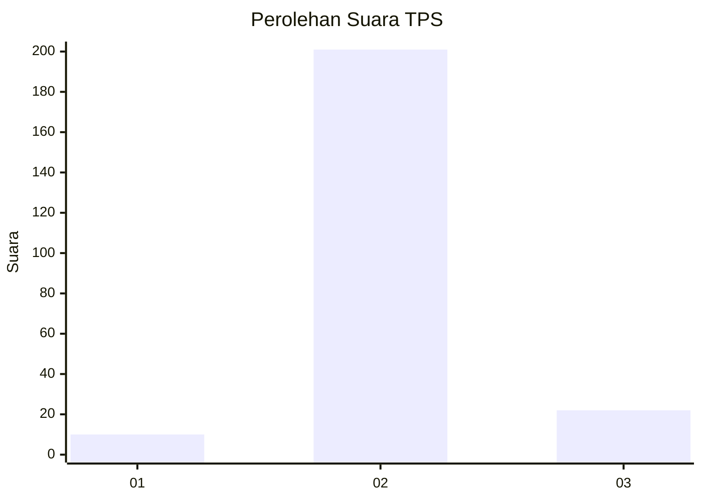
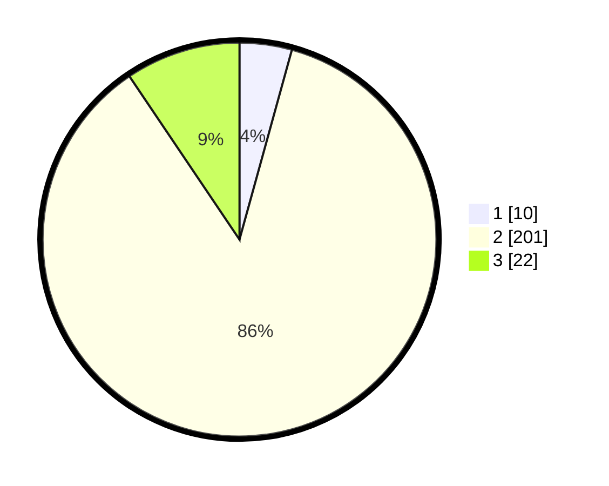

# Hasil

## Grafik

## Tabel

| No. | Nama Paslon    | Suara | Suara (raw) | Persentase |
|:--- |:-------------- | -----:| -----------:| ----------:|
| 1   | ANIES MUHAIMIN | 10    | [10][p-1]   | 4,29       |
| 2   | PRABOWO GIBRAN | 201   | [201][p-2]  | 86,27      |
| 3   | GANJAR MAHFUD  | 22    | [22][p-3]   | 9,44       |

[p-1]: https://github.com/gigit-pemilu/pemilu-2024-35-jawa-timur/blob/main/pilpres/hitung-suara/sub/35-jawa-timur/sub/20-magetan/sub/13-karangrejo/sub/1001-karangrejo/sub/003-tps/sub/paslon-1.txt
[p-2]: https://github.com/gigit-pemilu/pemilu-2024-35-jawa-timur/blob/main/pilpres/hitung-suara/sub/35-jawa-timur/sub/20-magetan/sub/13-karangrejo/sub/1001-karangrejo/sub/003-tps/sub/paslon-2.txt
[p-3]: https://github.com/gigit-pemilu/pemilu-2024-35-jawa-timur/blob/main/pilpres/hitung-suara/sub/35-jawa-timur/sub/20-magetan/sub/13-karangrejo/sub/1001-karangrejo/sub/003-tps/sub/paslon-3.txt

## Foto C Plano

https://sirekap-obj-formc.kpu.go.id/fc86/pemilu/ppwp/35/20/13/10/01/3520131001003-20240214-193405--a34546af-b66c-484b-bdc4-299ba7338961.jpg

https://sirekap-obj-formc.kpu.go.id/fc86/pemilu/ppwp/35/20/13/10/01/3520131001003-20240214-193648--491df2be-9d1e-483a-9f85-9986ad1808e8.jpg

https://sirekap-obj-formc.kpu.go.id/fc86/pemilu/ppwp/35/20/13/10/01/3520131001003-20240214-194046--b5572cf5-ca1a-4f79-87bd-8345f499dc03.jpg

## Metadata

| Key        | Value               |
| ---------- | ------------------- |
| Time Stamp | 2024-02-22 12:00:00 |

