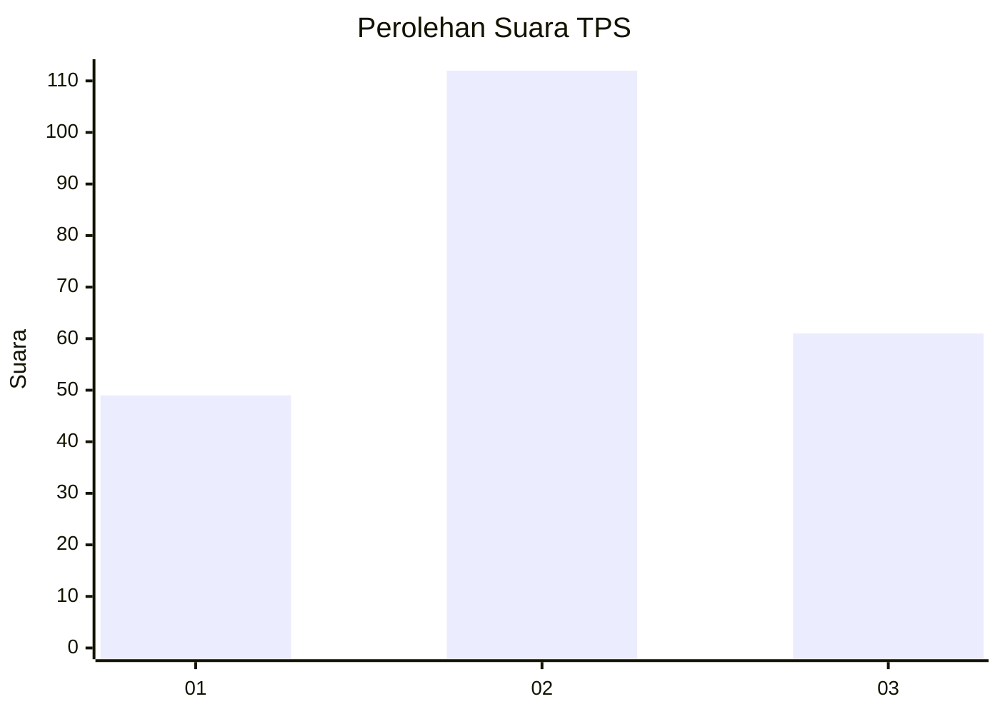
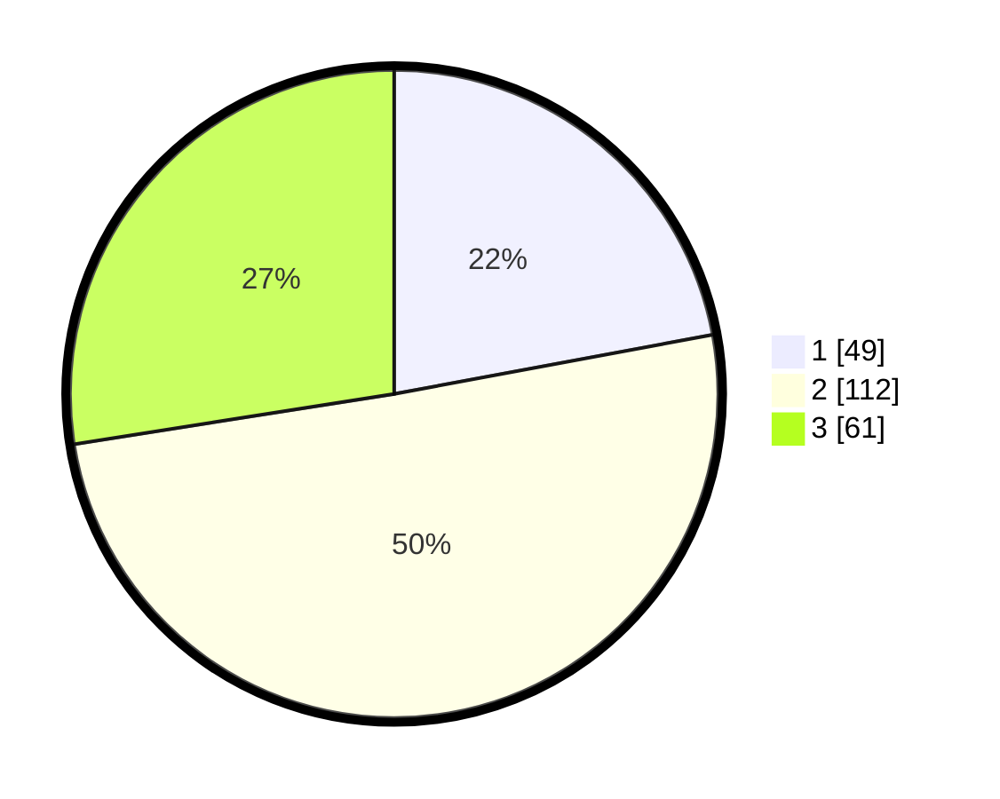

# Hasil

## Grafik

## Tabel

| No. | Nama Paslon    | Suara | Suara (raw) | Persentase |
|:--- |:-------------- | -----:| -----------:| ----------:|
| 1   | ANIES MUHAIMIN | 49    | [49][p-1]   | 22,07      |
| 2   | PRABOWO GIBRAN | 112   | [112][p-2]  | 50,45      |
| 3   | GANJAR MAHFUD  | 61    | [61][p-3]   | 27,48      |

[p-1]: https://github.com/gigit-pemilu/pemilu-2024/blob/main/pilpres/hitung-suara/sub/35-jawa-timur/sub/20-magetan/sub/13-karangrejo/sub/1006-manisrejo/sub/004-tps/sub/paslon-1.txt
[p-2]: https://github.com/gigit-pemilu/pemilu-2024/blob/main/pilpres/hitung-suara/sub/35-jawa-timur/sub/20-magetan/sub/13-karangrejo/sub/1006-manisrejo/sub/004-tps/sub/paslon-2.txt
[p-3]: https://github.com/gigit-pemilu/pemilu-2024/blob/main/pilpres/hitung-suara/sub/35-jawa-timur/sub/20-magetan/sub/13-karangrejo/sub/1006-manisrejo/sub/004-tps/sub/paslon-3.txt

## Foto C Plano

https://sirekap-obj-formc.kpu.go.id/9d5c/pemilu/ppwp/35/20/13/10/06/3520131006004-20240215-041811--ecbd2e29-fd51-43aa-aea3-f9855db7f76d.jpg

https://sirekap-obj-formc.kpu.go.id/9d5c/pemilu/ppwp/35/20/13/10/06/3520131006004-20240215-041849--c9fafd70-0be9-4cb1-9799-642339ece669.jpg

https://sirekap-obj-formc.kpu.go.id/9d5c/pemilu/ppwp/35/20/13/10/06/3520131006004-20240215-041917--86202d25-0ba4-46df-969a-818b611c79b7.jpg

## Metadata

| Key        | Value               |
| ---------- | ------------------- |
| Time Stamp | 2024-02-22 12:00:00 |

