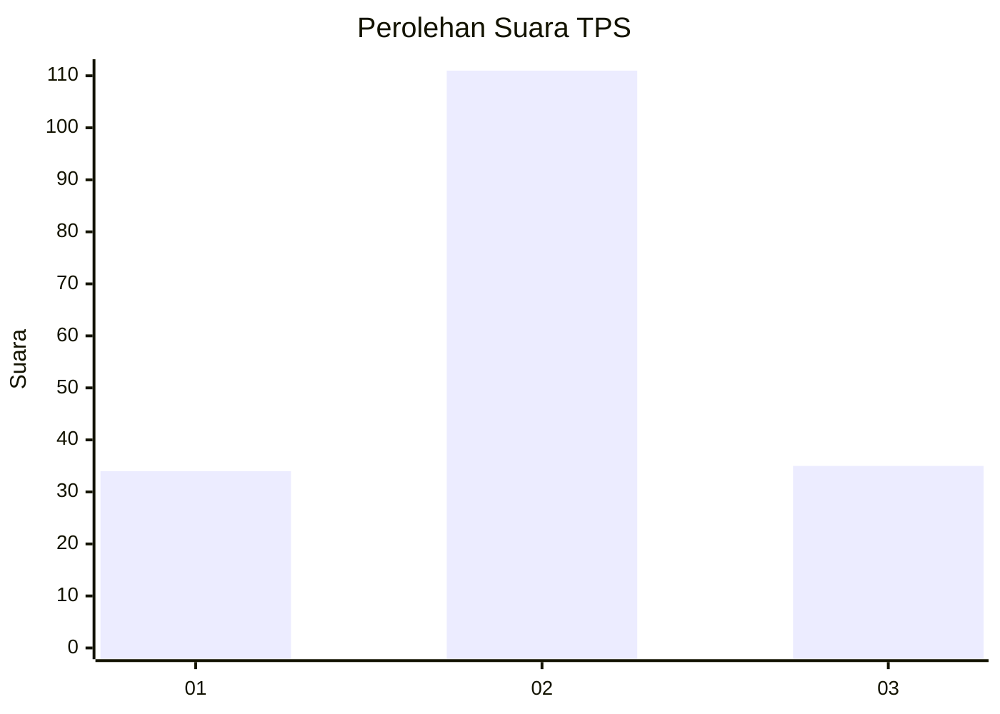
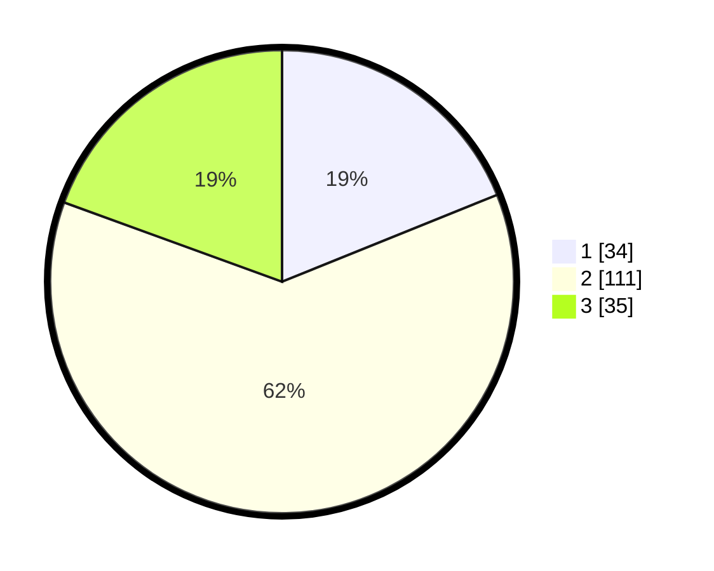

# Hasil

## Grafik

## Tabel

| No. | Nama Paslon    | Suara | Suara (raw) | Persentase |
|:--- |:-------------- | -----:| -----------:| ----------:|
| 1   | ANIES MUHAIMIN | 34    | [34][p-1]   | 18,89      |
| 2   | PRABOWO GIBRAN | 111   | [111][p-2]  | 61,67      |
| 3   | GANJAR MAHFUD  | 35    | [35][p-3]   | 19,44      |

[p-1]: https://github.com/gigit-pemilu/pemilu-2024-35-jawa-timur/blob/main/pilpres/hitung-suara/sub/35-jawa-timur/sub/20-magetan/sub/13-karangrejo/sub/2002-mantren/sub/006-tps/sub/paslon-1.txt
[p-2]: https://github.com/gigit-pemilu/pemilu-2024-35-jawa-timur/blob/main/pilpres/hitung-suara/sub/35-jawa-timur/sub/20-magetan/sub/13-karangrejo/sub/2002-mantren/sub/006-tps/sub/paslon-2.txt
[p-3]: https://github.com/gigit-pemilu/pemilu-2024-35-jawa-timur/blob/main/pilpres/hitung-suara/sub/35-jawa-timur/sub/20-magetan/sub/13-karangrejo/sub/2002-mantren/sub/006-tps/sub/paslon-3.txt

## Foto C Plano

https://sirekap-obj-formc.kpu.go.id/cee2/pemilu/ppwp/35/20/13/20/02/3520132002006-20240214-211619--efa47c52-8dc7-4d3c-8c05-45063ff88864.jpg

https://sirekap-obj-formc.kpu.go.id/cee2/pemilu/ppwp/35/20/13/20/02/3520132002006-20240214-211729--4bf0dd08-e5d7-4e10-b3e2-9d119dc7cffb.jpg

https://sirekap-obj-formc.kpu.go.id/cee2/pemilu/ppwp/35/20/13/20/02/3520132002006-20240214-211827--5ce6d42b-4cc4-4c09-955b-6fc7d613d661.jpg

## Metadata

| Key        | Value               |
| ---------- | ------------------- |
| Time Stamp | 2024-02-22 20:00:00 |

