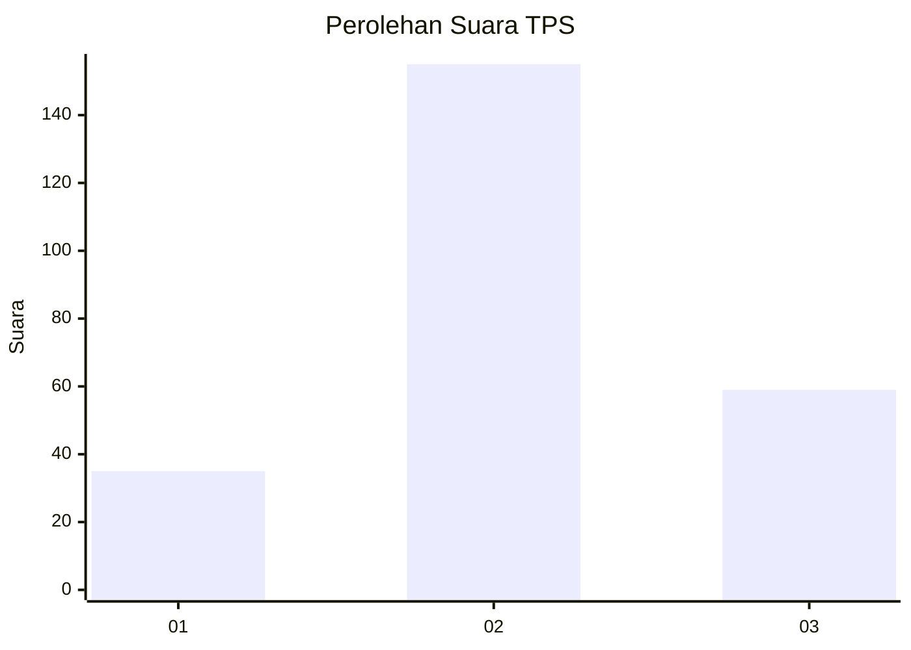
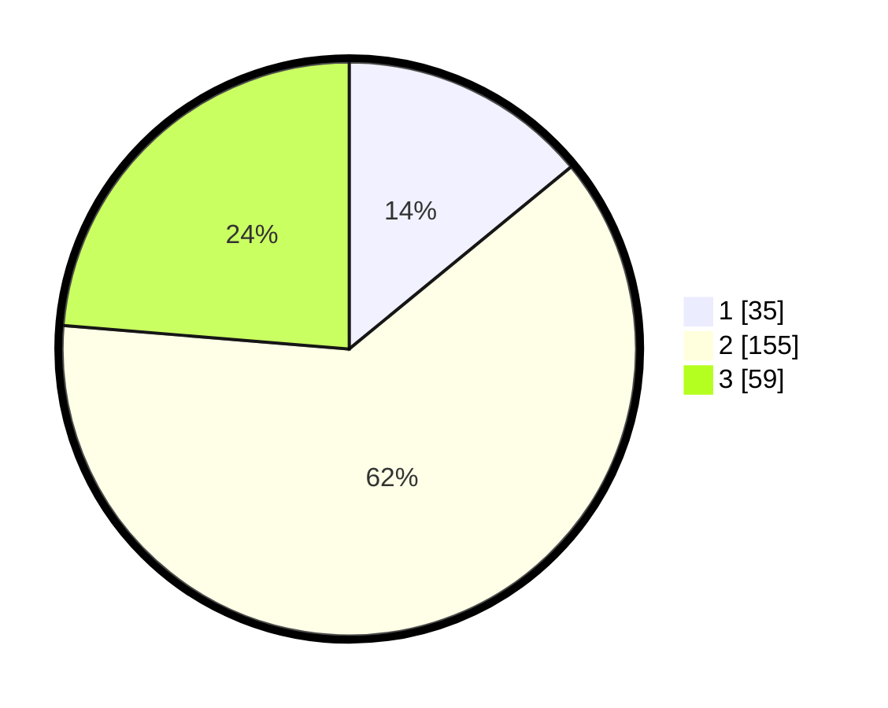

# Hasil

## Grafik

## Tabel

| No. | Nama Paslon    | Suara | Suara (raw) | Persentase |
|:--- |:-------------- | -----:| -----------:| ----------:|
| 1   | ANIES MUHAIMIN | 35    | [35][p-1]   | 14,06      |
| 2   | PRABOWO GIBRAN | 155   | [155][p-2]  | 62,25      |
| 3   | GANJAR MAHFUD  | 59    | [59][p-3]   | 23,69      |

[p-1]: https://github.com/gigit-pemilu/pemilu-2024/blob/main/pilpres/hitung-suara/sub/35-jawa-timur/sub/20-magetan/sub/13-karangrejo/sub/2005-patihan/sub/001-tps/sub/paslon-1.txt
[p-2]: https://github.com/gigit-pemilu/pemilu-2024/blob/main/pilpres/hitung-suara/sub/35-jawa-timur/sub/20-magetan/sub/13-karangrejo/sub/2005-patihan/sub/001-tps/sub/paslon-2.txt
[p-3]: https://github.com/gigit-pemilu/pemilu-2024/blob/main/pilpres/hitung-suara/sub/35-jawa-timur/sub/20-magetan/sub/13-karangrejo/sub/2005-patihan/sub/001-tps/sub/paslon-3.txt

## Foto C Plano

https://sirekap-obj-formc.kpu.go.id/f5fb/pemilu/ppwp/35/20/13/20/05/3520132005001-20240215-010505--a54f6209-3f42-4390-81d7-855b7c8eecd0.jpg

https://sirekap-obj-formc.kpu.go.id/f5fb/pemilu/ppwp/35/20/13/20/05/3520132005001-20240215-010558--e861624f-d023-44c4-8f84-f6cc32c95189.jpg

https://sirekap-obj-formc.kpu.go.id/f5fb/pemilu/ppwp/35/20/13/20/05/3520132005001-20240215-010636--92503aad-d107-45eb-b826-80f783563e3b.jpg

## Metadata

| Key        | Value               |
| ---------- | ------------------- |
| Time Stamp | 2024-02-22 12:00:00 |

