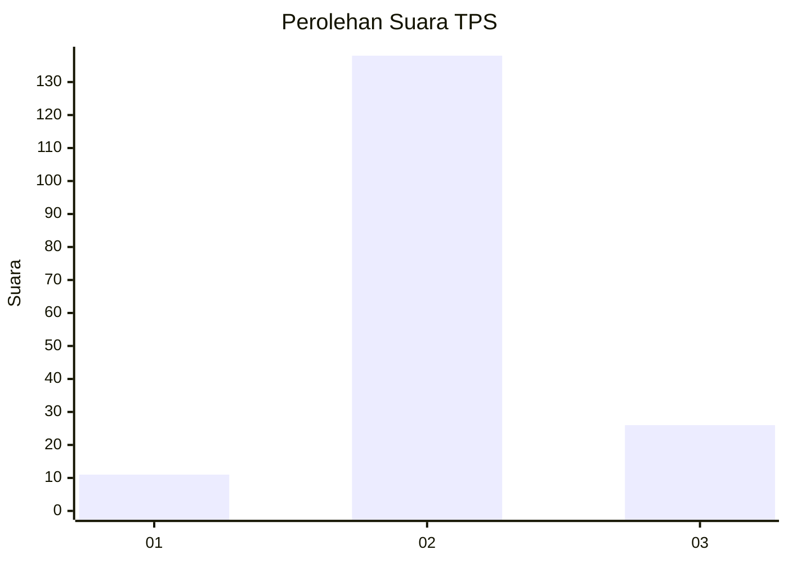

# Hasil

## Grafik

## Tabel

| No. | Nama Paslon    | Suara | Suara (raw) | Persentase |
|:--- |:-------------- | -----:| -----------:| ----------:|
| 1   | ANIES MUHAIMIN | 11    | [11][p-1]   | 6,29       |
| 2   | PRABOWO GIBRAN | 138   | [138][p-2]  | 78,86      |
| 3   | GANJAR MAHFUD  | 26    | [26][p-3]   | 14,86      |

[p-1]: https://github.com/gigit-pemilu/pemilu-2024-35-jawa-timur/blob/main/pilpres/hitung-suara/sub/35-jawa-timur/sub/20-magetan/sub/13-karangrejo/sub/2009-gebyog/sub/001-tps/sub/paslon-1.txt
[p-2]: https://github.com/gigit-pemilu/pemilu-2024-35-jawa-timur/blob/main/pilpres/hitung-suara/sub/35-jawa-timur/sub/20-magetan/sub/13-karangrejo/sub/2009-gebyog/sub/001-tps/sub/paslon-2.txt
[p-3]: https://github.com/gigit-pemilu/pemilu-2024-35-jawa-timur/blob/main/pilpres/hitung-suara/sub/35-jawa-timur/sub/20-magetan/sub/13-karangrejo/sub/2009-gebyog/sub/001-tps/sub/paslon-3.txt

## Foto C Plano

https://sirekap-obj-formc.kpu.go.id/7ba0/pemilu/ppwp/35/20/13/20/09/3520132009001-20240214-190912--63c1fb69-9f06-442b-9c3c-43f09ff58a8d.jpg

https://sirekap-obj-formc.kpu.go.id/7ba0/pemilu/ppwp/35/20/13/20/09/3520132009001-20240214-191045--3c90f519-1c27-4c2f-8a48-16681fab8618.jpg

https://sirekap-obj-formc.kpu.go.id/7ba0/pemilu/ppwp/35/20/13/20/09/3520132009001-20240214-215807--b7b67232-8da8-4488-8b8e-d2016eac28d8.jpg

## Metadata

| Key        | Value               |
| ---------- | ------------------- |
| Time Stamp | 2024-02-15 00:41:44 |

