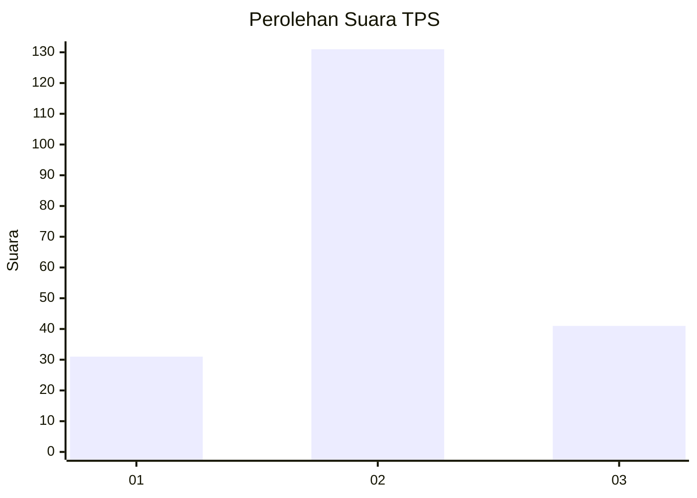
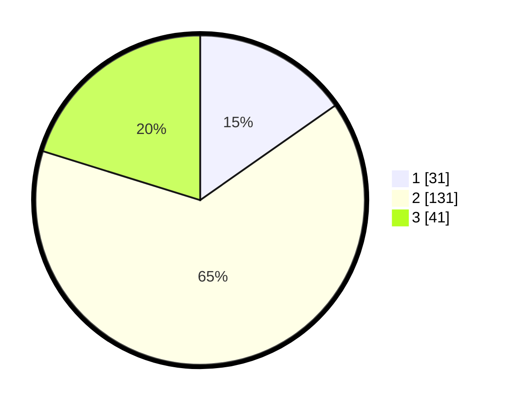

# Hasil

## Grafik

## Tabel

| No. | Nama Paslon    | Suara | Suara (raw) | Persentase |
|:--- |:-------------- | -----:| -----------:| ----------:|
| 1   | ANIES MUHAIMIN | 31    | [31][p-1]   | 15,27      |
| 2   | PRABOWO GIBRAN | 131   | [131][p-2]  | 64,53      |
| 3   | GANJAR MAHFUD  | 41    | [41][p-3]   | 20,20      |

[p-1]: https://github.com/gigit-pemilu/pemilu-2024/blob/main/pilpres/hitung-suara/sub/35-jawa-timur/sub/20-magetan/sub/13-karangrejo/sub/2009-gebyog/sub/003-tps/sub/paslon-1.txt
[p-2]: https://github.com/gigit-pemilu/pemilu-2024/blob/main/pilpres/hitung-suara/sub/35-jawa-timur/sub/20-magetan/sub/13-karangrejo/sub/2009-gebyog/sub/003-tps/sub/paslon-2.txt
[p-3]: https://github.com/gigit-pemilu/pemilu-2024/blob/main/pilpres/hitung-suara/sub/35-jawa-timur/sub/20-magetan/sub/13-karangrejo/sub/2009-gebyog/sub/003-tps/sub/paslon-3.txt

## Foto C Plano

https://sirekap-obj-formc.kpu.go.id/431d/pemilu/ppwp/35/20/13/20/09/3520132009003-20240214-203922--aa78726d-1c28-40f0-96c8-bb7b0fa11f5d.jpg

https://sirekap-obj-formc.kpu.go.id/431d/pemilu/ppwp/35/20/13/20/09/3520132009003-20240214-204331--2f05b208-1d58-42aa-b5e8-5809bd3cfa5d.jpg

https://sirekap-obj-formc.kpu.go.id/431d/pemilu/ppwp/35/20/13/20/09/3520132009003-20240214-204616--5f727c28-e260-49f0-aaed-67941e09d236.jpg

## Metadata

| Key        | Value               |
| ---------- | ------------------- |
| Time Stamp | 2024-02-22 12:00:00 |

