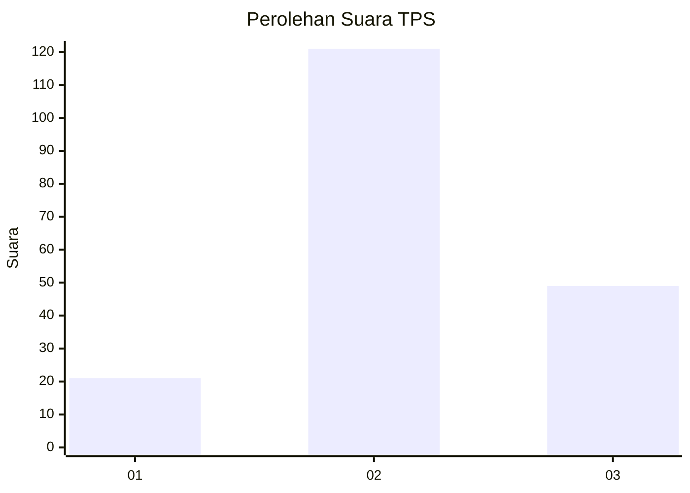
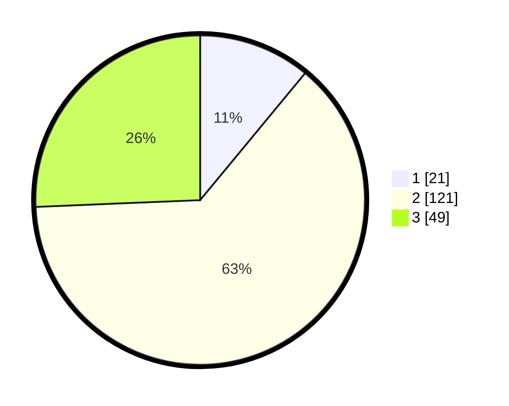

# Hasil

## Grafik

## Tabel

| No. | Nama Paslon    | Suara | Suara (raw) | Persentase |
|:--- |:-------------- | -----:| -----------:| ----------:|
| 1   | ANIES MUHAIMIN | 21    | [21][p-1]   | 10,99      |
| 2   | PRABOWO GIBRAN | 121   | [121][p-2]  | 63,35      |
| 3   | GANJAR MAHFUD  | 49    | [49][p-3]   | 25,65      |

[p-1]: https://github.com/gigit-pemilu/pemilu-2024/blob/main/pilpres/hitung-suara/sub/35-jawa-timur/sub/20-magetan/sub/13-karangrejo/sub/2009-gebyog/sub/005-tps/sub/paslon-1.txt
[p-2]: https://github.com/gigit-pemilu/pemilu-2024/blob/main/pilpres/hitung-suara/sub/35-jawa-timur/sub/20-magetan/sub/13-karangrejo/sub/2009-gebyog/sub/005-tps/sub/paslon-2.txt
[p-3]: https://github.com/gigit-pemilu/pemilu-2024/blob/main/pilpres/hitung-suara/sub/35-jawa-timur/sub/20-magetan/sub/13-karangrejo/sub/2009-gebyog/sub/005-tps/sub/paslon-3.txt

## Foto C Plano

https://sirekap-obj-formc.kpu.go.id/d2e5/pemilu/ppwp/35/20/13/20/09/3520132009005-20240215-010054--743ef187-0c38-4966-81e5-3c58bfea0ea4.jpg

https://sirekap-obj-formc.kpu.go.id/d2e5/pemilu/ppwp/35/20/13/20/09/3520132009005-20240215-010252--92b8efe5-d791-4a9e-afe6-82eaa9ae5b5c.jpg

https://sirekap-obj-formc.kpu.go.id/d2e5/pemilu/ppwp/35/20/13/20/09/3520132009005-20240215-010539--b06e69b6-a554-470b-a4c5-6aec9b438a9c.jpg

## Metadata

| Key        | Value               |
| ---------- | ------------------- |
| Time Stamp | 2024-02-22 12:00:00 |

