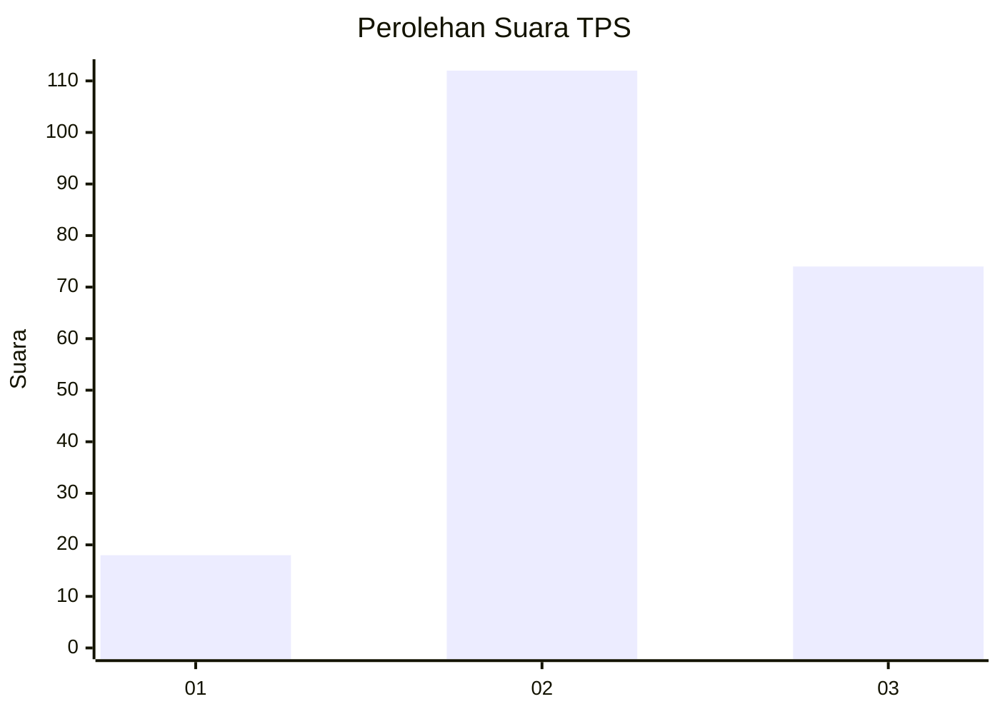
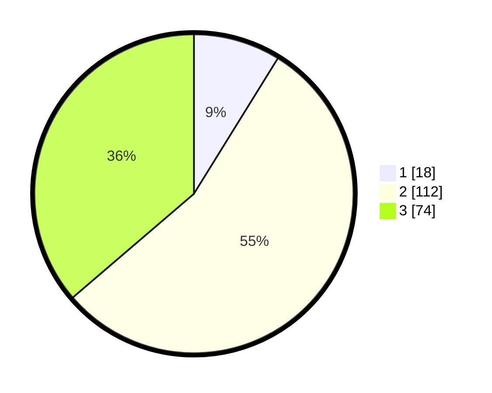

# Hasil

## Grafik

## Tabel

| No. | Nama Paslon    | Suara | Suara (raw) | Persentase |
|:--- |:-------------- | -----:| -----------:| ----------:|
| 1   | ANIES MUHAIMIN | 18    | [18][p-1]   | 8,82       |
| 2   | PRABOWO GIBRAN | 112   | [112][p-2]  | 54,90      |
| 3   | GANJAR MAHFUD  | 74    | [74][p-3]   | 36,27      |

[p-1]: https://github.com/gigit-pemilu/pemilu-2024/blob/main/pilpres/hitung-suara/sub/35-jawa-timur/sub/20-magetan/sub/14-karas/sub/2003-sumursongo/sub/007-tps/sub/paslon-1.txt
[p-2]: https://github.com/gigit-pemilu/pemilu-2024/blob/main/pilpres/hitung-suara/sub/35-jawa-timur/sub/20-magetan/sub/14-karas/sub/2003-sumursongo/sub/007-tps/sub/paslon-2.txt
[p-3]: https://github.com/gigit-pemilu/pemilu-2024/blob/main/pilpres/hitung-suara/sub/35-jawa-timur/sub/20-magetan/sub/14-karas/sub/2003-sumursongo/sub/007-tps/sub/paslon-3.txt

## Foto C Plano

https://sirekap-obj-formc.kpu.go.id/5ee7/pemilu/ppwp/35/20/14/20/03/3520142003007-20240215-123221--8320b845-67e7-44bf-beb8-8a127243d688.jpg

https://sirekap-obj-formc.kpu.go.id/5ee7/pemilu/ppwp/35/20/14/20/03/3520142003007-20240215-123333--3ce788ea-2eca-4844-8551-24ffde715815.jpg

https://sirekap-obj-formc.kpu.go.id/5ee7/pemilu/ppwp/35/20/14/20/03/3520142003007-20240215-123355--cda871ae-8b8d-4b52-a574-176d5af0a518.jpg

## Metadata

| Key        | Value               |
| ---------- | ------------------- |
| Time Stamp | 2024-02-22 20:00:00 |

