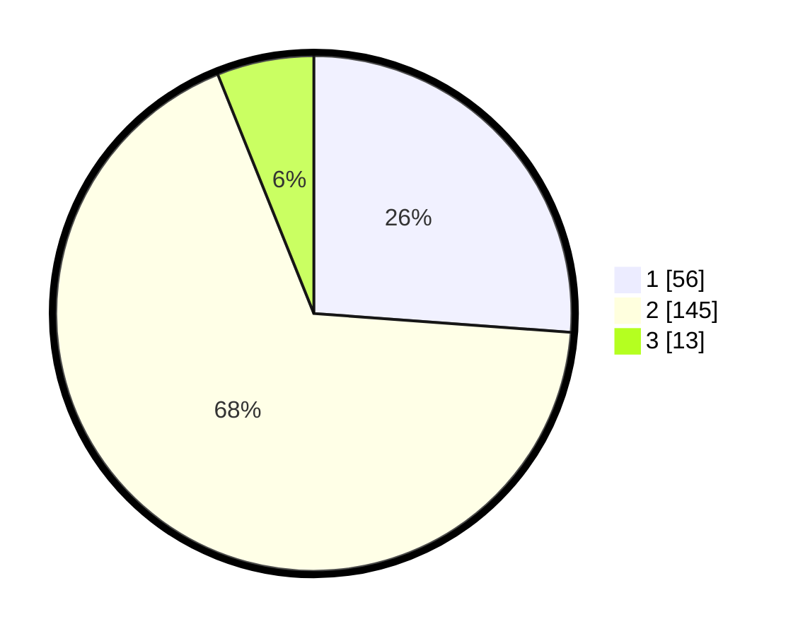

# Hasil

## Grafik

## Tabel

| No. | Nama Paslon    | Suara | Suara (raw) | Persentase |
|:--- |:-------------- | -----:| -----------:| ----------:|
| 1   | ANIES MUHAIMIN | 56    | [56][p-1]   | 26,17      |
| 2   | PRABOWO GIBRAN | 145   | [145][p-2]  | 67,76      |
| 3   | GANJAR MAHFUD  | 13    | [13][p-3]   | 6,07       |

[p-1]: https://github.com/gigit-pemilu/pemilu-2024/blob/main/pilpres/hitung-suara/sub/35-jawa-timur/sub/20-magetan/sub/14-karas/sub/2006-jungke/sub/005-tps/sub/paslon-1.txt
[p-2]: https://github.com/gigit-pemilu/pemilu-2024/blob/main/pilpres/hitung-suara/sub/35-jawa-timur/sub/20-magetan/sub/14-karas/sub/2006-jungke/sub/005-tps/sub/paslon-2.txt
[p-3]: https://github.com/gigit-pemilu/pemilu-2024/blob/main/pilpres/hitung-suara/sub/35-jawa-timur/sub/20-magetan/sub/14-karas/sub/2006-jungke/sub/005-tps/sub/paslon-3.txt

## Foto C Plano

https://sirekap-obj-formc.kpu.go.id/b39e/pemilu/ppwp/35/20/14/20/06/3520142006005-20240214-232255--fcb7be16-b3a0-4729-9665-301c8a6f3b6e.jpg

https://sirekap-obj-formc.kpu.go.id/b39e/pemilu/ppwp/35/20/14/20/06/3520142006005-20240214-232436--21de402a-bcba-4eda-9e5a-c238710f65a7.jpg

https://sirekap-obj-formc.kpu.go.id/b39e/pemilu/ppwp/35/20/14/20/06/3520142006005-20240214-232623--fd77f936-9b02-45db-8ae0-0085e3baf44e.jpg

## Metadata

| Key        | Value               |
| ---------- | ------------------- |
| Time Stamp | 2024-02-22 12:00:00 |

