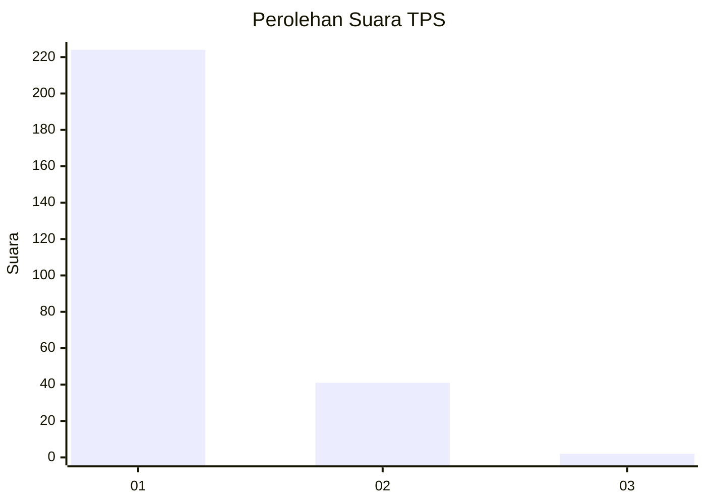
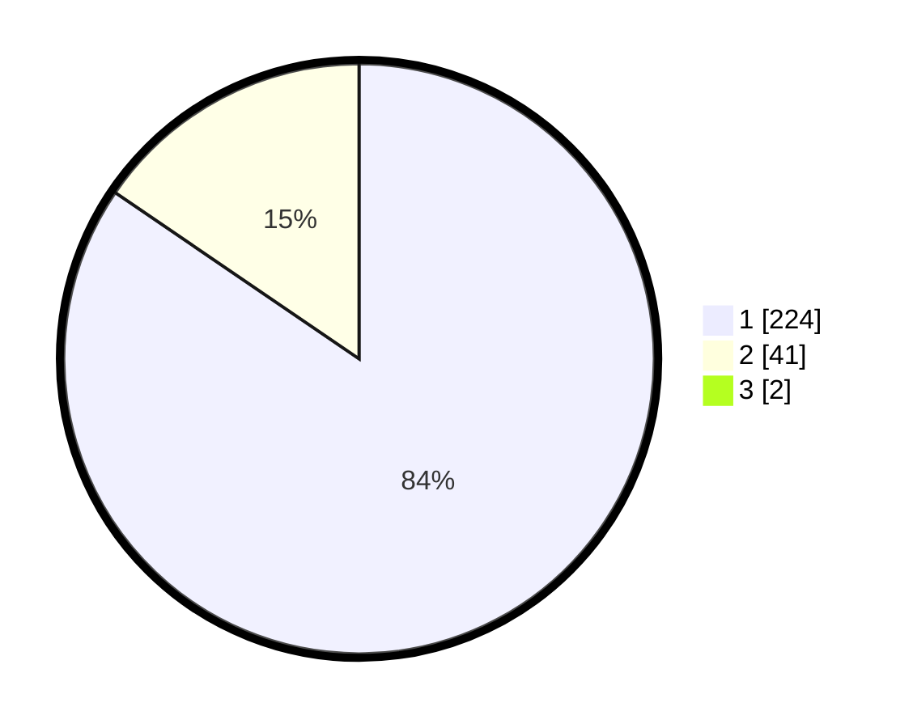

# Hasil

## Grafik

## Tabel

| No. | Nama Paslon    | Suara | Suara (raw) | Persentase |
|:--- |:-------------- | -----:| -----------:| ----------:|
| 1   | ANIES MUHAIMIN | 224   | [224][p-1]  | 83,90      |
| 2   | PRABOWO GIBRAN | 41    | [41][p-2]   | 15,36      |
| 3   | GANJAR MAHFUD  | 2     | [2][p-3]    | 0,75       |

[p-1]: https://github.com/gigit-pemilu/pemilu-2024-35-jawa-timur/blob/main/pilpres/hitung-suara/sub/35-jawa-timur/sub/20-magetan/sub/14-karas/sub/2007-temboro/sub/009-tps/sub/paslon-1.txt
[p-2]: https://github.com/gigit-pemilu/pemilu-2024-35-jawa-timur/blob/main/pilpres/hitung-suara/sub/35-jawa-timur/sub/20-magetan/sub/14-karas/sub/2007-temboro/sub/009-tps/sub/paslon-2.txt
[p-3]: https://github.com/gigit-pemilu/pemilu-2024-35-jawa-timur/blob/main/pilpres/hitung-suara/sub/35-jawa-timur/sub/20-magetan/sub/14-karas/sub/2007-temboro/sub/009-tps/sub/paslon-3.txt

## Foto C Plano

https://sirekap-obj-formc.kpu.go.id/e7fd/pemilu/ppwp/35/20/14/20/07/3520142007009-20240214-213552--7b5c5885-bde7-4d2d-823e-cb44aa10526a.jpg

https://sirekap-obj-formc.kpu.go.id/e7fd/pemilu/ppwp/35/20/14/20/07/3520142007009-20240214-213624--2fb5073d-a186-44a8-9db3-c4c5bad8c4c3.jpg

https://sirekap-obj-formc.kpu.go.id/e7fd/pemilu/ppwp/35/20/14/20/07/3520142007009-20240214-213705--f58f7a18-0fb2-4c02-bf86-1d3cd0501182.jpg

## Metadata

| Key        | Value               |
| ---------- | ------------------- |
| Time Stamp | 2024-02-24 22:31:28 |

