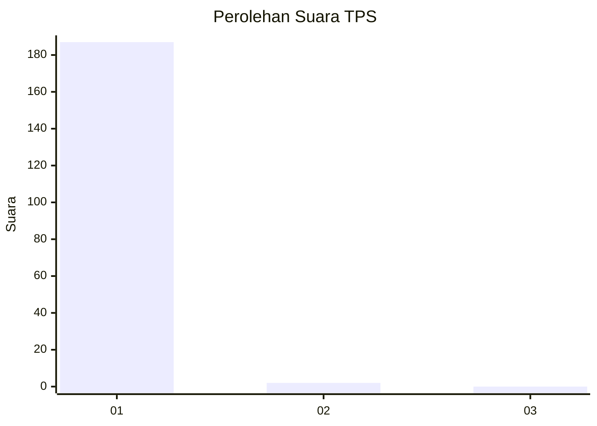
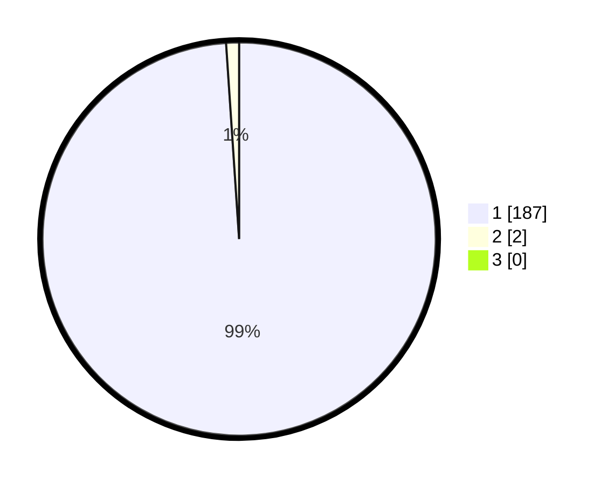

# Hasil

## Grafik

## Tabel

| No. | Nama Paslon    | Suara | Suara (raw) | Persentase |
|:--- |:-------------- | -----:| -----------:| ----------:|
| 1   | ANIES MUHAIMIN | 187   | [187][p-1]  | 98,94      |
| 2   | PRABOWO GIBRAN | 2     | [2][p-2]    | 1,06       |
| 3   | GANJAR MAHFUD  | 0     | [0][p-3]    | 0,00       |

[p-1]: https://github.com/gigit-pemilu/pemilu-2024-35-jawa-timur/blob/main/pilpres/hitung-suara/sub/35-jawa-timur/sub/20-magetan/sub/14-karas/sub/2007-temboro/sub/910-tps/sub/paslon-1.txt
[p-2]: https://github.com/gigit-pemilu/pemilu-2024-35-jawa-timur/blob/main/pilpres/hitung-suara/sub/35-jawa-timur/sub/20-magetan/sub/14-karas/sub/2007-temboro/sub/910-tps/sub/paslon-2.txt
[p-3]: https://github.com/gigit-pemilu/pemilu-2024-35-jawa-timur/blob/main/pilpres/hitung-suara/sub/35-jawa-timur/sub/20-magetan/sub/14-karas/sub/2007-temboro/sub/910-tps/sub/paslon-3.txt

## Foto C Plano

https://sirekap-obj-formc.kpu.go.id/6e71/pemilu/ppwp/35/20/14/20/07/3520142007910-20240214-222229--2031c318-12ef-48bc-8df0-a632783788ba.jpg

https://sirekap-obj-formc.kpu.go.id/6e71/pemilu/ppwp/35/20/14/20/07/3520142007910-20240214-222328--f14240f6-1f36-41ec-ba5c-e6d6b7bf6a62.jpg

https://sirekap-obj-formc.kpu.go.id/6e71/pemilu/ppwp/35/20/14/20/07/3520142007910-20240214-222445--0522cdd5-9302-4adf-b672-fa8fb69cb281.jpg

## Metadata

| Key        | Value               |
| ---------- | ------------------- |
| Time Stamp | 2024-02-22 20:00:00 |

