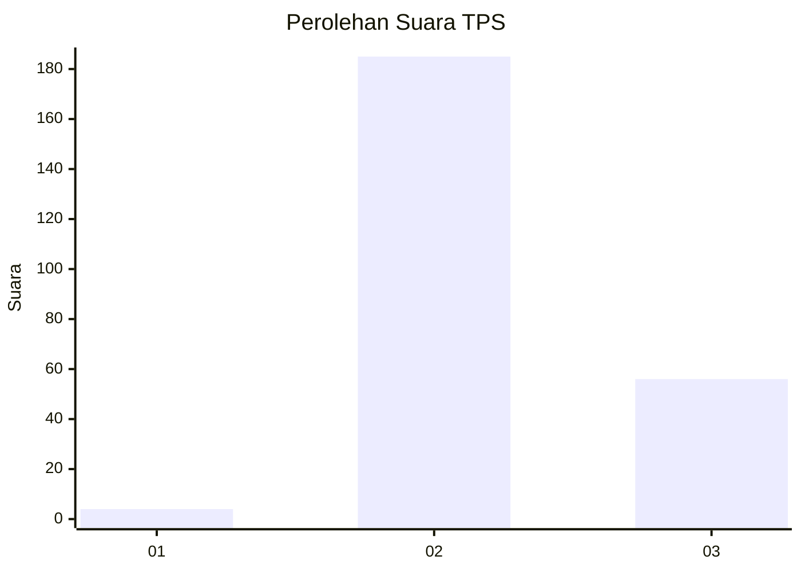
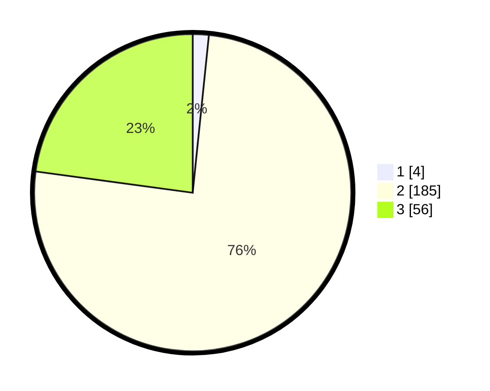

# Hasil

## Grafik

## Tabel

| No. | Nama Paslon    | Suara | Suara (raw) | Persentase |
|:--- |:-------------- | -----:| -----------:| ----------:|
| 1   | ANIES MUHAIMIN | 4     | [4][p-1]    | 1,63       |
| 2   | PRABOWO GIBRAN | 185   | [185][p-2]  | 75,51      |
| 3   | GANJAR MAHFUD  | 56    | [56][p-3]   | 22,86      |

[p-1]: https://github.com/gigit-pemilu/pemilu-2024-35-jawa-timur/blob/main/pilpres/hitung-suara/sub/35-jawa-timur/sub/20-magetan/sub/15-kartoharjo/sub/2001-kartoharjo/sub/001-tps/sub/paslon-1.txt
[p-2]: https://github.com/gigit-pemilu/pemilu-2024-35-jawa-timur/blob/main/pilpres/hitung-suara/sub/35-jawa-timur/sub/20-magetan/sub/15-kartoharjo/sub/2001-kartoharjo/sub/001-tps/sub/paslon-2.txt
[p-3]: https://github.com/gigit-pemilu/pemilu-2024-35-jawa-timur/blob/main/pilpres/hitung-suara/sub/35-jawa-timur/sub/20-magetan/sub/15-kartoharjo/sub/2001-kartoharjo/sub/001-tps/sub/paslon-3.txt

## Foto C Plano

https://sirekap-obj-formc.kpu.go.id/fe43/pemilu/ppwp/35/20/15/20/01/3520152001001-20240214-214324--a344edf6-094b-471d-b595-9ce0f66a9a52.jpg

https://sirekap-obj-formc.kpu.go.id/fe43/pemilu/ppwp/35/20/15/20/01/3520152001001-20240214-214427--b283ac45-629c-4117-8134-14c0fe6f1bea.jpg

https://sirekap-obj-formc.kpu.go.id/fe43/pemilu/ppwp/35/20/15/20/01/3520152001001-20240214-214503--585c692a-e372-4d4c-87f9-47bb39155778.jpg

## Metadata

| Key        | Value               |
| ---------- | ------------------- |
| Time Stamp | 2024-02-16 00:30:27 |

