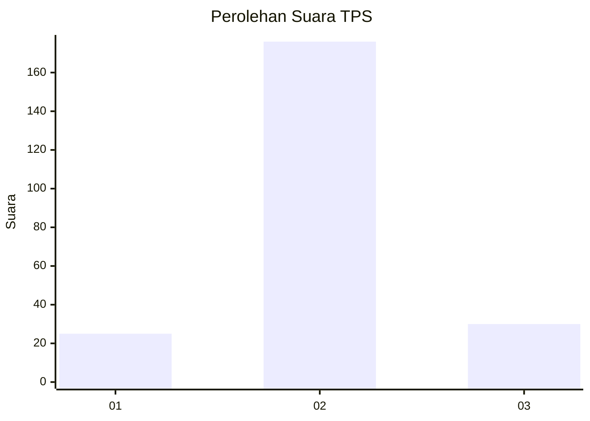
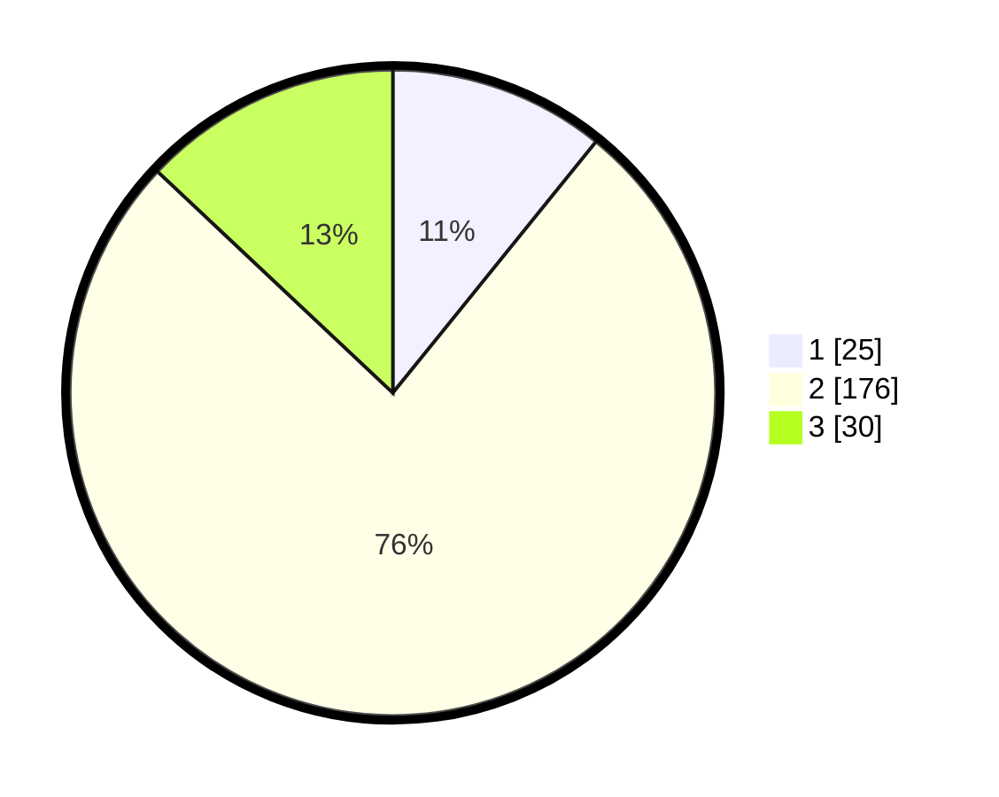

# Hasil

## Grafik

## Tabel

| No. | Nama Paslon    | Suara | Suara (raw) | Persentase |
|:--- |:-------------- | -----:| -----------:| ----------:|
| 1   | ANIES MUHAIMIN | 25    | [25][p-1]   | 10,82      |
| 2   | PRABOWO GIBRAN | 176   | [176][p-2]  | 76,19      |
| 3   | GANJAR MAHFUD  | 30    | [30][p-3]   | 12,99      |

[p-1]: https://github.com/gigit-pemilu/pemilu-2024-35-jawa-timur/blob/main/pilpres/hitung-suara/sub/35-jawa-timur/sub/20-magetan/sub/16-ngariboyo/sub/2001-selotinatah/sub/004-tps/sub/paslon-1.txt
[p-2]: https://github.com/gigit-pemilu/pemilu-2024-35-jawa-timur/blob/main/pilpres/hitung-suara/sub/35-jawa-timur/sub/20-magetan/sub/16-ngariboyo/sub/2001-selotinatah/sub/004-tps/sub/paslon-2.txt
[p-3]: https://github.com/gigit-pemilu/pemilu-2024-35-jawa-timur/blob/main/pilpres/hitung-suara/sub/35-jawa-timur/sub/20-magetan/sub/16-ngariboyo/sub/2001-selotinatah/sub/004-tps/sub/paslon-3.txt

## Foto C Plano

https://sirekap-obj-formc.kpu.go.id/d0d6/pemilu/ppwp/35/20/16/20/01/3520162001004-20240215-000448--23331676-ef4d-4c55-8566-d35a8ff45ccc.jpg

https://sirekap-obj-formc.kpu.go.id/d0d6/pemilu/ppwp/35/20/16/20/01/3520162001004-20240215-000905--6f5a71db-9460-4ffe-aeff-39540e79fd66.jpg

https://sirekap-obj-formc.kpu.go.id/d0d6/pemilu/ppwp/35/20/16/20/01/3520162001004-20240214-193118--b4bbb091-64d8-4bd0-a97d-d47321b5d47b.jpg

## Metadata

| Key        | Value               |
| ---------- | ------------------- |
| Time Stamp | 2024-02-22 20:00:00 |

