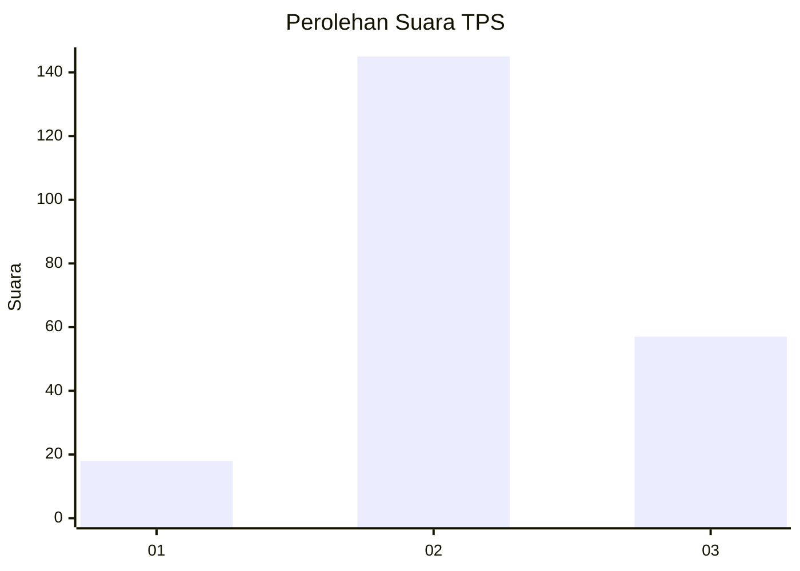
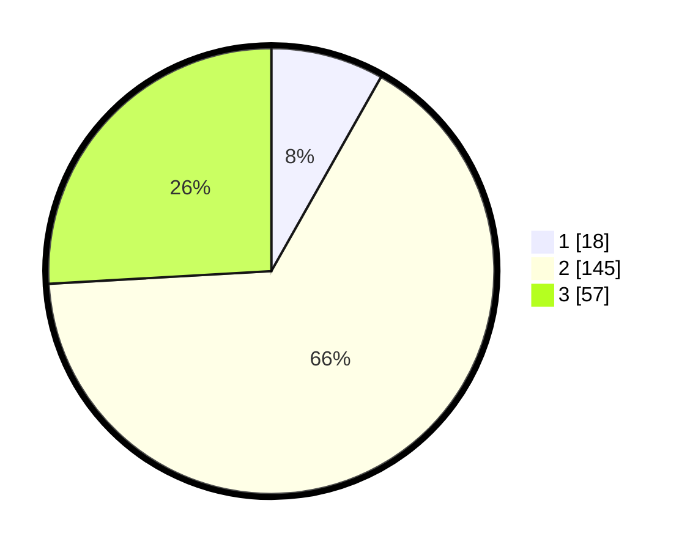

# Hasil

## Grafik

## Tabel

| No. | Nama Paslon    | Suara | Suara (raw) | Persentase |
|:--- |:-------------- | -----:| -----------:| ----------:|
| 1   | ANIES MUHAIMIN | 18    | [18][p-1]   | 8,18       |
| 2   | PRABOWO GIBRAN | 145   | [145][p-2]  | 65,91      |
| 3   | GANJAR MAHFUD  | 57    | [57][p-3]   | 25,91      |

[p-1]: https://github.com/gigit-pemilu/pemilu-2024/blob/main/pilpres/hitung-suara/sub/35-jawa-timur/sub/20-magetan/sub/16-ngariboyo/sub/2001-selotinatah/sub/006-tps/sub/paslon-1.txt
[p-2]: https://github.com/gigit-pemilu/pemilu-2024/blob/main/pilpres/hitung-suara/sub/35-jawa-timur/sub/20-magetan/sub/16-ngariboyo/sub/2001-selotinatah/sub/006-tps/sub/paslon-2.txt
[p-3]: https://github.com/gigit-pemilu/pemilu-2024/blob/main/pilpres/hitung-suara/sub/35-jawa-timur/sub/20-magetan/sub/16-ngariboyo/sub/2001-selotinatah/sub/006-tps/sub/paslon-3.txt

## Foto C Plano

https://sirekap-obj-formc.kpu.go.id/fc9a/pemilu/ppwp/35/20/16/20/01/3520162001006-20240214-205402--85444a93-5489-4cc2-a45f-30dd33c28639.jpg

https://sirekap-obj-formc.kpu.go.id/fc9a/pemilu/ppwp/35/20/16/20/01/3520162001006-20240214-205505--f1667bbf-e694-49bb-ac1f-9cf33aef5931.jpg

https://sirekap-obj-formc.kpu.go.id/fc9a/pemilu/ppwp/35/20/16/20/01/3520162001006-20240214-205148--8ece28b8-15a7-4258-bc9d-2887f3156eb0.jpg

## Metadata

| Key        | Value               |
| ---------- | ------------------- |
| Time Stamp | 2024-02-22 20:00:00 |

